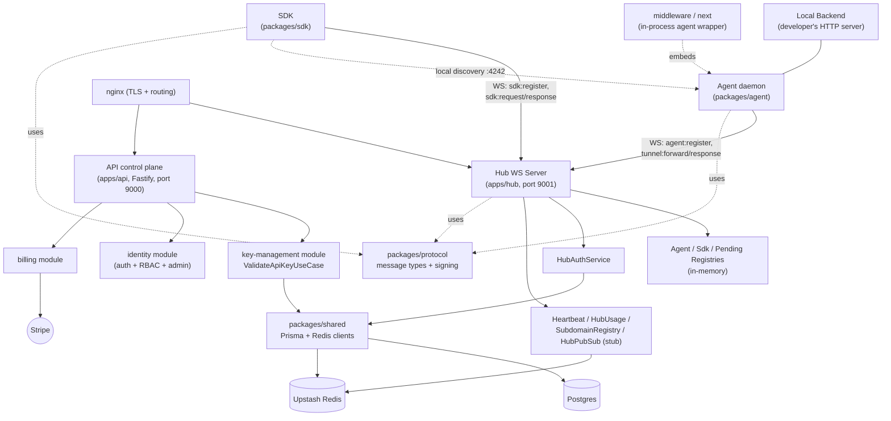
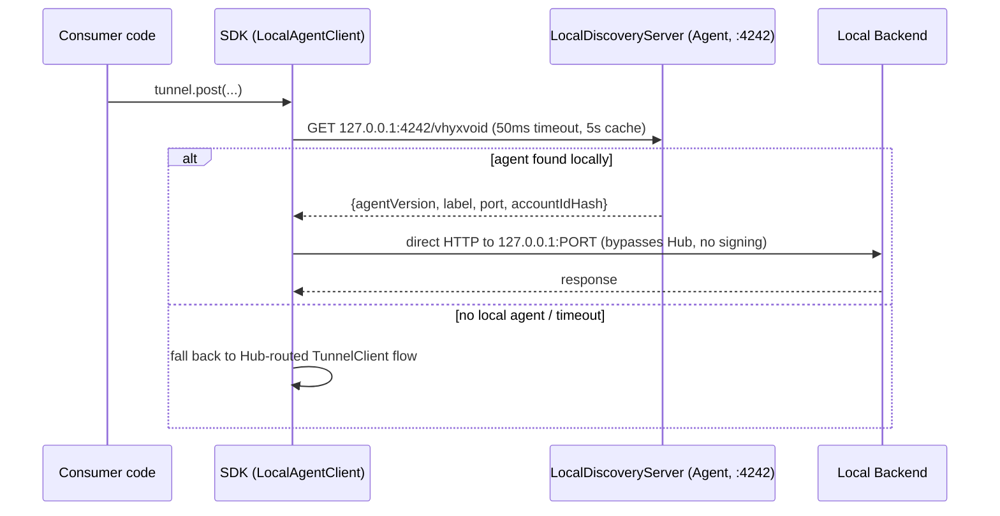
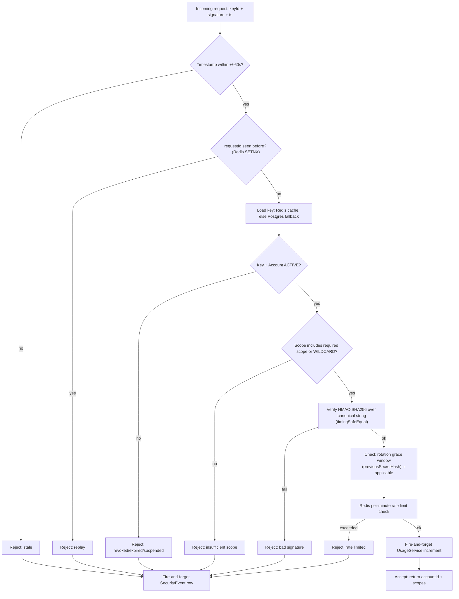

# Project Context

## Overview

This repository ("Black-Server" on disk, package scope `@vhyxvoid/*`) is **VhyxVoid**, a self-hosted tunnel / reverse-proxy platform in the spirit of ngrok. A small **Agent** daemon runs next to a developer's local backend and holds a persistent WebSocket connection to a central **Hub**. Any HTTP (and now WebSocket) request sent through the **SDK** by a consumer application is routed by the Hub to the correct Agent, forwarded to the developer's `localhost` backend, and the response is streamed back — typically in 10-70ms. A separate **API** service is the control plane: accounts, users, API keys (with HMAC-based signing/rotation), Stripe billing, admin RBAC, notifications, and feedback.

The project is mid-rename from an earlier codename **"BlackServer" / "BKSR"** to **"VhyxVoid"** — evidence of the old name (`bksr_live_...` key prefixes, `blackserver` in a stale npm lockfile, a dead `HubClient`/`blackserver-client.ts`) is scattered throughout, alongside the new `@vhyxvoid/*` scope and `VHYXVOID_*` env vars. The system is also mid-migration on a second axis: from a **WebSocket-tunnel model** (Agent+Hub+`TunnelClient`) toward a **subdomain HTTP model** (`SubdomainRegistry` on the Hub + `packages/sdk/src/client.ts`), and is growing **zero-config framework integrations** (`packages/middleware`, `packages/next`) that embed the Agent directly inside a consumer's Express/Fastify/Next.js process instead of running it as a separate CLI daemon.

Current state: functionally working core tunnel loop (agent registration → signed request → forward → response), a fairly complete control-plane API (DDD-style modules, seeded RBAC, Stripe billing, Prisma/Postgres), but with real gaps — an unauthenticated internal Hub endpoint, a stubbed cross-hub pub/sub (no horizontal Hub scaling), an unenforced email-verification check, a likely-misconfigured hub TLS cert, and very thin automated test coverage (4 e2e tests total, no unit tests in any app/package).

## Product Vision (from original build sessions)

VhyxVoid's goal is to become the default tunnel tool for full-stack development teams — not by being cheaper than ngrok, but by being deeply integrated into the workflow so developers stop thinking about tunnels as a separate tool. The core insight: cookie-domain sharing (`Domain=.vhyxvoid.com`) and a multi-label tunnel system mean an entire dev environment (frontend `acme--app`, backend `acme--default`, webhooks `acme--webhooks`) shares one domain, so auth/cookies/CORS just work without configuration.

"Done" for V1: a developer adds one line to their Express/Fastify/Next.js server (`withVhyxvoid(nextConfig)` or middleware equivalent) and their local backend is instantly reachable at a stable public URL — zero separate processes, zero CLI commands, zero config beyond an API key. Teammates hit the same URL from the shared dashboard.

"Done" for the platform: real usage in the dashboard, working billing, team collaboration, and the agent handling webhook testing end-to-end without anyone touching ngrok. Longer-term: the tunnel is the entry point, but the real product is the visibility/collaboration/control layer built on top of it — a developer infrastructure platform.

## Tech Stack

- **Language**: TypeScript throughout (strict mode), Node.js runtime.
- **Monorepo**: pnpm workspaces (`apps/*`, `packages/*`) orchestrated by Turborepo (`turbo.json`); `pnpm@10.6.2` pinned as `packageManager`.
- **API (control plane)**: Fastify 5, Prisma 6 → Postgres, `@upstash/redis` + `ioredis` (both present), `@fastify/jwt` + cookies for user auth, Stripe SDK, Resend (email), bcryptjs, zod. Root-level linting is ESLint 9 flat config (`eslint.config.ts`) — **not** `eslint-plugin-boundaries` (an earlier audit pass claimed that; confirmed wrong by reading the file directly): it's a plain `no-restricted-imports` rule banning deep imports into another workspace package's `src/` and cross-package relative imports.
- **Frontend (apps/web, `@vhyxvoid/web`)**: Next.js 16 / React 19, moved into this monorepo 2026-09-09 from a standalone repo (was `vhyx-void`). Runs on port **4000** (not the default 3000). Deliberately kept OUT of the root TS project-reference graph (own `tsc --noEmit` script instead) and OUT of the root ESLint flat config (own ESLint 8 config) — see `decision.md` for both. **VhyxUI migration complete as of 2026-09-14** (see Directory Structure and decision.md's per-step entries) — MUI 7/Vuexy remains only where explicitly deferred (blank-layout-pages' illustration/responsive-layout code, NotificationBell/FeedbackButton), not as an ongoing migration. VhyxUI is an in-house component library kept in a **separate** sibling repo and consumed via pnpm `link:` — see Configuration & Environment for the linking convention.
- **Hub (tunnel router)**: plain Node `http` module + `ws` (WebSocketServer in `noServer` mode) — `fastify`, `uWebSockets.js`, and `pg` are also listed as dependencies but are confirmed leftovers from two earlier rewrite attempts (uWebSockets.js → Fastify → plain http+ws), safe to remove. Imports `packages/shared`'s Prisma client directly (no HTTP call to the API).
- **Agent**: `ws` client, `axios` (backend proxy), `better-sqlite3` (durable queue, WAL mode), `commander` (CLI).
- **SDK**: `isomorphic-ws`, hand-rolled HMAC signing. Two live client implementations plus one dead one (see SDK Client Strategy below).
- **Build**: `tsc -b` composite TypeScript project references (root `tsconfig.json`, narrower `tsconfig.api.json`/`tsconfig.hub.json` for Docker builds) + `tsc-alias`; `agent`/`middleware`/`next` bundle with esbuild. Note: `packages/middleware` and `packages/next` sit outside this project-reference graph, so `tsc -b` doesn't build them as part of the standard flow.
- **Testing**: Vitest, config at `tests/vitest.config.ts`. Only 4 e2e tests exist repo-wide.
- **Deployment**: Docker (`Dockerfile.api`, `Dockerfile.hub`) + `docker-compose.yml` (api, hub, nginx, certbot — no Postgres/Redis containers, both external managed services) + nginx reverse proxy with TLS.

## Architecture

Three deployable services (`api`, `hub`, plus the developer-embedded `agent`) share two library packages: `packages/shared` (Prisma + Redis clients and `ValidateApiKeyUseCase`, imported directly by both `apps/api` and `apps/hub` — no HTTP hop between them) and `packages/protocol` (WebSocket wire-message types and the canonical-string HMAC signing helpers used by `agent`, `sdk`, and `hub`).

**The two-auth-scheme split is intentional and permanent** (confirmed by two independent build sessions): Agent registration uses a raw-secret HMAC check (`HubAuthService.authenticateAgent`) because it's a one-time connection handshake over a trusted, deliberately-run process — no replay risk since the connection itself is the session. SDK/API requests use full canonical-signature verification (`ValidateApiKeyUseCase`: timestamp window, replay protection via Redis, scope check, rotation-grace, rate limiting) because they're per-request calls over untrusted networks. These should **not** be unified — doing so would require agents to know the HMAC pepper, which was deliberately kept off the agent. The duplication is accepted tech debt, not a bug, but the two paths must be kept in sync by hand when either changes.



## Directory Structure

```
apps/
  api/            Control-plane REST API (Fastify + Prisma/Postgres). DDD-style modules.
    src/modules/  identity (auth+RBAC+admin), key-management (ApiKey issue/validate),
                  billing (Stripe), notification, feedback
    src/core/     config, DI container, errors, redis client, shared middleware/utils
    prisma/       schema.prisma + migrations (source of truth for the whole system's DB)
    archived/     dead pre-refactor RBAC/key-management code (gitignored, local only)
    NOTE: there is no apps/api/src/app.ts — Fastify app wiring lives elsewhere;
    the /me/password route is registered in identity.routes.ts, not account.routes.ts
    (account.routes.ts exists but is a different, narrower file)
  hub/            Tunnel router: WS server, registries, message router, auth, pubsub
    src/registry/     in-memory Agent/Sdk/Pending/WsConnection registries
    src/router/       Message.router.ts — dispatches by WS message type
    src/services/     HubAuth, HubUsage, Heartbeat, HubPubSub (stub), SubdomainRegistry
    src/repositories/ TunnelSession / TunnelRequest writes (via packages/shared's Prisma)
    prisma/schemaprisma.ts   NOT a real schema — stale dead Prisma model comments
  demo-backend/   Trivial test HTTP server (`/hello`, `/echo`) used to exercise a tunnel locally
  web/            Consumer-facing dashboard (`@vhyxvoid/web`). Next.js 16 / React 19,
                  moved into the monorepo 2026-09-09. Talks to apps/api over normal HTTP —
                  not part of the tunnel protocol, so not shown in the Architecture diagram
                  above. **VhyxUI migration complete as of 2026-09-14** (Steps 1-5: public
                  marketing pages, auth-flow pages, dashboard shell/nav, simple content
                  pages, and all three GenericServerTable list+CRUD screens). MUI remains
                  present only where explicitly deferred (blank-layout-pages' illustration
                  panels, NotificationBell/FeedbackButton) — see decision.md's per-step
                  entries. Step 6 ("admin-only screens"), the last step in the originally
                  planned sequence, turned out to have no real scope to migrate — see the
                  "No admin frontend exists" item below and decision.md, 2026-09-14.
                  **Committed as a clean baseline 2026-09-16** (was uncommitted since the
                  2026-09-09 move, per decision.md's same-day entry). archived/ (gitignored,
                  local only — same convention as apps/api/archived/) holds confirmed-unused
                  Vuexy template material moved out of the tracked tree, plus older,
                  unrelated pre-existing content (a pre-migration route-group structure)
                  — see decision.md, 2026-09-16.
                  **MUI/Vuexy holdout list corrected 2026-09-16** (fresh audit): "only
                  explicitly deferred: blank-layout-pages illustration +
                  NotificationBell/FeedbackButton" (above) is stale — also live:
                  views/org/{CreateOrgDialog,MyAccountsTable,billing/BillingView,
                  AcceptInvitationView}.tsx, views/profile/FeedbackHistoryTab.tsx +
                  views/feedback/FeedbackDetailDrawer.tsx, contexts/FeedbackContext.tsx
                  (a global confirm/alert Dialog), views/pages/NotFound.tsx. Full inventory
                  and phased removal plan: decision.md, 2026-09-16 ("Fresh MUI/Vuexy
                  dependency audit").
                  **Phase 0 of that plan executed 2026-09-16**: the orphaned pre-Step-3
                  dashboard-shell generation (most of libs/layout/vertical/,
                  libs/layout/shared/{ModeDropdown,UserDropdown}.tsx,
                  @layouts/VerticalLayout.tsx and its subtree), the dead @menu vertical-menu
                  *rendering* subsystem (@menu/vertical-menu/, most of
                  @menu/components|styles|svg|utils/, @core/styles/vertical/*), and ~13
                  standalone dead files (3 of the 4 @core/components/mui/* wrappers,
                  members.columns.tsx, generic unused Vuexy boilerplate) are gone —
                  superseded by libs/layout/vhyxui/* and confirmed zero-importer, per
                  decision.md, 2026-09-16 ("Phase 0 executed"). `@mui` import surface
                  dropped 94→71 files, 209→147 lines.
                  **Phase 1 executed 2026-09-16**: NotFound.tsx (Button/Typography, not its
                  theme-coupled illustration), AuthGuard.tsx (CircularProgress→Spinner),
                  AcceptInvitationView.tsx (its one, genuinely-untheme-coupled
                  styled('img')), and the dashboard layout's ScrollToTop button all
                  migrated to VhyxUI. `@mui` surface now 68 files/142 lines. Hit and fixed a
                  real Turbopack SSR build break: importing `@vhyxui/react`'s `Button`
                  directly into `(dashboard)/layout.tsx` (a genuine Server/Client
                  boundary-crossing file, no `'use client'` of its own) broke `/profile`'s
                  production build — fixed by extracting to a dedicated client component,
                  `@core/components/scroll-to-top/ScrollToTopButton.tsx`. See decision.md,
                  2026-09-16 ("Phase 1 executed"). Phases 2-4 (org/profile view migrations,
                  NotificationBell/FeedbackButton rebuild, the illustration-panel problem)
                  remain open.

packages/
  protocol/       Wire message types, canonical-string HMAC signing, shared constants/errors.
                  No version negotiation despite a `v: "1"` field on every message (never checked).
  shared/         Prisma client + Redis client + ValidateApiKeyUseCase, imported directly
                  by both apps/api and apps/hub (no HTTP between them)
  agent/          The daemon: AgentClient state machine, MessageBatcher, BackendProxy,
                  ResponseCache, LocalDiscoveryServer, DurableQueue/NoOpQueue, CLI.
                  src/replay/replayQueue.ts — outbound replay works, inbound is partial (see Core Flows §1 note)
  sdk/            Developer-facing client: TunnelClient (WS, browser-oriented, narrowing scope),
                  client.ts (HTTP/subdomain model, confirmed fully implemented — ~198 lines,
                  real VhyxvoidClient class, this is now the primary/default surface),
                  blackserver-client.ts (dead legacy, should be deleted), demo.js (test file,
                  should not ship in published package)
  middleware/     Zero-config in-process Agent wrapper for Express (index.ts) and
                  Fastify (fastify.ts) + Next config (next.ts). Reuses the full CLI-oriented
                  AgentClient (including SQLite durable queue) — acknowledged architectural
                  overfit for an in-process context (see Design Notes).
  next/           Independent (duplicate) Next.js integration — reimplements
                  middleware/next.ts's logic rather than reusing it

archived/         Two prior generations of dead code: an old standalone agent
                  ("agentsdead") and a 742-line audit/refactor-planning doc (all.md)
                  that explains the shape of the current agent/protocol cleanup
tests/            Only 4 vitest e2e tests exist repo-wide (signature, queue replay, heartbeat)
```

## SDK Client Strategy (resolved — was previously contradictory across build sessions)

Two prior build sessions gave conflicting answers on whether `client.ts` (HTTP/subdomain) replaces `TunnelClient` (WebSocket) or the two coexist permanently. Both were reasoning from intent, not a settled decision — **this was genuinely never decided during the build.**

**Resolved direction (recommended by both sessions independently once pressed):**

- `client.ts` (HTTP) is the default, primary SDK surface — confirmed fully implemented, not a stub.
- `TunnelClient` (WebSocket) is narrowed to one legitimate remaining case: browser environments wanting a persistent bidirectional connection where per-request HTTPS overhead is unacceptable (e.g. a live-reload style dev tool). Not the common case.
- Proposed packaging: `@vhyxvoid/sdk` default export → HTTP client; `@vhyxvoid/sdk/ws` named export → TunnelClient.
- No hard deprecation yet, but no new features should land on TunnelClient going forward.
- This is a documentation/export-organization task, not a rewrite — action it before more consumers build against the wrong surface.

## Core Flows

### 1. Agent Registration & Handshake

The Agent daemon authenticates itself to the Hub with a raw shared secret (not the canonical-signature scheme used elsewhere) before it can receive tunneled traffic. This split is intentional (see Architecture).

```mermaid
sequenceDiagram
    participant CLI as agent CLI
    participant AC as AgentClient
    participant Hub as Hub (WS)
    participant Auth as HubAuthService
    participant Store as Postgres/Redis

    CLI->>AC: start() — state: IDLE -> CONNECTING
    AC->>Hub: WS connect
    AC->>Hub: agent:register {keyId, label, rawSecret, agentVersion}
    Hub->>Auth: authenticateAgent(keyId, rawSecret)
    Auth->>Store: load ApiKey (Redis cache, else Postgres + warm cache)
    Auth->>Auth: HMAC-SHA256(pepper, rawSecret) vs secretHash (timingSafeEqual)
    Auth-->>Hub: {accountId, scopes} or reject
    Hub->>Store: TunnelSession.upsert(status=CONNECTED)
    Hub->>Store: Redis SET hub:agent:{accountId}:{label} = hubInstanceId (TTL 25s)
    Hub-->>AC: hub:registered {agentId, accountId, replayPending}
    AC->>AC: state = CONNECTED; start heartbeat; replayQueue()
```

Side effects/non-obvious behavior: on WS close/error the Agent moves to `RECONNECTING` with exponential backoff (1s → 2s → 4s → ... capped at 300s); `AgentClient` never calls `LocalDiscoveryServer.setAccountIdHash()` despite receiving `accountId` in `hub:registered`, so the local-discovery account-verification feature described in code comments is not actually wired up. `hub:registered`'s `replayPending` field is **hardcoded to `false`** — the hub never actually queues inbound requests for an agent to replay; see the inbound-replay note below.

**Inbound replay — confirmed partial, not a full stub.** Outbound replay (agent queues responses while WS is down, drains them on reconnect) works correctly via `packages/agent/src/replay/replayQueue.ts`. Inbound replay (a `tunnel:forward` the hub sent while the agent was mid-reconnect) does not work: `PendingRegistry` (hub-side) holds in-flight requests with a timeout (default 30s); if the agent reconnects within that window it can still respond normally, but if it reconnects after, the request has already been rejected with `AGENT_TIMEOUT`/504 and there is nothing to replay — the agent has no way to know what it missed. If a stale-requestId response does eventually arrive from the agent, the hub silently drops it since the pending entry is gone. Net effect: for GET this is harmless (caller retries), but for POST/DELETE it's a real correctness gap — the local backend processes the mutation but the original caller already got an error. Acceptable for a dev tool today; flagged as the top reliability item before advertising "requests survive disconnects."

### 2. Tunneled HTTP Request (main value-prop flow)

```mermaid
sequenceDiagram
    participant App as Consumer code
    participant SDK as TunnelClient (SDK)
    participant Hub as Hub
    participant Pend as PendingRegistry
    participant Agent as AgentClient
    participant Backend as Local Backend

    App->>SDK: tunnel.post('/api/users', body)
    SDK->>SDK: sign request (canonical string + HMAC)
    SDK->>Hub: sdk:request {requestId, method, path, body, signature}
    Hub->>Hub: authenticateRequest() -> ValidateApiKeyUseCase
    Hub->>Pend: enqueue(requestId, resolve/reject, 30s timeout)
    Hub->>Agent: tunnel:forward {requestId, method, path, body}
    Agent->>Backend: axios request to 127.0.0.1:PORT
    Backend-->>Agent: status + body
    Agent->>Agent: MessageBatcher.add(tunnel:response)
    Agent->>Hub: agent:batch [tunnel:response] (flush at 50ms or 100 items)
    Hub->>Pend: resolve(requestId, {status, body}); clearTimeout
    Hub->>Hub: TunnelRequest.create(...) — fire-and-forget, errors swallowed
    Hub-->>SDK: sdk:response {status, body}
    SDK-->>App: resolved Promise
```

Non-obvious behavior: both the Hub's Postgres writes (`TunnelSession`/`TunnelRequest`) and the Agent's response caching are best-effort/fire-and-forget by design ("never block the tunnel") — DB hiccups are silently swallowed. `ResponseCache` keys only on `path+query`, not on `Authorization`/`Cookie` — **confirmed an oversight, not a conscious tradeoff**, that became acceptable only because the agent runs on a developer's local (assumed single-user) machine. Both original build sessions independently flag this as a real bug to fix (add auth-header hash to the cache key) before the agent is used in any shared/CI environment.

### 3. Local Discovery Fast Path

When the SDK and Agent are on the same machine, the SDK bypasses the Hub entirely for lower latency.



Gap: the `accountIdHash` field exists specifically so the SDK can confirm it's talking to _its own_ agent, but it's never populated by the Agent nor checked by the SDK — any process that can reach `127.0.0.1:4242` is routed through whichever agent is running, regardless of account/label. Low severity since it requires local machine access, but the security property implied by the field doesn't exist end-to-end.

### 4. API Key Validation (shared by Hub-SDK auth and direct API auth)



Note: this is the path used correctly for SDK↔Hub auth, but the Hub's own `HubAuthService.authenticateAgent` re-implements a _subset_ of this logic ad hoc for Agent registration rather than reusing it. Confirmed intentional (see Architecture) — not a bug, but must be kept in sync by hand.

**Rate limiting is a known stub**: `rateLimitPerMinute` in `ValidateApiKeyUseCase` always returns `-1` (unlimited); `buildCachePayload` hardcodes `Infinity`. Plan-based limits were never actually wired to a real check.

### 5. User Signup / Login / RBAC

```mermaid
sequenceDiagram
    participant User
    participant Api as apps/api (Fastify)
    participant Identity as identity module
    participant DB as Postgres

    User->>Api: POST /auth/signup {email, password}
    Api->>Identity: RegisterUser use-case
    Identity->>DB: User.create(); EmailVerificationToken.create()
    Identity->>Identity: notificationService.sendEmailVerification (AND console.log raw token — both happen)
    Api-->>User: verification email sent (Resend)

    User->>Api: POST /auth/login {email, password}
    Api->>Identity: Login use-case (bcrypt compare, lockout check via ensureCanLogin())
    Identity->>DB: Session.create(tokenHash); AccountMember lookup (roleLevel)
    Api-->>User: {accessToken} in JSON body; refresh token as httpOnly SameSite=Strict cookie

    User->>Api: GET /account/... (Authorization: Bearer accessToken)
    Api->>Api: userAuthGuard (reads Authorization header, RS256JwtService.verify — no cookie involved)
    Api->>Identity: check Role/Ability via RoleAbility (account-scoped RBAC)
    Identity-->>Api: allow/deny
```

**Corrected 2026-09-15 — this diagram previously said login sets an `access_token` cookie and `userAuthGuard` verifies via that cookie; both were wrong, confirmed by reading the code directly rather than assumed.** The real flow: `Login`/`Register`/`RefreshSession` use-cases return `accessToken` in the JSON response body only (no `Set-Cookie` for it anywhere in the codebase — grepped `setCookie` calls across all of `apps/api/src`, exactly one exists, for the *refresh* token). `apps/web` keeps the access token in memory only (Zustand `auth.store.ts`, explicitly excluded even from its own `sessionStorage` persistence — restored via `/auth/refresh` on each fresh load) and sends it as `Authorization: Bearer <token>` on every request. `userAuthGuard.ts` (the real, live guard — used by every protected route: account, identity, tunnel, notification, feedback, apiKey, billing) reads only `request.headers.authorization`; it never touches cookies. A **second**, cookie-based JWT guard exists in the codebase (`core/middleware/auth.middleware.ts`'s `authenticate`, using Fastify's generic `req.jwtVerify()` against the `access_token` cookie name `register.plugin.ts` configures on `@fastify/jwt`) but is **fully dead — zero importers anywhere**, never wired onto any route. The only cookie in the whole session-auth flow is the refresh-token cookie (`REFRESH_COOKIE_NAME`, `httpOnly`, `sameSite: 'strict'`, `path: '/api/v1/auth'`) — already real, correctly-configured CSRF protection for the one endpoint that uses it, and moot for every other endpoint since they authenticate via an explicit header a cross-site page cannot make a victim's browser attach automatically. Investigated and confirmed while removing apps/web's client-side HMAC request signing — see "Missing Features"/Known Risks below and decision.md, 2026-09-15, "NEXT_PUBLIC_SECRET_KEY removal".

**Confirmed live gap: email verification is not enforced at login.** `ensureCanLogin()` (`User.entities.ts:119-134`) checks only `deletedAt`, `status`, and `lockedUntil` — no `isEmailVerified` check. The only `isEmailVerified`-gated throw in the codebase is dead, commented-out code (`User.entities.ts:309`). An unverified user can register and log in normally today. This needs a real fix, not just documentation — add the check to `ensureCanLogin()` or `Login.usecase.ts` directly.

Separate from this is a fully independent **Admin RBAC system** (`AdminUser`/`AdminRole`/`AdminAbility`/`AdminSession`, guarded by `adminAuthGuard`/`requireAbility`/`requireSuperAdmin`, all actions written to an immutable `AdminAuditLog`) — it does not share code with the regular-user RBAC above. **The backend side of this is real and complete; there is no frontend for it at all** — see "Missing Features" below.

## Data Model


`OAuthAccount` — **confirmed planned-but-never-started** (Google/GitHub login as an alternative to email/password; no use-case, route, or provider config anywhere). Safe to leave (no data, no harm) or drop via migration for schema cleanliness; build later if OAuth is prioritized. Several old model definitions are left commented out in `schema.prisma` (~15% of the file) rather than deleted.

## Configuration & Environment

| Variable                                                                                                                | Purpose                                                                                                                                                                                                                                           | Required?                      |
| ----------------------------------------------------------------------------------------------------------------------- | ------------------------------------------------------------------------------------------------------------------------------------------------------------------------------------------------------------------------------------------------- | ------------------------------ |
| `DATABASE_URL`                                                                                                          | Postgres connection string (shared by api & hub via `packages/shared`)                                                                                                                                                                            | Yes, both services             |
| `UPSTASH_REDIS_REST_URL` / `_TOKEN`                                                                                     | Redis (Upstash REST client) for caching, rate limiting, presence, pending mirror                                                                                                                                                                  | Yes, both services             |
| `SERVER_HMAC_PEPPER`                                                                                                    | Secret pepper mixed into every API-key HMAC (must be ≥32 chars — hub validates this at boot)                                                                                                                                                      | Yes, both services             |
| `PORT` (api) / `HUB_PORT` (hub)                                                                                         | Listen port — api defaults 9000, hub's fallback is inconsistent (main.ts logs 3001, actually binds 9001)                                                                                                                                          | Yes                            |
| `JWT_SECRET`, `JWT_EXPIRES_IN` (`JWT_ACCESS_SECRET`/`JWT_REFRESH_SECRET` in practice)                                   | User-session JWT signing (`@fastify/jwt`, HS256/symmetric — this is what's actually live)                                                                                                                                                         | Yes (api)                      |
| `PRIVATE_KEY`/`PUBLIC_KEY` (dev) vs `PRIVATE_KEY_B64`/`PUBLIC_KEY_B64` (prod) + `.pem` files under `apps/api/src/keys/` | **Confirmed unused.** Leftover from an abandoned plan to use RS256 (asymmetric) JWT signing instead of the HS256 symmetric scheme actually shipped. Safe to delete unless RS256 is revisited later (would need `sign.ts` in the SDK updated too). | No — dead                      |
| `STRIPE_SECRET_KEY`, `STRIPE_WEBHOOK_SECRET`, `STRIPE_PRO_PRICE_ID`, `STRIPE_ENTERPRISE_PRICE_ID`                       | Billing module / Stripe integration. Flat-rate price IDs only — see Billing note below.                                                                                                                                                           | Yes (api)                      |
| `RESEND_API_KEY`, `EMAIL_FROM`, `SUPPORT_EMAIL`, `ADMIN_FEEDBACK_EMAIL` (dev only)                                      | Transactional email                                                                                                                                                                                                                               | Yes (api)                      |
| `HUB_INTERNAL_URL` (dev only, api)                                                                                      | Used by `POST /api/v1/tunnelproxy/request` (`tunnelProxy.routes.ts`) to reach the Hub's `POST /internal/proxy` — a synchronous HTTP tunnel-request path, alternative to the SDK's WS/subdomain flow. A real caller exists (corrected 2026-09-13 — previously documented as unbuilt/no-caller, which was wrong); that caller was simply broken (missing auth header, fixed — see context.md item 40) and itself has no external callers yet. | Wired but unused end-to-end     |
| `HUB_INTERNAL_SECRET` (hub, and api once a real caller exists)                                                          | Added 2026-09-12. Shared secret required on every `/internal/proxy` request (`x-hub-internal-secret` header, checked via `crypto.timingSafeEqual`). Hub fails closed (503) when unset — see Known Risks #7.                                       | No — endpoint has no caller yet |
| `HUB_DOMAIN` (dev only, hub)                                                                                            | Public hostname for tunnel URLs / subdomain routing                                                                                                                                                                                               | Yes (hub, dev)                 |
| `HUB_DEBUG_LOGGING` (hub)                                                                                               | Added 2026-09-12. `true` enables verbose flow-debug logging (subdomain registration, per-request tunnel logs) via `apps/hub/src/utils/debug.ts`. Default off. Never gates secret-adjacent output — those lines were deleted outright, not flagged. | No — defaults off               |
| `CLIENT_123_SECRET`                                                                                                     | Oddly-named literal var in both api env files — likely a placeholder/test secret                                                                                                                                                                  | Flag for review                |
| `VHYXVOID_API_KEY`/`_SECRET`/`_PORT`/`_LABEL`/`_HUB_URL`/`_QUEUE_PATH`/`_WRITE_ENV`/`_ENV_KEY`                          | Agent CLI and `packages/middleware`/`packages/next` configuration                                                                                                                                                                                 | Yes, for agent/middleware/next |

**Project convention — VhyxUI linking.** `apps/web` consumes `@vhyxui/react` and `@vhyxui/tokens` from a **separate** repo (VhyxUI, not part of this monorepo) via pnpm's `link:` protocol, using **relative** paths (`link:../../../VhyxUI/packages/react`, `link:../../../VhyxUI/packages/tokens`), not absolute ones. This assumes VhyxUI is checked out as a **sibling directory** to this repo on disk — any contributor building `apps/web` needs both repos checked out side by side at that relative depth, or the link needs updating. This is the established pattern for any future workspace that consumes VhyxUI too, not a one-off for `apps/web` — don't rediscover this per-session. `apps/web/next.config.ts` also widens `turbopack.root` to the common parent of both repos (required for Turbopack to resolve a `link:` target outside its own root) and any VhyxUI component must be rendered from a `'use client'` boundary (VhyxUI's components aren't RSC-safe). See `apps/web/README.md` for the full setup and `decision.md`'s 2026-09-09 "VhyxUI stays a separate repo" entry for why this topology was chosen over vendoring or publishing.

**Same pattern, second sibling repo, added 2026-09-15**: `apps/web` also consumes `@vhyx/api-kit` (shared `createHttpClient`/`createQueryKeys`/`createQueryClient` conventions extracted per `TABLE_API_ARCHITECTURE_COMPARISON.md`'s Phase 1) from `link:../../../vhyx-api-kit` — a separate, single-package sibling repo at `/Users/tanveer/Documents/tanveer/vhyx-api-kit`, with its own fresh git history. No further `next.config.ts` change was needed since `turbopack.root` was already widened to the common parent directory, which already covers this new sibling too. See context.md item 44 and decision.md, 2026-09-15.

**Dev vs Prod differences observed**: prod API env drops `JWT_SECRET`/`JWT_EXPIRES_IN`/`HUB_INTERNAL_URL`/`ADMIN_FEEDBACK_EMAIL` and renames the key-pair vars to base64 variants (`_B64`) for safer injection; prod Hub env drops `PRIVATE_KEY`/`PUBLIC_KEY`/`HUB_DOMAIN`. Neither Postgres nor Redis is containerized in `docker-compose.yml` — both point at external managed instances via connection strings.

**Local dev backend for functional testing** — see `LOCAL_DEV_BACKEND.md` (repo root). A local Postgres 16 database (`Black-server`, already migrated + already has real seeded org/member/tunnel/API-key data) already exists on this machine independent of `apps/api/.env`'s active (remote Neon) `DATABASE_URL`. Overriding `DATABASE_URL` for just the `apps/api` dev process (never editing `.env`) lets `apps/web` be functionally tested against a real running API with real role-gated data, instead of every request failing at the network level as in every migration-step session before 2026-09-10. Set up specifically because Steps 3 and 4 both hit UI that's impossible to verify without real admin/multi-member org data. See `decision.md`, 2026-09-10, "Local dev backend set up as standing test infrastructure".

**Nginx/TLS — SAN question resolved live 2026-09-12; a different, more urgent problem found instead.** The repo's `nginx.conf` points `hub.vhyxvoid.com`'s `ssl_certificate`/`ssl_certificate_key` at the `/etc/letsencrypt/live/api.vhyxvoid.com/...` path, which looked like a possible misconfiguration from reading the file alone. A live check from this sandbox (which turned out to have network egress) settled it: `openssl s_client -connect hub.vhyxvoid.com:443 -servername hub.vhyxvoid.com` shows the actual served certificate's SAN is `DNS:*.vhyxvoid.com, DNS:vhyxvoid.com` — a wildcard, so the `api.`-named lineage directory is a red herring; the cert itself covers `hub.` regardless of which domain name certbot filed it under. **The real, live, urgent problem found instead: this certificate expired on 2026-08-03** (checked against the live clock, 2026-09-12 — over 5 weeks ago), on both `hub.` and `api.` subdomains (same cert, same expiry). Both services are otherwise up (`curl -k .../health` → 200), so this is purely a TLS-validation failure, but it will reject any real client that doesn't skip certificate verification. This cannot be fixed from a repo/session — it requires direct access to the live server to check certbot's renewal automation (the `certbot` container in `docker-compose.yml` per the Tech Stack section) — its cron/systemd timer or container logs. See `decision.md`, 2026-09-12, and Known Risks #2.

## Missing Features (not bugs — unbuilt surfaces, discovered 2026-09-14)

**No admin frontend exists, despite a complete, working admin backend.** Investigated while scoping the VhyxUI migration's originally-planned Step 6 ("admin-only screens") — the premise that admin screens existed and needed restyling turned out to be false. What's actually there:

- **Backend (real, functional, unaffected by this finding)**: `apps/api`'s Admin RBAC system is fully built — `POST /api/v1/admin/identity/auth/login` (separate admin login, own JWT/session via `AdminSession`, not the regular-user `/auth/login`), `POST /admin/auth/refresh`, `POST /admin/auth/logout`; admin-user CRUD (`POST/GET /admin/users`, `GET/PUT /admin/users/:id`, `POST /admin/users/:id/disable`|`/enable`); role CRUD + assignment (`POST/GET/PUT /admin/roles`, `POST /admin/users/:adminId/roles`, `DELETE /admin/users/:adminId/roles/:roleId`); ability CRUD + role-assignment (`POST/GET/DELETE /admin/abilities`, `POST/DELETE /admin/roles/:roleId/abilities`); `GET /admin/audit-logs` (filterable by adminId/action/targetId); `GET /admin/me`, `GET /admin/me/abilities`. Every mutating route is gated by `requireAbility('<resource>.<action>')` (e.g. `admin.create`, `role.assign`, `ability.delete`); `requireSuperAdmin` exists as a stricter gate (checks `request.admin.isSuperAdmin`) but no route in `admin.routes.ts` currently uses it — only `requireAbility`/`adminAuthGuard`. Every mutation writes an immutable `AdminAuditLog` row (action, targetType/targetId, before/after diff, ip/userAgent/statusCode).
- **Frontend (apps/web): nothing.** No admin login page, no admin API client/service/hooks, no route under `app/` gated for admin access, no middleware admin guard. `apps/web/src/views/admin/` existed (6 files: AdminUsersTables, AdminForm, RoleTable, RoleDialog, AbilityTables, AbilityDialog) but was confirmed 100% commented-out mock scaffolding — zero real lines, zero route wired, zero importers anywhere in the app — and was deleted 2026-09-14 as abandoned dead code (see decision.md). Building a real admin frontend is unstarted, net-new feature work, not a migration/restyling task — the backend is ready and waiting for it whenever it's prioritized.
- **Consequence for VhyxUI migration tracking**: the original gap-analysis report's one flagged Autocomplete/multi-select usage lived only inside this now-deleted dead scaffold (an admin ability-category creatable-select, never wired). There is currently **zero live Autocomplete/multi-select usage anywhere in the app** — VhyxUI's missing-Autocomplete gap (still confirmed missing as of the linked 0.3.1-alpha, no Combobox/multi-select primitive in `packages/react/src/components`) is moot for this codebase as it stands today. If/when a real admin frontend is built, this gap will need revisiting then (role/ability-assignment UI is a plausible place a multi-select would actually be needed).

## Known Risks / Gaps

**Reconciled 2026-09-12** against the original Phase 0-3 audit, then **audited in full for the Hub 2026-09-12** (security + reliability + the HubPubSub/inbound-replay questions — see `decision.md`'s many 2026-09-12 entries for full reasoning on every item below marked FIXED/resolved this pass). Status legend: **OPEN** (unchanged), **OPEN\*** (open, but situation shifted since the original description), **FIXED**, **STALE**.

### Confirmed by direct file/grep verification

1. **OPEN — Email verification not enforced at login.** Re-verified directly: `ensureCanLogin()` (`User.entities.ts:119-134`) still checks only `deletedAt`, `status`, `lockedUntil`; the only `isEmailVerified` check anywhere is the same dead, commented-out code (now around line 309). No session has touched this. Any account can be used unverified today.
2. **RESOLVED (live-checked) — Hub TLS cert.** The SAN theory in the original finding was wrong to worry about: live `openssl s_client` against both `hub.vhyxvoid.com` and `api.vhyxvoid.com` (this sandbox has network egress, checked 2026-09-12) shows the served cert's SAN is `DNS:*.vhyxvoid.com, DNS:vhyxvoid.com` — a wildcard, so `hub.` is covered regardless of the certbot lineage directory name. **But the certificate is expired**: `Not After: Aug 3 21:03:51 2026 GMT`, checked against the live clock `Sat Sep 12 08:32:46 UTC 2026` — over 5 weeks past expiry, on both subdomains (same cert). Services are up (`curl -k .../health` → 200 on both); only the TLS handshake's cert-validity check fails, which most real clients won't skip. **This is a live production issue requiring direct server access this session doesn't have** — certbot's renewal automation (the `certbot` container in `docker-compose.yml`) has evidently not run successfully in over a month. See decision.md, 2026-09-12, "nginx/TLS cert: the SAN theory was wrong, but the live cert is actually expired" for exact commands. **Action needed from the user directly on the live server**: check `certbot renew` / its cron or systemd timer / the `certbot` container's logs.
3. **DECIDED (accepted, not fixed) — Inbound replay is real but incomplete.** No longer an open "no consensus" question — decided 2026-09-12: accepted as-is for pre-launch/casual-dev-tool usage. Explicit trigger condition recorded for when to revisit: before onboarding any team relying on POST/DELETE reliability across reconnects, or before any product messaging implying "requests survive disconnects." See decision.md, 2026-09-12, "Inbound replay gap: accepted as-is for pre-launch."
4. **STALE — "Rate limiting is not actually enforced" is no longer accurate.** Re-read `ValidateApiKeyUseCase` and `PLAN_LIMITS` (`apps/api/src/modules/billing/domain/enums/index.ts`) directly: rate limiting **is** enforced end-to-end today — `cached.rateLimitPerMinute !== Infinity && count > cached.rateLimitPerMinute` gates every gateway request, and `PLAN_LIMITS` carries real per-tier values (FREE 60/min, PRO 1,000/min, ENTERPRISE genuinely `Infinity` by design, not a stub). The original claim ("`rateLimitPerMinute` always returns -1", "`buildCachePayload` hardcodes `Infinity`") does not match current code and can't be dated to a specific fixing session — likely already wrong at the time of the original audit, not a later fix. **Narrower gap, FIXED 2026-09-13**: `HardcodedPlanLimitService.getLimitsForAccount()` used to always return the `PRO` tier for every account regardless of actual subscription — now a real lookup (renamed `SubscriptionPlanLimitService`); see item 6 for the fix.
5. **OPEN — `ResponseCache` keys only on `path+query`.** Re-read `packages/agent/.../ResponseCache.ts` directly: `buildKey()` is still `query ? \`${path}?${query}\` : path`, no auth-header/cookie component. Unchanged. (Separately, this same file's `CachedResponse` gained a `bodyEncoding` field 2026-09-12 as part of item 21's fix — unrelated to this cache-key gap.)
6. **FIXED (2026-09-13) — Billing model decided and implemented: flat-rate tiers, usage tracking stays display-only.** The user formally decided the billing model this item was blocked on: flat-rate FREE/PRO/ENTERPRISE plans (already real — Stripe price IDs, `PLAN_LIMITS` per-tier values), no metered billing. `HardcodedPlanLimitService` (renamed `SubscriptionPlanLimitService`, `apps/api/.../domain/repositories/SubscriptionPlanLimitService.repositories.ts`) now does the real lookup: most-recent `Subscription` row for the account (matching `PrismaSubscriptionRepository.findByAccountId`'s existing "most recent wins" convention, since `accountId` isn't unique on that table), `PLAN_LIMITS[subscription.plan]`. Edge cases, decided explicitly rather than assumed: no `Subscription` row at all (a brand-new account — confirmed via `CreateOrganization.usecase.ts` that account creation never creates one; only the Stripe webhook's `customer.subscription.created` handler does) → `FREE`. `Account.status` of `SUSPENDED`/`RESTRICTED`/`CANCELED`/`DELETED` → downgraded to `FREE` regardless of `Subscription.plan`, since `Account.status` is already the canonical "not currently entitled" signal the Stripe-webhook state machine maintains (`HandleStripeWebhookUseCase.subscriptionStatusToAccountStatus()`) — confirmed nothing else in the `CreateApiKey`/`RotateApiKey`/`UpdateApiKey` call path already checks this, so this is the one real enforcement point, not a duplicate. `PAST_DUE` deliberately excluded from the downgrade list — that's the grace-period window (`GracePeriodWorker`/`GRACE_PERIOD_MS`/`Account.graceEndsAt`): the account keeps its real plan's limits until the grace period actually expires and the account is moved to `SUSPENDED`. **New gap surfaced by this investigation, not fixed this session**: `GracePeriodWorker` (a real, complete, correctly-written class) is never actually instantiated/scheduled anywhere in the codebase — confirmed by grep, zero references outside its own file, despite its own header comment saying "Register this in your billingPlugin" — so an account that goes `PAST_DUE` today has no automatic path to ever being moved to `SUSPENDED`; it would stay `PAST_DUE` (and keep its real plan's limits) indefinitely. See item 41. **Also decided this session**: `ReportUsageToStripeWorker`-shaped speculative infrastructure for metered billing (never built as an actual worker, but real orphaned plumbing existed for it — `UsageAggregate.markReportedToStripe()`, `UsageAggregateRepository.findUnreportedToStripe()`, both zero-caller) removed outright, since metered billing is now formally decided against. The `reportedToStripe`/`stripeUsageRecordId` Prisma columns were kept (not dropped — would need a real migration, not warranted just for this decision) but commented as vestigial. Two fully-commented-out, never-active schema models (`UsageAggregate` draft, `UsageReport`) describing the same abandoned design were deleted from `schema.prisma` as drive-by cleanup. **Confirmed, not touched**: the usage dashboard display (`GetApiKeyUsageUseCase`, `toUsageDTO`, and `apps/web`'s `useTunnelUsage`/`useUsageSummary` hooks) is genuinely read-only end to end — no speculative code path assumes usage data will drive billing; `toUsageDTO` doesn't even expose `reportedToStripe`/`isLocked` to the frontend. Tested: `tests/e2e/subscriptionPlanLimitService.test.ts`. See decision.md, 2026-09-13, "Billing model: flat-rate tiers."
7. **FIXED — Unauthenticated internal endpoint.** Fixed 2026-09-12: `POST /internal/proxy` now requires a `x-hub-internal-secret` header, checked via `crypto.timingSafeEqual` against `HUB_INTERNAL_SECRET` (new pure/tested helper: `apps/hub/src/utils/internalAuth.ts`). **Fails closed** — if `HUB_INTERNAL_SECRET` is unset (true today; correction 2026-09-13: a caller *does* exist, `POST /api/v1/tunnelproxy/request` — see item 40 — it's just that nothing calls that route yet), every request gets a 503, not silent bypass. See decision.md, 2026-09-12, "internal/proxy authentication." Tested: `tests/e2e/internalProxyAuth.test.ts`.
8. **FIXED — Debug logging leaks key material.** Fixed 2026-09-12. Deleted outright (not just gated, since these should never be printable): `HubAuth.service.ts`'s pepper-length/expectedHash/storedHash prints, and a worse, previously-unflagged line — `console.log('[hub-auth] received agent register:', JSON.stringify(msg))`, which logged the agent's **plaintext raw secret** (`msg.rawSecret`), not just a hash. Gated behind a new `HUB_DEBUG_LOGGING=true` env var (default off, `apps/hub/src/utils/debug.ts`): `Message.router.ts`'s subdomain-registration-flow lines, `AgentRegistry.register()`'s per-registration log (now logs `agentId`/`accountId`/`label` only, not the raw session/`ws` object it used to dump), and three previously-unflagged `HttpTunnelHandler.ts` lines that fired on every single incoming request/connection (`isTunnelRequest`, forward-send, browser-WS-connected). See decision.md, 2026-09-12, "Hub debug logging."
9. **DECIDED (confirmed safe, trigger condition recorded) — No horizontal Hub scaling.** `HubPubSub.ts` is still a confirmed no-op stub (unchanged). Investigated 2026-09-12 whether anything today assumes multi-hub behavior: confirmed **no** — `findAgentHub()`/`publishForward()` (the two methods that would matter) are never called anywhere; only lifecycle `start()`/`stop()` are. Safe as-is for single-instance deployment. **Recorded trigger, not open-ended**: build Phase 2 before running more than one Hub process in production for any reason, including a blue/green deploy — until then, a second instance would misroute (`AGENT_NOT_FOUND` for agents connected to the other instance), a confusing, load-balancer-dependent failure mode. See decision.md, 2026-09-12, "HubPubSub stub."
10. **OPEN, confirmed intentional — Auth-path divergence** (Agent HMAC vs SDK canonical signature). Matches `decision.md`'s 2026-09-09 "Agent/SDK auth schemes stay permanently separate" entry — not a bug, permanent by design.
11. **RESOLVED — Plaintext-looking credentials on disk.** `vhyxconfig.md` deleted 2026-09-12 — user confirmed the real credentials it contained were rotated manually outside any session. Confirmed via `git status`/`git log --all -- vhyxconfig.md` it was never tracked (clean local delete, no commit involved).
12. **OPEN\* — Three overlapping SDK client implementations. Narrower now: the barrel-export gap is FIXED (2026-09-13), the primary/secondary path split is still not done.** Previously this item conflated two different things — (a) `client.ts`'s exports being unreachable from `packages/sdk`'s actual public entry point, and (b) the decided `@vhyxvoid/sdk` (default) / `@vhyxvoid/sdk/ws` (secondary) packaging split (`decision.md`, 2026-09-09) not being implemented. Investigated directly (2026-09-13, prompted by the previous session's report flagging an "unrelated diff" sitting uncommitted on `packages/sdk/src/index.ts`): that diff was not unrelated at all — it was this exact fix, already written (by an earlier, unidentified session) and already described by this item's prior text, just never committed. Verified it was complete and correct (all of `client.ts`'s exports present — `createClient`, `VhyxvoidClient`, `ClientError`, plus the `ClientConfig`/`ClientResponse` types — and `TunnelClient`/`TunnelError`/`TunnelTimeoutError`'s existing exports undisturbed), then committed it. **(a) is now FIXED**: a consumer importing from `@vhyxvoid/sdk`'s barrel can reach both `createClient` and `TunnelClient` today — verified with a real smoke test (construct, don't just import) rather than assuming the diff worked. **(b) remains OPEN, deliberately not actioned in this pass**: both are still exported from the *same* path (`packages/sdk/package.json`'s `exports` field has no `/ws` subpath at all, confirmed by reading it directly, not assumed) — `TunnelClient` is not narrowed to a secondary import path, and the barrel's own comments still list it first as "Existing WebSocket SDK" with the HTTP client positioned as the addition, the inverse of the decided primary/secondary framing. This is a real, separate, larger repackaging task (new subpath export, docs, migration guidance for existing internal consumers) intentionally left for its own session rather than folded into this narrow fix — see decision.md, 2026-09-13. `blackserver-client.ts` (dead legacy) is still present, untouched. Separately noted, not part of this item: `packages/sdk/package.json`'s `exports` field declares an `"import": "./dist/index.mjs"` condition but the build script (`tsc -b`) never emits `dist/index.mjs` — a pre-existing, unrelated ESM-build gap (confirmed present before this fix too), flagged for whoever next touches this package's build tooling. Tested: `tests/e2e/sdkBarrelExports.test.ts`.
13. **OPEN — `packages/sdk/src/demo.js`.** Still present, unchanged.
14. **OPEN — Duplicated framework-integration logic** (`packages/middleware/src/next.ts` vs `packages/next/src/index.ts`). Unchanged.
15. **FIXED — Missing/misplaced workspace dependencies.** Both halves resolved 2026-09-13. `packages/agent` was declaring `@vhyxvoid/protocol` only under `devDependencies` despite runtime use — re-verified still true immediately before fixing, then moved to `dependencies`. `packages/middleware` and `packages/next` were both missing a real dependency declaration for `@vhyxvoid/agent` (their bare `import { AgentClient } from "@vhyxvoid/agent"` had no dependency-graph-correct type source), which is what made both fail `tsc -b` from a clean state (`'disableQueue' does not exist in type 'AgentConfig'`, confirmed reproducibly the day before) — fixed by adding `"@vhyxvoid/agent": "workspace:*"` to both `package.json`s, matching the existing convention (e.g. `apps/hub`'s `"@vhyxvoid/shared": "workspace:*"`). A repo-wide grep for every workspace package importing `@vhyxvoid/agent`/`@vhyxvoid/protocol`/`@vhyxvoid/shared`/`@vhyxvoid/sdk` without declaring it found no further instances beyond these three. **Verified**: `pnpm install` created real symlinks for all three (`packages/next/node_modules/@vhyxvoid/agent`, `packages/middleware/node_modules/@vhyxvoid/agent`); deleted `tsconfig.tsbuildinfo` and `dist/` for all three packages and rebuilt each from scratch — all clean, no errors. **Runtime-verified, not just type-checked**: confirmed via `tests/e2e/frameworkIntegrationDependency.test.ts` that both `packages/middleware`'s `vhyxvoid()` and `packages/next`'s `withVhyxvoid()` actually import and execute without throwing (with no credentials configured, exercising the documented safe/no-op path) — and separately confirmed by grepping the built `dist/index.js` output for `AgentClient`-only strings (e.g. `NoOpQueue`, `drainForReplay`) that esbuild was already correctly inlining `@vhyxvoid/agent`'s code into both bundles even before this fix, since neither package's esbuild `--external` list excludes it — meaning the missing declaration broke local `tsc -b`/dev-time type-checking but would **not** have broken a real end-user's installed package (the bundle is self-contained). CI's build step (`.github/workflows/ci.yml`) no longer excludes either package. See decision.md, 2026-09-13, "packages/next and packages/middleware: @vhyxvoid/agent dependency fix".
16. **OPEN — `withVhyxvoid` may start a tunnel during `next build`/CI.** Untouched.
17. **OPEN\* — `AgentClient` reused wholesale in `packages/middleware`, situation improved.** A `NoOpQueue` class was added (`packages/agent/src/queue/NoOpQueue.ts`, new file) and `AgentClient` now branches on a `disableQueue` config flag to use `NoOpQueue` instead of instantiating `DurableQueue`/SQLite at all when set (`packages/middleware/src/tunnel.ts:49` sets `disableQueue: true` with an explicit comment: "in-process agent reconnects automatically; no SQLite needed"). `replayQueue()` was also generalized to accept a `QueueLike` interface instead of a concrete `DurableQueue`, so it works with either. **Net effect: the specific complaint (SQLite durable queue instantiated inside an in-process middleware context) is now actually fixed**, not just patched around — no SQLite file gets created when middleware runs. The broader architectural point (a lighter, purpose-built `LightAgentClient` would still be a cleaner design than branching the full CLI-oriented class) remains a valid but non-urgent suggestion, not a live bug.
18. **OPEN — Account slug generation has no retry loop.** Untouched (out of scope for the 2026-09-12 Hub-only audit — this is apps/api).
19. **FIXED (fully, 2026-09-14) — `onAgentClose` called without `await`, and the underlying cross-connection race it couldn't fix alone.** `await` added 2026-09-12 (WS close handler is `async`, awaits `router.onAgentClose(ws)` with a `try/catch`) — a genuine correctness/observability improvement but, as that session's own entry documented, not a fix for the actual race: `onAgentClose`'s async `subdomainRegistry.unregister()` and a reconnecting agent's async `subdomainRegistry.register()` for the same label run on two independent WS connections with no ordering guarantee between their Redis round-trips. **Real fix, 2026-09-14**: `SubdomainRegistry` now has (a) a per-(label,accountSlug) in-process async mutex serializing `register()`/`unregister()` for the same key (sufficient since the Hub is single-instance — `HubPubSub`/multi-hub is a confirmed stub, item 9 — no need for cross-process/Redis-level locking), and (b) `unregister()` is now a compare-and-delete (`unregister(label, accountSlug, expectedAgentId)`) rather than a blind delete — it only removes the Redis entry if it still belongs to the agentId that's disconnecting, so a stale/superseded unregister call becomes a correct no-op instead of deleting a newer, valid registration, regardless of which of the two independent async chains happens to finish first. Both real callers (`Message.router.ts`'s `onAgentClose`, and `HttpTunnelHandler`'s stale-Redis-entry cleanup path — a second, related instance of the same blind-delete pattern, fixed the same way) updated to pass the agentId they already have on hand. Tested: `tests/e2e/subdomainRegistryRace.test.ts` — every test in the file was verified to genuinely fail against the pre-fix implementation (not just pass trivially against the new one): a stale unregister no longer wipes a newer registration (both timing orderings), the mutex provably prevents concurrent Redis operations on the same key, and different labels are confirmed not serialized against each other. See decision.md, 2026-09-14, "onAgentClose cross-connection race, real fix."
20. **FIXED — `AgentRegistry.findByAgentId` is O(n).** Fixed 2026-09-12: now `return this.byAgentId.get(agentId)` — the O(1) reverse-index map was already maintained by `register()`/`evict()`, just never used by this method. Tested: `tests/e2e/agentRegistry.test.ts`.
21. **FIXED (fully — both follow-ups closed 2026-09-13) — `tunnel:forward`/`tunnel:response` body had no explicit encoding field.** Investigated 2026-09-12 and found this **understated the actual bug**: `BackendProxy.forward()` unconditionally did `bodyBuffer.toString("utf8")` on every backend response regardless of content type — a lossy, irreversible corruption of any binary response (images, PDFs, etc.), not just "fragile inference" on the decode side. Fixed then: added optional `bodyEncoding?: 'utf8'|'base64'` to `TunnelResponseMsg`/`SdkResponseMsg` (protocol); `BackendProxy.forward()` now detects binary content-type and base64-encodes correctly; `ResponseCache`'s `CachedResponse` preserves `bodyEncoding` too; `HttpTunnelHandler.writeResponse()` prefers the explicit field over content-type sniffing (falls back for an older agent). Two follow-ups were explicitly left unfixed at the time — both closed out 2026-09-13:
    - **(a) SDK-side response decoding, closed.** Investigated which of `packages/sdk`'s response paths actually needed this: `TunnelClient` (WS/hub path) receives real `sdk:response` messages and previously never decoded `bodyEncoding` — fixed, `onMessage()` now decodes a `'base64'` body into a real `Buffer`. `client.ts` (the primary/default HTTP-subdomain path) does **not** use `sdk:response` at all — confirmed not relevant to `bodyEncoding` mechanics, since it gets already-correct bytes over the wire once the response-path fix above runs. However, investigating "does this path already have any encoding handling" surfaced two more, real, closely-related corruption bugs sharing the same root cause (an HTTP/WS response reader defaulting to a lossy UTF-8 decode for binary content) that were fixed alongside the two originally-scoped items: `client.ts` itself used `res.text()` for any non-JSON response, corrupting binary data at the fetch layer even though the bytes arrived correct; and `LocalAgentClient` (the local-discovery fast path used *inside* `TunnelClient.request()`, bypassing the hub entirely to talk straight to the developer's backend) had the identical `toString('utf8')` bug, with no `bodyEncoding` field to consult at all since it never goes through the hub's protocol messages — both now detect binary via content-type and preserve real bytes. **Public API note**: `TunnelResponse.body` (packages/sdk's public type) widened from `string | null` to `string | Buffer | null` to expose real binary bytes — confirmed via repo-wide grep that no consumer in this monorepo assumed `body` was always a string, and binary responses via any of these three paths never worked correctly before this fix, so nothing that previously worked can regress. See decision.md, 2026-09-13, "SDK response decoding."
    - **(b) Request-direction corruption, closed.** Confirmed via investigation that `packages/sdk`'s WS path (`TunnelClient.request()`) always `JSON.stringify`s its body and so can never carry raw binary today — that half of "is the fix symmetric" doesn't apply; sending real binary bodies over the WS SDK path would be a real feature addition (change `request()`'s signature to accept a `Buffer`), not something this fix touches. The actual corrupted path is the raw HTTP tunnel path (`accountslug--label.vhyxvoid.com`, hit by `client.ts`, curl, webhook providers, etc.) via `HttpTunnelHandler.readBody()`, which did unconditionally `.toString('utf8')`. Fixed: added `bodyEncoding?: 'utf8'|'base64'` to `TunnelForwardMsg`; `readBody()` now returns raw bytes and `handle()` decides encoding via content-type (mirroring the response-path fix exactly); `BackendProxy.forward()` now decodes a `'base64'` request body back into a real `Buffer` before handing it to axios, rather than sending the base64 text literally to the local backend. See decision.md, 2026-09-13, "Request-direction body corruption."
    - **Consolidation, done alongside both fixes**: the binary-content-type detection list (`image/`, `application/pdf`, `application/octet-stream`, `audio/`, `video/`, `font/`, `application/zip`) had been independently reimplemented in `BackendProxy` (pre-existing) and was about to be reimplemented three more times (`HttpTunnelHandler`, `LocalAgentClient`, `client.ts`) while making these fixes — consolidated into `isBinaryContentType()` in `packages/protocol/src/bodyEncoding.ts` (all four call sites already depend on `@vhyxvoid/protocol`), and `HttpTunnelHandler.writeResponse()`'s own separate, narrower inline sniffing fallback (missing `font/`/`zip`) was also switched to use it, fixing a small pre-existing inconsistency in passing.
    - Tested: `tests/e2e/backendProxyBodyEncoding.test.ts` (response path, pre-existing), `tests/e2e/sdkResponseBodyEncoding.test.ts` (new — `TunnelClient` via a real fake-hub `WebSocketServer`, `LocalAgentClient` and `client.ts`/`VhyxvoidClient` via a real local HTTP server), `tests/e2e/tunnelRequestBodyEncoding.test.ts` (new — `HttpTunnelHandler`'s encode side via a real HTTP request against a handler wired to fake registries, `BackendProxy`'s decode side, and a full in-process round trip: hub encode → agent decode → real local backend receives the exact original bytes).
22. **STALE — "Protocol has no real versioning" was already wrong before this session.** Checked 2026-09-12: `packages/protocol/src/serializer.ts`'s `parseMessage()` already throws `ProtocolError('VERSION_UNSUPPORTED', ...)` on any `v` mismatch, and has since the file's very first commit — not a later fix, the original claim was simply inaccurate. Both Hub and client side (`AgentClient.ts`, `TunnelClient.ts`) parse through this same shared function, so it's enforced consistently both directions. No code change needed; added a regression test since nothing previously verified it: `tests/e2e/protocolVersionCheck.test.ts`.
23. **OPEN\* — `PendingRegistry` is in-memory only, description corrected; severity assessed and accepted for now.** Re-read `Pending.registry.ts` directly: it does write a Redis mirror on `enqueue()`/`resolve()`/`reject()`/`rejectAllForAgent()` (`hub:pending:{requestId}`, TTL-bound) — this predates the current audit cycle (present since the file's original April commit) and was never reflected in the prior description. However, the Redis copy stores only `{accountId, agentLabel, ts}` metadata, **not** the `resolve`/`reject` closures (bound to a live WS connection, inherently unserializable) — so a hub crash still drops every in-flight request exactly as originally described. **Assessed and decided 2026-09-12**: acceptable risk for current single-instance/pre-launch deployment (bounded, client-retriable failures, not silent data loss) — tied explicitly to the same trigger condition as item 9 (HubPubSub Phase 2), since a real fix here and horizontal-scaling support are the same piece of work. See decision.md, 2026-09-12, "PendingRegistry crash gap."

### Cruft / cleanup, safe to act on directly

24. **OPEN — Two lockfiles.** `package-lock.json` still present at repo root, still not in `.gitignore` (grepped directly — no match). Unchanged.
25. **FIXED, scope expanded — Unused dependencies in `apps/hub/package.json`.** Fixed 2026-09-12: removed the three originally-named (`fastify`, `uWebSockets.js`, `pg`) plus six more found to be equally unused during the same verification pass — `bcryptjs`, `jsonwebtoken`, `pino`, `ioredis`, `zod`, and all six `@fastify/*` plugins (`compress`/`cookie`/`cors`/`helmet`/`jwt`/`rate-limit`) — plus their orphaned devDependencies (`@types/pg`, `@types/jsonwebtoken`, `pino-pretty`) and the now-dead `apps/hub/src/types/uWebSockets.d.ts`. Confirmed zero real imports for all nine before removing; `pnpm install` + `pnpm --filter @vhyxvoid/hub typecheck`/`build` both pass clean after. See decision.md, 2026-09-12, "apps/hub dependency cleanup."
26. **OPEN — Heavy AI-assisted-dev cruft.** Not re-audited file-by-file this pass, but no session_update.md entry claims a cleanup pass touched this — presumed unchanged.
27. **OPEN — Stale/dead files that could mislead a reader.** No session_update.md entry claims any of these were removed — presumed unchanged. (`apps/hub/src/registry/WsConnection.registry.ts` is a newly-noticed addition to this category — confirmed dead/never-instantiated, `HubServer.ts` has it commented out — not acted on this session, out of scope.)
28. **OPEN — Inconsistent lint/format setup** (`apps/hub`'s legacy ESLint 8 config). Unchanged.
29. **OPEN — `PRIVATE_KEY`/`PUBLIC_KEY` env vars and `.pem` files.** Re-checked directly: all four `.pem` files (`public.pem`, `private.pem`, `prod_public.pem`, `prod_private.pem`) still present under `apps/api/src/keys/`. Unchanged.
30. **STALE (no action needed) — `OAuthAccount` Prisma model.** Re-confirmed present in `schema.prisma` (`model OAuthAccount`, referenced from `User.oauthAccounts`). No data, no harm either way — this item was always "leave or drop, no urgency," not a risk; downgrading from the numbered risk list is not needed but the status is unchanged from "planned, never started."
31. **OPEN — `vhyxvoid_next` duplicate vs `middleware/next.ts`.** Same as item 14 — unchanged.

### New risks discovered since the last audit pass (surfaced by later bugfix/migration/Hub-audit sessions, never folded into this list until now)

32. **FIXED (2026-09-12 Hub audit) — `RedisApiKeyCacheService.get()`/`.markRequestId()` unguarded Redis calls, plus a correction to the premise.** The 2026-09-12 reconciliation pass had framed this as sitting "on the Hub's own request-validation path" — **investigated directly and found that premise false**: the Hub does not use `apps/api`'s `RedisApiKeyCacheService` at all. It uses a wholly separate, independently-duplicated `ValidateApiKeyUseCaseImpl` in `packages/shared/src/validateApiKey.ts`, which was **already** fail-soft on cache reads and fail-open on `markRequestId` (with an explicit "fail open — never block on Redis failure" comment already in the code). The Hub's real gateway path was never exposed to this bug. The literal file named IS real and was genuinely unguarded, but backs a different, currently-**dormant** path: `apps/api`'s own `ValidateApiKeyUseCase.usecase.ts`, wired only to `POST /gateway/v1/validate` — confirmed via repo-wide grep that nothing calls that route today. Fixed anyway (dormant code is still real code): `get()` now fails soft (returns null, falls through to the existing DB fallback); `markRequestId()` now fails OPEN (matches the already-live `packages/shared` copy's choice) — full tradeoff reasoning recorded in decision.md, 2026-09-12. **New risk surfaced by this investigation, not yet resolved**: two independent implementations of the identical `ValidateApiKeyUseCase` logic exist (`apps/api`'s and `packages/shared`'s) with no shared source of truth — one was already safer than the other purely by accident of who wrote it, and nothing keeps them in sync. See item 37. Tested: `tests/e2e/redisApiKeyCacheFailSoft.test.ts`.
33. **FIXED — `apps/api/src/server.ts` registered `setErrorHandler` after `registerPlugins`/`registerRoutes` completed.** Fixed 2026-09-12 (`decision.md`, "Bug 2 resolution"). Fastify resolves each nested plugin's inherited error handler at registration time, not lazily — so effectively the entire API surface (everything registered via `server.register(module, {prefix})`) was silently wired to Fastify's own default error handler instead of this app's custom one, for an unknown but likely long duration. Concrete effects while broken: every `ZodError` returned an opaque 500 instead of a clean 400; every `AppError` (`ForbiddenError`, `NotFoundError`, etc.) lost its intended `{success, code, message, data, requestId}` shape. This was also the true root cause misdiagnosed in an earlier session as a `RemoveMemberUseCase` bug (see decision.md's 2026-09-11 Step 5c entry, corrected 2026-09-12) — `RemoveMemberUseCase` itself needed no changes. Worth remembering as a class of risk: **Fastify plugin/error-handler registration order is load-bearing and easy to silently break again** if `server.ts` is restructured.
34. **OPEN — `GenericServerTable`'s internal query key is disjoint from the semantic query-key factories mutation hooks invalidate.** Discovered during the VhyxUI frontend migration (Step 5c, `decision.md` 2026-09-11): `GenericServerTable` runs its own `useQuery` keyed by `[tableKey, params]` (an ad hoc template-string convention each screen sets independently), completely separate from e.g. `memberKeys.list(...)`/`apiKeyKeys.lists(...)` query-key factories that mutation hooks call `invalidateQueries` against — so a successful mutation can return 200 and correctly persist, while the visible table silently never refreshes until a full page reload. Point-fixed for Members and API Keys (both screens' mutation hooks now also invalidate the table's literal `tableKey` string alongside their semantic key). **Tunnels is unaffected only because it has no mutations at all** — not because it avoids the pattern. The design gap itself, in `GenericServerTable` (`apps/web`), is unfixed and will recur on any future list screen that adds a mutation without remembering this convention. Suggested direction already on record: an exported `tableQueryKey(tableKey)` helper so mutation hooks can invalidate it directly.
35. **FIXED (2026-09-14) — zombie `ts-node-dev` supervisor processes accumulate across sessions.** Discovered 2026-09-12 (`decision.md`, "Bug 2" entry's closing note): stopping `apps/api`'s local dev server by killing the port-9000 listener only kills the `ts-node-dev --respawn` child, not the supervisor parent, which silently respawns and re-binds later. Docs-only fix at the time (`LOCAL_DEV_BACKEND.md`'s corrected stop procedure) enforced nothing. **Real fix**: `apps/api/scripts/kill-zombie-dev.sh`, wired as a `predev` script in `apps/api/package.json` (pnpm/npm run this automatically before `dev`) — finds and force-kills any process whose command line matches both this repo's own directory name (`Black-Server`) and `ts-node-dev` (both substrings required, so a same-machine ts-node-dev process from an unrelated project, or this repo's own non-ts-node-dev processes like `apps/web`'s Next.js dev server, are never touched). This doesn't require anyone to remember the corrected stop command — a zombie from an incompletely-stopped previous session is cleaned up automatically the next time `pnpm dev` runs, before the new instance starts. **Verified for real, not just reasoned about**: ran three full start → wrong-stop (`lsof -ti :9000 | xargs kill -9`, killing only the port listener) → restart cycles against the actual local dev server on this machine; confirmed via `ps aux | grep ts-node-dev` after each wrong-stop that the zombie supervisor did survive (reproducing the original bug), and confirmed after each restart that `predev` found and killed it before the new instance started, leaving exactly one supervisor+worker pair alive each time. Final state after all three cycles confirmed clean (`lsof -ti :9000` and `ps aux | grep ts-node-dev` both empty). Not unit-tested — this is a shell script driving OS process management, not application logic; the three-cycle manual verification above is the appropriate check for this class of fix and was actually performed, not assumed. See decision.md, 2026-09-14, "Zombie ts-node-dev processes."
36. **FIXED (2026-09-13) — `HardcodedPlanLimitService` always returned PRO-tier limits for every account.** Fixed together with item 6 (same underlying class) — see item 6 for the full fix, edge-case handling, and the new gap it surfaced (`GracePeriodWorker` never scheduled, item 41).
37. **FIXED (2026-09-13, dedicated session) — Two independent `ValidateApiKeyUseCase` implementations, unified.** Surfaced 2026-09-12 while investigating item 32: `apps/api/src/modules/key-management/application/use-cases/ValidateApiKey.usecase.ts` and `packages/shared/src/validateApiKey.ts` independently reimplemented the identical timestamp/replay/cache/scope/HMAC/rate-limit logic. Full investigation this session found: (a) `packages/shared`'s copy is the Hub's real, live gateway path (confirmed via `apps/hub/src/main.ts` → `buildValidateApiKeyUseCase`/`buildDbApiKeyLoader`); (b) `apps/api`'s copy backed **two** routes, not one — `POST /gateway/v1/validate` (its registration was already commented out in `server.ts`; never actually mounted) and `POST /api/v1/tunnelproxy/request` (mounted and live-routable, but had zero real callers anywhere in the repo and would always fail downstream regardless, since it never sent the `x-hub-internal-secret` header the Hub's `/internal/proxy` requires — see item 40); (c) `gateway.routes.ts`'s own header comment documented the *original* architectural intent — the Hub calling apps/api over HTTP as "the data plane entry point" before every tunneled request — but the system evolved to the strictly better in-process/no-HTTP-hop design (`packages/shared` imported directly by both apps), leaving the HTTP route as a superseded, never-actually-wired leftover, not a deliberate separate trust boundary; (d) apps/api's copy additionally had its own undiscovered bug — on a cache-miss, `buildCachePayload(key, Infinity, key.accountId)` passed the key's own `accountId` as the `accountStatus` argument (no account-status join exists on `ApiKeyRepository.findByKeyId`), so a cold-cache validation would always fail with `SUSPENDED_ACCOUNT` regardless of the account's real status — never caught because nothing exercises this path today. **Decision: unify, don't keep separate** (see decision.md, 2026-09-13, "Unify ValidateApiKeyUseCase") — apps/api's `ValidateApiKeyUseCase` is now a thin adapter delegating to `packages/shared`'s canonical `buildValidateApiKeyUseCase` (wired with apps/api's own Redis + Prisma via `buildDbApiKeyLoader`, the same factory the Hub uses), adding only what's genuinely apps/api-specific: mapping the canonical generic-string failure code onto `SecurityEventType` (two codes needed an explicit map — `SCOPE_MISSING`→`SCOPE_VIOLATION`, `RATE_LIMITED`→`RATE_LIMIT_EXCEEDED`, the rest matched already) and writing the fire-and-forget `SecurityEvent` audit row apps/api's DDD module needs but `packages/shared` deliberately doesn't know how to do (stays Prisma-free by design). `packages/shared`'s `GatewayValidationFailure` gained an optional `accountId` field (populated from the point a key is loaded onward) specifically so this audit-logging wrapper doesn't lose per-rejection account attribution by delegating to a black-box `execute()`. `apps/api` now declares `@vhyxvoid/shared` as a real dependency (it never had before — same class of gap as item 15) and a project reference to it. `packages/shared/src/validateApiKey.ts`'s ~290-line dead first-draft comment block (a full duplicate of the file predating the current DI-based design) was deleted as drive-by cleanup. `/gateway/v1/validate` was removed outright (see item 39); `/api/v1/tunnelproxy/request`'s missing-header bug was fixed (see item 40). Tested: `tests/e2e/validateApiKeyUseCase.test.ts` (15 tests — the canonical logic: success, timestamp/replay/unknown-key/status/scope/signature/rotation-grace/rate-limit rejections, fail-soft cache read, fail-open replay check, accountId attribution), `tests/e2e/apiValidateApiKeyAdapter.test.ts` (6 tests — code mapping, audit-event attribution). Also fixed in passing: `packages/shared/package.json`'s `exports` map had `require`/`types` conditions but no `import` condition, so any ESM-first resolver (Vite/Vitest included) failed to resolve the bare `@vhyxvoid/shared` specifier at all — discovered while writing the new tests; added `import` pointing at the same CJS `dist/index.js` (harmless since the package emits CJS either way — this only fixes conditional-exports matching, not module format). New tests still import via relative `../../packages/shared/src/...` paths to match this suite's established convention (see `protocolVersionCheck.test.ts`), not the bare specifier.
38. **OPEN, real bug, high severity — Test suite was already completely broken; "4 e2e tests exist" undersold how bad this is.** Discovered 2026-09-12 while establishing a baseline before adding new Hub-audit tests: running `npx vitest run --config tests/vitest.config.ts` shows **all 4 pre-existing test files fail at the import stage** — `heartbeat.test.ts` imports `apps/hub/src/ws_heartbeat` (doesn't exist), `queueReplay.test.ts` imports `apps/agent/src/utils/queue` (wrong path entirely — should be `packages/agent`, and that file doesn't exist either), `signature-success.test.ts`/`verifySignature.test.ts` both import `apps/hub/src/auth`/`apps/hub/src/store` (replaced by `HubAuthService`/the registry classes at some past restructuring, never updated). Real test coverage of this codebase, as of 2026-09-12, is **zero**, not "thin." Not fixed this session (out of explicit scope — diagnosing what each was originally meant to test against current architecture is separate, nontrivial work). This session added 5 new, real, passing test files instead (21 tests total — internal-proxy auth, AgentRegistry O(1) lookup, RedisApiKeyCacheService fail-soft/open, protocol version enforcement, BackendProxy body-encoding correctness) and added the `vite-tsconfig-paths` plugin to `tests/vitest.config.ts` (new devDependency) so tests can actually import `apps/hub`/`apps/api` source through their respective `@/...` aliases. See decision.md, 2026-09-12, "Test infrastructure." **Correction, noticed in passing 2026-09-13**: this item's own "OPEN" label is stale — the 2026-09-13 broken-test-repair session replaced all 4 files with real, passing tests and the 2026-09-13 agent-dependency-fix session added 2 more (35/35 passing at that point; now 56/56 after this session's additions). Left the historical text above as-is rather than rewriting it; treat this item as resolved.

39. **FIXED (2026-09-13) — `POST /gateway/v1/validate` removed.** Part of item 37's unification. Confirmed dead two ways over, not just "no callers": its registration in `apps/api/src/server.ts` was already commented out (never mounted in the running app at all), and even if it were, a repo-wide grep found no caller. It also duplicated a security-sensitive surface (unauthenticated-at-the-route-level key-validation probing, differentiated error reasons that could leak key-existence/status information) for zero functional benefit once `packages/shared`'s in-process path was confirmed to be the real, working design. Deleted `gateway.routes.ts` and its dead commented-out import/registration in `server.ts`.

40. **FIXED (2026-09-13) — `POST /api/v1/tunnelproxy/request` was reachable but always failed: missing the Hub's required internal-auth header.** Discovered while investigating item 37/39: this route (registered live at `/api/v1/tunnelproxy`, unlike item 39's route) is a distinct, legitimate feature — a synchronous HTTP-only alternative to the SDK's WS/subdomain tunnel flow — with a real intended caller path (it forwards to the Hub's `POST /internal/proxy`), but its `fetch()` call never sent the `x-hub-internal-secret` header that endpoint's 2026-09-12 auth fix (item 7) requires, so every call would fail closed (503) or with a mismatch (401) regardless of a valid API key. This also corrects the Configuration table's `HUB_INTERNAL_URL` entry and the "What is `HUB_INTERNAL_URL` for?" open question below — both said "no caller currently exists in apps/api"; a caller does exist (this route), it was simply broken. Fixed: added `"x-hub-internal-secret": process.env.HUB_INTERNAL_SECRET ?? ""` to the forwarded request. Still has zero real external callers today (nothing in the SDK, docs, or tests calls `/api/v1/tunnelproxy/request`) — kept, not removed, since unlike item 39 there's a clear, undocumented-but-plausible intended use (a plain-HTTPS tunnel path for callers that can't/don't want to run the WS-based SDK) and the only thing wrong with it was one missing header, not a superseded design. Not verified end-to-end against a real Hub (would need `HUB_INTERNAL_SECRET` configured identically on both sides in a real environment) — flagged as a follow-up if this route is ever actually wired up to a real caller.

41. **FIXED (2026-09-14) — `GracePeriodWorker` is a real, complete, correctly-written class that was never actually scheduled anywhere.** Surfaced 2026-09-13 while fixing item 6/36. Confirmed by grep: zero references outside `apps/api/src/modules/billing/infrastructure/workers/GracePeriod.worker.ts` itself. **Fixed**: instantiated and `.start()`ed in `billing.plugin.ts` (the class's own home module, matching where its header comment already said to register it), with `.stop()` wired into the plugin's `onClose` hook — matching the same instantiate/schedule/clean-up-on-close shape `apiKeyPlugin.ts` already uses for its own workers (`FlushUsageWorker`/`ExpireRotationGraceWorker`/`ExpireApiKeysWorker`), even though `GracePeriodWorker`'s own `start()`/`stop()` self-manage their interval internally rather than being externally `setInterval`-wrapped like those three — its public API is already self-contained by design, so wrapping it in a second, redundant interval would have been inventing complexity, not matching the pattern. **"Stale accounts on first deploy" question, decided**: no special backfill/migration needed — `start()` already runs an immediate sweep before its first hourly interval, so this fix's first deploy behaves exactly like any other restart (which was always safe to let the normal interval catch, per the class's own design) — already-stale `PAST_DUE` accounts (`graceEndsAt` already in the past) get caught on the very first tick after this fix ships, not up to an hour later. Tested: `tests/e2e/gracePeriodWorker.test.ts` — a `PAST_DUE` account past its `graceEndsAt` moves to `SUSPENDED`; no expired accounts is a no-op; multiple expired accounts all get swept in one pass; one account's update failing doesn't abort the sweep for the rest; `start()` itself performs the immediate sweep (the mechanism the first-deploy answer above relies on). See decision.md, 2026-09-14, "Schedule GracePeriodWorker."

42. **FIXED (2026-09-15) — `apps/web`'s client-side HMAC request signing removed; it protected nothing.** Surfaced by `TABLE_API_ARCHITECTURE_COMPARISON.md`'s convergence point #6 (the `NEXT_PUBLIC_SECRET_KEY`-in-browser-bundle finding, shared across VhyxVoid/kautilyan-admin/kautilyan-frontend). Investigated directly before removing anything: `apps/web/src/api/wrapper/http.ts`'s `coreFetch()` signed every request (nonce/timestamp/HMAC-SHA256 signature via `NEXT_PUBLIC_SECRET_KEY`/`NEXT_PUBLIC_API_KEY`) — but `apps/api`'s only signature-checking code, `signatureVerification` (`core/utils/auth.util.ts`), was **never registered as a preHandler on any route** (zero importers anywhere outside its own definition file), and even if it had been, its one hardcoded client (`getClientSecret`'s `client_123` → `CLIENT_123_SECRET`, a placeholder value in `.env`) doesn't match `apps/web`'s real `NEXT_PUBLIC_API_KEY` (`blackserver-api-key-12345`) anyway. These headers were generated and sent on every dashboard request and verified by literally nothing. Real protection was, and remains, `userAuthGuard`'s Bearer-JWT check (see the corrected Core Flows §5 above) — confirmed via direct investigation that no endpoint relied on the HMAC signature as its only or even partial protection, so removing it changed nothing about what actually authenticates dashboard requests. Also confirmed CSRF and rate-limiting were already adequate without the signing layer, so neither needed new work: the only cookie in the auth flow (the refresh token) is already `sameSite: 'strict'`, and `@fastify/rate-limit` is already registered globally in `register.plugin.ts` (`{max: 100, timeWindow: '1 minute'}`), covering every route including session-authenticated ones. **Removed**: `coreFetch`'s signing block and the ~130 lines of dead commented-out draft implementations at the bottom of `http.ts` (302 → ~150 lines); `api/hooks/signer.ts` (now-dead, deleted along with the now-empty `api/hooks/` directory); `NEXT_PUBLIC_SECRET_KEY`/`NEXT_PUBLIC_API_KEY` from `apps/web/.env`. **Also fixed in the same pass** (directly adjacent, already fully diagnosed): `Confirmation.tsx`'s dead dual-path default action (an `apiUrl`/`method`/`payloadData` shorthand routing through a second, independently-implemented HTTP client, `utils/fetchData.ts` — its own from-scratch HMAC signing, a hardcoded `'x-api-key': 'livein-key'` header that didn't even read the real key env var, and a stray `console.log` of the secret) — confirmed zero live callers (`grep -rn "apiUrl="` across `apps/web/src` → empty) and deleted, along with `utils/fetchData.ts` and `utils/convertFormdataInObject.ts` (both fully dead once `fetchData.ts`/`signer.ts` were gone) and the now-unused `crypto-js` dependency. **A real, independent bug found and fixed while rewriting `Confirmation.tsx`'s `handleConfirm`**: `onSuccessCallback` was previously only invoked from the now-deleted default-action path — meaning it silently never fired for any real (`onConfirm`-based) usage, including `TableAction.tsx`'s bulk-action `clearSelection()` after a successful confirm. Now called after a successful `onConfirm()` unconditionally. **New, separate finding, not fixed this session (out of scope — backend, not `apps/web`)**: `signatureVerification` and a second dead cookie-based JWT guard, `core/middleware/auth.middleware.ts`'s `authenticate` (zero importers, superseded by `userAuthGuard`), are both confirmed-dead backend code, along with the placeholder `CLIENT_123_SECRET` env var — flagged for a future backend dead-code cleanup pass. **Verified against the real local dev backend** (not just reasoned about): a real login returns `accessToken` with zero signature headers sent; a protected route (`GET /account/me`) returns `200` with only `Authorization: Bearer <token>` and no signature headers; the same route returns `401` with no token at all; a disallowed `Origin` is still rejected by CORS. New test: `tests/e2e/userAuthGuard.test.ts` (5 tests, calling the guard plugin directly against a real `RS256JwtService`/RSA keypair rather than booting a real Fastify server — `fastify` itself isn't resolvable from a bare import under `tests/e2e/` given this repo's pnpm-isolated `node_modules` layout). See decision.md, 2026-09-15, "NEXT_PUBLIC_SECRET_KEY removal".

43. **OPEN, flagged not fixed — `kautilyan-admin` and `kautilyan-frontend` share the identical `NEXT_PUBLIC_SECRET_KEY`-in-browser-bundle pattern** (per `TABLE_API_ARCHITECTURE_COMPARISON.md`, confirmed in both sibling repos' `http.ts`). Item 42's fix only touched VhyxVoid — those two repos need the same investigation-then-removal applied separately, outside this session's reach (different repos, different sessions). Before removing there, re-verify their own backend's signature-checking wiring the same way this session did for `apps/api` — kautilyan-admin's/kautilyan-frontend's backends were not investigated for whether their signature checks are actually live (unlike `apps/api`'s, confirmed dead) — don't assume the same "verified by nothing" conclusion transfers without checking.

44. **FIXED (2026-09-15) — Phase 1 of `TABLE_API_ARCHITECTURE_COMPARISON.md`'s recommendation implemented: a new shared package extracted, adopted in VhyxVoid.** A new, separate sibling repo, `vhyx-api-kit` (`/Users/tanveer/Documents/tanveer/vhyx-api-kit`, package name `@vhyx/api-kit`), was created following the exact same repo-topology/pnpm-`link:` convention as VhyxUI (see decision.md, 2026-09-09, "VhyxUI stays a separate repo") — its own fresh git history, committed from the start (31 tests across the query-key factory, HTTP client, and QueryClient factory), ships compiled `dist/` output like VhyxUI does. It exports `createQueryKeys(base)` (extracted from VhyxVoid's own `utils/utility.ts`, confirmed byte-for-byte identical to kautilyan-admin's copy), `createHttpClient(config)` (a configurable factory — the shared piece is signing/envelope-unwrapping/error-typing; auth-header attachment and unauthorized-handling are injected per project via `getAuthHeaders`/`onUnauthorized`, deliberately not hardcoded to VhyxVoid's own refresh-queue model), and `createQueryClient(config)` (a configurable reconstruction of kautilyan-admin's documented onError/toast/retry/session-death pattern — this session didn't have kautilyan-admin's actual source, so it's a faithful behavioral port with the ambiguous specifics — e.g. exact retry count — left as documented, overridable defaults, not claimed as a verbatim copy).
    - **Adopted in VhyxVoid**: `@vhyxui/react`-style `link:../../../vhyx-api-kit` added to `apps/web/package.json` (documented in `apps/web/README.md` alongside the existing VhyxUI note; no `next.config.ts` change needed — `turbopack.root` was already widened to the common parent covering any sibling). `utils/utility.ts`'s local `createQueryKeys` removed; its two real consumers (`account.keys.ts`, `auth.keys.ts`) now import it from `@vhyx/api-kit`. `api/types/api.ts`'s local `ApiError` class replaced with a re-export of the shared package's (same class the shared `httpClient`/`QueryClient` throw/check against — a second, different `ApiError` class would have silently broken every `instanceof` check in the app). `api/wrapper/http.ts` rewritten as a thin config file wiring VhyxVoid's existing refresh-queue logic into `createHttpClient`'s `getAuthHeaders`/`onUnauthorized` hooks — same observable behavior, ~40% less code. `api/types/HttpClientConfig.ts` deleted (redundant with the shared package's `HttpRequestConfig`; its `responseType`/`onUploadProgress`/`onDownloadProgress` fields were confirmed dead — declared, never implemented, never used by any caller — so nothing was lost).
    - **The toast-pipeline fix, and a correction to the prior root-cause description**: item 42 (and `LOCAL_DEV_BACKEND.md`, before this session) described the dead toast pipeline as "no `<ToastContainer/>` mounted anywhere" — investigated directly while wiring `queryClient.ts` onto the new `createQueryClient` and found this was imprecise. A real, working `<Toaster/>` (`react-hot-toast`) was always mounted (`providers.client.tsx`) — but `queryClient.ts`'s `onError` handlers called `toast.error(...)` from a **different**, also-installed library, `react-toastify`, whose own `<ToastContainer/>` was never mounted anywhere. Fixed by wiring the rebuilt `queryClient.ts` onto `react-hot-toast` (the library actually mounted) rather than adding a second, competing toast container — the more correct fix once the real root cause was found. `utils/copyToClipboard.ts` had the identical bug (same wrong-library import, confirmed via grep) and was fixed the same way while already touching this exact issue.
    - **Verified**: `pnpm --filter @vhyxvoid/web typecheck`/`build` both pass clean (19 routes, no count change); `vhyx-api-kit`'s own 31 tests pass; against the real local dev backend, login and a real failing mutation both confirmed to flow through the new `httpClient`/`ApiError`/`onNotify` chain correctly end-to-end at the data level (real `{success:false,message,...}` envelope → `ApiError` → would reach `onNotify`/`toast.error`). The final DOM-visual "does a toast actually render" step could not be confirmed via screenshot — the Claude in Chrome browser extension wasn't connected in this environment (same limitation as item 42's session) — reasoned from `react-hot-toast`'s own well-established global-singleton rendering behavior (calling `toast.error()` anywhere while a `<Toaster/>` is mounted renders a toast, no ancestor/context relationship required) rather than pixel-confirmed.
    - **Deliberately not done this session, per the report's own sequencing**: the table component itself (`GenericServerTable`) was not touched — Phase 2 of the report's recommendation (fixing its internal-query-ownership flaw) is separate, larger, scheduled-not-now work. kautilyan-admin/kautilyan-frontend were not touched (see item 43). See decision.md, 2026-09-15, "Phase 1 adoption: @vhyx/api-kit in VhyxVoid".

45. **FIXED (2026-09-15) — Phase 2 pilot of `TABLE_API_ARCHITECTURE_COMPARISON.md`'s recommendation: `GenericServerTable` converted to a props-based data contract, proven on Members.** `libs/table/GenericServerTable.tsx` no longer runs its own internal `useQuery` — it now takes `data`/`isLoading`/`error`/`total`/`extra` as props, plus `serverTable` (a `useServerTable(tableKey)` instance the caller now owns, since the caller needs the same page/limit/search/sortBy/sortOrder/filters state to drive its own query). `useServerTable` itself is unchanged — only the data-fetching responsibility moved out of `GenericServerTable`, exactly as the report's Phase 2 section specified.
    - **Members (the pilot)**: `views/members/MembersTable.tsx` now calls `useServerTable('members-${accountId}')` directly and a new `useMembersTableList(accountId, params)` hook (`api/application/hooks/useMembers.ts`) whose query is keyed through `memberKeys.list({accountId, ...params})` — the same `createQueryKeys`-based factory (from `@vhyx/api-kit`, item 44) every Members mutation hook already invalidates via `memberKeys.list({accountId})`, not an ad hoc `[tableKey, params]` string. `memberKeys`'s generic param type widened to `{accountId: string} & Partial<FetchParams>` (`api/infrastructure/query-keys/account.keys.ts`) to allow this.
    - **The point-fix removal, verified not just deleted-and-assumed-fine**: `useMembers.ts`'s `invalidateMembersTable()` helper and its three call sites (`useChangeMemberRole`, `useRemoveMember`, `useTransferOwnership`) — the Step 5c/closing-check-session workaround, a second `invalidateQueries({queryKey: ['members-${accountId}']})` alongside the real semantic-key invalidate — are now genuinely removable dead code and were removed. Proof, not assertion: (1) a new automated test, `api/infrastructure/query-keys/account.keys.test.ts`, exercises a real `QueryClient` — seeds a cache entry under `memberKeys.list({accountId, page, limit, sortBy, sortOrder})` (the table's real key shape) and confirms `invalidateQueries({queryKey: memberKeys.list({accountId})})` (the exact call every mutation hook already makes) marks it invalidated via React Query's default partial-key matching, and confirms a *different* accountId's entry is correctly left alone; (2) live against the real local dev backend (Acme Corp, `alicess`/`alicesss`): PATCH'd `alicesss`'s role ADMIN→MEMBER→ADMIN (reverted), and re-GET the exact parameterized query the table now runs (`?sortBy=roleLevel&sortOrder=asc`) immediately after each mutation — the change was visible with no separate cache-busting call, matching what the automated proof predicts.
    - **`useInviteMember`/`useCancelInvitation` deliberately NOT touched**, despite the task brief naming both alongside the three that were fixed — investigated first: `useInviteMember`'s ad hoc invalidation targets `invitations-${accountId}` (the *Invitations* tab's table key, a different, unconverted table — inviting a member creates a pending invitation, not an immediate Members-table row, so it never had a `members-${accountId}` invalidate to remove in the first place). `useCancelInvitation` (in `useOrg.ts`, not `useMembers.ts`) is the same story — its ad hoc invalidate is for `InvitationsTab.tsx`, which is rendered from `OrgSettingsView`, not the Members page (confirmed via `grep`: `MembersPage` renders only `MembersTable`). Removing either would have broken `InvitationsTab`, which still self-fetches via the pre-refactor pattern (see next item) — this was flagged as a deviation from the literal brief, not silently done.
    - **A real bug caught by functional testing, not assumed from the use case's code**: the initial column design made "Member" (name) sortable, mapped to a `sortBy=name` request — but the route's actual Zod validator (`getMembersQuerySchema`, `apps/api/.../dto/account.dto.ts`) only accepts `sortBy: "roleLevel" | "joinedAt"`, even though `GetAccountMembersUseCase`'s sort switch has dead, unreachable `"name"`/`"email"` cases. Confirmed live: a real `sortBy=name` request returns `400 VALIDATION_ERROR`, not a sorted result. Fixed by making only Role (`roleLevel`) and Joined (`joinedAt`) sortable; Member/Verified/Actions are not — both working sort options verified live against the real backend (ascending/descending, correct row order).
    - **GenericServerTable's shared contract change required touching every consumer, mechanically** — this session's brief named only Tunnels/API Keys as the two tables to leave unconverted, but `grep` found three more direct consumers the comparison report's inventory missed: `InvitationsTab.tsx`, `MyAccountsTable.tsx` (My Organizations), `FeedbackHistoryTab.tsx`. All five non-Members tables (Tunnels, API Keys, Invitations, My Organizations, My Feedback) now go through a new compat shim, `libs/table/useSelfFetchingServerTable.ts`, which reproduces GenericServerTable's exact pre-refactor internal `useQuery` (same `[tableKey, JSON.stringify(cleanParams)]` key, same disjoint-from-the-real-query-key-factory shape) — this is a mechanical relocation of existing behavior out of the now-shared component, not an architectural change to any of these five tables. Their own latent/point-fixed staleness risk (API Keys/Tunnels per the report; Invitations/My-Orgs/My-Feedback not investigated for the same bug this session) is untouched and unproven either way — do not assume converting the pattern here also proves it safe for them.
    - **Click-to-sort**: `GenericServerTable`'s `<thead>` now generically renders a clickable header (with a `tabler-chevron-up`/`-down`/`arrows-sort` icon reflecting `column.getIsSorted()`) for any column where `column.getCanSort()` is true, calling `column.getToggleSortingHandler()` — this applies to every table using the component, not just Members, since sorting-state plumbing (`manualSorting`, `onSortingChange`) was already shared infra. Individual columns opt out via `enableSorting: false` (needed explicitly, since TanStack defaults every column, including display columns, to sortable).
    - **Test infrastructure added, none existed before**: `apps/web` had zero tests of any kind prior to this session. Added its own `vitest.config.ts` (jsdom, `@testing-library/react`, mirrors the existing "apps/web stays independent of root tooling" precedent — decision.md, 2026-09-09) plus `pnpm --filter @vhyxvoid/web test` as the only supported invocation (a bare `npx vitest` from inside `apps/web` triggers Vitest 4's workspace auto-discovery across the whole pnpm monorepo and breaks both this config's and the root config's `@/` alias resolution — confirmed live, documented in `vitest.config.ts`'s own comment). `@vhyxui/react` components can't be rendered directly under this repo's React (a deeper instance of the item 44-adjacent cross-repo React-duplication class of issue — `@vhyxseal/react`'s `withAgentContract` HOC, wrapping every VhyxUI component, pulls VhyxUI's own separately-installed React copy regardless of Vite `resolve.dedupe`/`alias`) — worked around by mocking `@vhyxui/react` per test file rather than attempting a deeper fix (out of scope, and not fixable from this repo's side regardless).
    - **Not done this session, per the brief**: API Keys and Tunnels were not converted to the real props-based ownership pattern (only mechanically relocated, see above) — proving the pattern on Members first, same discipline as the original VhyxUI migration's Steps 5a/5b/5c. kautilyan-admin/kautilyan-frontend untouched.
    - **Part 0 (toast visual confirmation, carried over from the prior session) — RESOLVED, same session, once the Chrome extension came online.** Initially still unavailable (checked via tool search, not assumed) and stated plainly; the user then connected the Claude in Chrome extension and asked for a retry. Confirmed visually end-to-end: logged in as `alicess@example.com` (Acme Corp), opened Members, submitted "Invite member" for `alicesss@example.com` (already a pending invitation) — a real `POST .../members/invite` returned `409`, and a red `react-hot-toast` error toast rendered top-right reading "A pending invitation already exists for this email", screenshotted directly. Closes the toast-pipeline verification gap that had carried across three consecutive sessions (items 44, 45, and this one).
    - See decision.md, 2026-09-15, "Phase 2 pilot: Members converted to props-based table pattern" and its "point-fix removal, verified" and "useInviteMember/useCancelInvitation not touched" sub-entries.

46. **FIXED (2026-09-15) — Phase 2: API Keys converted to the props-based table pattern proven on Members.** Second table converted after the Members pilot (item 45), same approach. `views/org/api-keys/ApiKeysView.tsx` now owns `useServerTable('api-keys-${accountId}')` and a new `useApiKeysTableList(accountId, params)` hook (`api/application/hooks/useApiKeys.ts`), keyed through `apiKeyKeys.list(accountId, params)` — `apiKeyKeys` (a hand-written factory, not built on `@vhyx/api-kit`'s `createQueryKeys`) already accepted full query params before this change, so no generic-type widening was needed here (unlike `memberKeys`).
    - **The point-fix removal, verified two ways again**: `useApiKeys.ts`'s `invalidateApiKeysTable()` helper and its four call sites (`useCreateApiKey`, `useUpdateApiKey`, `useRevokeApiKey`, `useRotateApiKey`) — the Step 5b/closing-check-session workaround — are now genuinely removable and were removed. Proof: (1) `api/infrastructure/query-keys/api-key.keys.test.ts` (new, 3 tests) exercises a real `QueryClient` and confirms `invalidateQueries({queryKey: apiKeyKeys.lists(accountId)})` (matching `useCreateApiKey`/`useUpdateApiKey`/`useRevokeApiKey`) and `apiKeyKeys.all(accountId)` (matching `useRotateApiKey`) both invalidate the table's own parameterized query — via React Query's default **array-prefix** matching (a shorter filter key array matches any actual key with the same leading elements), a genuinely different mechanism than `memberKeys`' object-subset matching, verified separately since `apiKeyKeys` isn't built on the shared factory; plus a negative case for a different `accountId`. (2) live against the real local dev backend (`test@example.com`, Test Corp): created a throwaway key, revoked it (`204`, confirming the item-32-era Redis-fail-soft fix still holds), and re-GET the exact table query (`?sortBy=createdAt&sortOrder=desc`, the default) immediately after — showed `REVOKED` with no separate cache-busting call. Throwaway key deleted via direct SQL after testing.
    - **Click-to-sort: all 5 backend `sortBy` options verified live before shipping, unlike Members' case — no mismatch found this time.** Unlike `GetAccountMembersUseCase`'s dead switch branches (item 45 / backlog.md), `ListApiKeys.usecase.ts`'s sort switch (`name`/`createdAt`/`lastUsedAt`/`status`/`environment`) matches its route's actual Zod schema (`apiKey.routes.ts`'s `listApiKeysSchema`) exactly — confirmed live, all 5 values return `200`. Name/Env/Status/Last-used columns made sortable (ids already matched the backend field names by default); Key ID/Scopes/Expires/Actions are not (no matching backend `sortBy` option for any of them).
    - **A real, unrelated bug found and fixed while functionally verifying this in the browser**: `apps/web/src/app/[locale]/.../api-keys/page.tsx` had a stray `console.log('Rendering ApiKeysPage with params:', params)` logging the raw (already-awaited-on-the-previous-line) `params` Promise — Next.js's dev-mode instrumentation flags this as a sync-property-access-on-a-Promise error on every request to this route, and page loads measured 8–38s in the dev server log as a result (confirmed via `/tmp/apps-web-dev.log` timestamps, and directly responsible for a Claude-in-Chrome screenshot timing out mid-verification). One-line deletion; not something this session's actual task touched otherwise, fixed because it was directly blocking this session's own functional verification.
    - **Browser visual verification not completed this session** (distinct from Part 0's toast check, which did succeed): the Claude in Chrome extension itself became unresponsive partway through (screenshot/wait actions failing with "couldn't determine which page this action targets" even after the `console.log` fix, across multiple fresh tabs) — stopped retrying per the skill's own 2-3-attempt guidance rather than keep hammering a tool-connectivity issue unrelated to the code. Relied on the curl-based verification above instead (same standard as Members' core mutate-then-refetch proof, which was also curl-based).
    - **Not done this session**: Tunnels, Invitations, My Organizations, My Feedback remain on the `useSelfFetchingServerTable` compat shim — see backlog.md.
    - See decision.md, 2026-09-15, "Phase 2: API Keys converted to props-based table pattern".

47. **FIXED (2026-09-15) — Phase 2: Invitations converted to the props-based table pattern; structurally different from Members/API Keys, investigated rather than assumed.** `InvitationsTab.tsx` (embedded inside `OrgSettingsView`'s Tabs, not a standalone route — mounted only when the "Invitations" tab is clicked) was on the `useSelfFetchingServerTable` compat shim since the Members pilot. Investigated its backend before converting: `GET .../invitations` (`apps/api`'s `account.routes.ts`, `listInvitationsQuerySchema`) accepts only an optional `status` filter — **no** page/limit/search/sortBy at all, it's a fixed `orderBy: createdAt desc, take: 100` server-side. This means Invitations has no query-key factory at all (`useInvitations`/`useCancelInvitation` in `useOrg.ts` use a single plain key, `['invitations', accountId]`) and pagination/search/sort must stay entirely client-side — a genuinely different shape than Members (`memberKeys`, `createQueryKeys`-based, object-subset matching) or API Keys (`apiKeyKeys`, hand-written, array-prefix matching).
    - **Step 2's investigation, answered live/provably rather than assumed**: does `useCancelInvitation` currently leave the visible table stale? **No** — a new baseline test (`useOrg.invitations.test.ts`, 2 tests) proves the semantic-only invalidate (`['invitations', accountId]`) genuinely does NOT reach the compat shim's ad hoc `[tableKey, paramsString]` key (confirming Step 5c's original diagnosis still applies), but the point-fix (`[\`invitations-\${accountId}\`]`) DOES, via ordinary array-prefix matching — meaning the point-fix was, until this session, actively load-bearing, not removable dead weight. This directly answers the brief's "prove it either way" instruction: the bug's *cause* is real, but its *symptom* was already masked by the existing point-fix, same as it always was for Members/API Keys before their own fixes.
    - **New hook, `useInvitationsTableList(accountId, params)`** (`useOrg.ts`) wraps the *same* `useInvitations(accountId)` query and does search/sort/pagination in a `useMemo` — no separate parameterized cache entry at all, so the table's real query key is now **exactly** `['invitations', accountId]`, an exact match (not a prefix/subset one) with what `useCancelInvitation`/`useInviteMember` already invalidate. Proven with a third test in the same file (post-conversion: invalidating `['invitations', accountId]` now directly invalidates the exact cache entry the table reads from).
    - **Point-fix removed from both hooks that had it** — the brief named `useCancelInvitation` specifically, but `useInviteMember` (`useMembers.ts`) turned out to carry the identical `invalidateQueries({queryKey: [\`invitations-\${accountId}\`]})` call (found by grep before assuming only one hook needed the fix) — both removed, since both are now covered by the exact-match invalidate.
    - **Click-to-sort — client-side, not server-driven, a different flavor of "verify before shipping" than Members'/API Keys' schema checks.** Since the backend has zero sort support, there's no schema-mismatch risk to check the way `sortBy=name` (Members) or the 5 API-Key options were checked — instead, sorting is implemented entirely in `useInvitationsTableList`'s client-side comparator. Email/Role/Expires/Status made sortable; Invited-by (a nested object with two possible display fields, no single natural sort key) and Actions are not.
    - **Live functional check**: invited a throwaway email on Test Corp, confirmed it appeared in the exact query the table now runs (`GET .../invitations`, default `status=PENDING`), canceled it (`204`), confirmed it disappeared from the same query with no separate cache-busting call — matching the automated proof. Throwaway invitation cleanup left the account back at its original 1 pending invitation.
    - **Browser visual verification not completed, third session in a row for this specific check** (API Keys' session also couldn't complete it) — the Claude in Chrome extension was unresponsive again this session (`tabs_context_mcp` returning empty title/url, `wait`/`screenshot` failing with "couldn't determine which page this action targets"), stopped after 2-3 attempts per the skill's own guidance rather than keep retrying. Relied on the curl-based verification above.
    - **Not done this session**: Tunnels, My Organizations, My Feedback remain on the compat shim — see backlog.md.
    - See decision.md, 2026-09-15, "Phase 2: Invitations converted to props-based table pattern".

48. **FIXED (2026-09-16) — Phase 2 closed out: Tunnels, My Organizations, My Feedback converted; a genuinely new bug class found and fixed along the way, `useSelfFetchingServerTable` deleted as fully dead.** This was the fourth Phase 2 session (following Members, API Keys, Invitations) and closes out every remaining `GenericServerTable` consumer — after this session, **zero** tables are on the compat shim and the shim itself (`libs/table/useSelfFetchingServerTable.ts`) has been deleted (confirmed zero real importers by grep before deleting, only doc-comment mentions remained).
    - **Tunnels — mechanical, as predicted (zero mutations touch any tunnel hook or service, confirmed by grep).** New `useTunnelHistoryTableList(accountId, params)` (`useTunnels.ts`) keys through `tunnelKeys.history(accountId, params)` — the same hand-written, array-prefix factory `useTunnelHistory` already used, just not wired into the table. Preserves the pre-existing `id`-from-`agentId` substitution (the backend's history response omits `id`, per decision.md 2026-09-10 "Step 5a"). All 4 backend `sortBy` options (`connectedAt`/`disconnectedAt`/`label`/`status`) verified live — no mismatch. Verified both via `curl` and, this session, a **working live browser check** (see below) — 9 real connected sessions rendered correctly, click-to-sort on Connected confirmed ascending/descending.
    - **My Feedback — also mechanical, and the easiest conversion yet: a correct, already-existing hook (`useMyFeedback`, `useFeedback.ts`) simply wasn't wired into the table.** `FeedbackHistoryTab.tsx` was on the compat shim calling `feedbackService.list()` directly, even though `useMyFeedback(params)` (keyed via `feedbackKeys.list(params)`, the exact factory `useSubmitFeedback` already invalidates via `feedbackKeys.lists()`) already existed and was correctly wired — just unused by this specific table. New `useMyFeedbackTableList(params)` is a thin `FetchParams`→`ListFeedbackParams` adapter over it. This means submitting feedback never appeared in "My Feedback" without a manual reload, confirmed by reading the code (no dialog in the submit path reloads) — a real, previously-unnoticed instance of the same disjoint-key bug class, fixed by simply using the hook that was already there. All columns made non-sortable (the backend has zero `sortBy` support **and**, unlike Invitations, has real server-side pagination — not a fetch-everything-then-slice shape — so client-side sorting would silently only sort the current page). Verified live: submitted a real feedback item via the UI, it appeared in the table immediately with no reload (screenshotted), then deleted via direct SQL.
    - **My Organizations — the session's real finding: not just an unconverted table, but a genuinely separate, previously-undiagnosed bug.** Investigating `MyAccountsTable.tsx` (backed by `GET /account/me`, no pagination/sort/search server-side — same shape as Invitations) surfaced that **`useCreateOrg`, `useUpdateProfile`, `useRenameOrg`** (`useOrg.ts`) **and `useTransferOwnership`, `useAcceptInvitation`** (`useMembers.ts`) — five mutation hooks across two files — all invalidated `accountKeys.all` (`createQueryKeys<{userId?}>('accounts')`, evaluating to `['accounts']`), but **the only live reader of "my organizations" data anywhere in the codebase is `useMe`/`useMyAccounts`/`useMyProfile` (`useMe.ts`), keyed through `meKeys.detail()` = `['me', 'detail']`** — a completely different, non-overlapping key. `accountKeys` had **zero real `useQuery` readers**, confirmed by grep — it existed only as a dead invalidation target. `CreateOrgDialog.tsx` had been masking this specifically for the create-org case with a `window.location.reload()` (with a comment: "can be removed once we have global state management in place" — it could have been removed by fixing the actual key instead). Renaming an org, transferring ownership, and accepting an invitation had **no such mask** — the sidebar org switcher and "My organizations" table genuinely stayed stale after any of those three actions until a manual browser refresh. This was confirmed **live in the browser, both before and after the fix**: renamed "Test Corp" → "Test Corp Renamed" via Settings, and (pre-fix behavior reasoned from the code, not separately reproduced-then-reverted to save session time) the sidebar/table would not have updated without the fix; post-fix, both the sidebar and the "My organizations" table updated **immediately**, no reload, confirmed by screenshot. Reverted the rename afterward, account left in its original state.
      - **Fix**: all five call sites now invalidate `meKeys.detail()` instead of `accountKeys.all`. `accountKeys` itself deleted from `account.keys.ts` (fully dead after the fix — confirmed by grep). `CreateOrgDialog.tsx`'s `window.location.reload()` removed, now genuinely unnecessary. A stale comment in `VerticalMenu.tsx` ("Reads from accountKeys.list() cache") — itself evidence this bug predates this session, from an earlier refactor that moved the sidebar onto `meKeys` without updating the mutations that were supposed to keep it fresh — corrected to reference `meKeys.detail()`.
      - **Proof, not just reasoning**: `account.keys.test.ts` gained two new tests — one confirming `['accounts']` (the old, literal value of the now-deleted `accountKeys.all`) does NOT invalidate `meKeys.detail()`'s cache entry (the historical bug, kept as a permanent regression guard via a literal array rather than importing the deleted symbol), and one confirming `meKeys.detail()` (the fix) does.
      - **New hook, `useMyAccountsTableList(params)`** (`useMe.ts`) wraps the *same* `useMyAccounts()` query (sharing `meKeys.detail()`'s cache entry with `useMe`/`useMyProfile`) and does search/role-filter/sort/pagination client-side — same exact-key-match shape as Invitations' hook. Organization/Role/Joined columns made sortable (client-side comparator); the `accountId`-accessor column was renamed to `accountName` to match what it actually displays and sorts by (same class of fix as Members' pilot `'member'`→`'name'` rename). Actions non-sortable.
    - **Browser visual verification — worked this session**, unlike the three prior Phase 2 sessions' repeated Claude-in-Chrome failures. Same initial flakiness pattern (`tabs_context_mcp` lag after `navigate`/`tabs_create_mcp`) appeared 2-3 times per fresh tab as before, but each time resolved after creating a fresh tab and retrying once — did not need to fall back to curl-only verification for the live DOM checks this session (Tunnels' active/history tables, My Organizations' rename-propagation, My Feedback's submit-then-appears flow all screenshotted working).
    - **Test count**: `pnpm --filter @vhyxvoid/web test` — 7 files / 23 tests (up from 5/17 at the start of this session: +1 file/+2 tests for Tunnels' hook test, +1 file/+2 tests for `feedback.keys.test.ts`, +2 tests appended to the existing `account.keys.test.ts`). `typecheck`/`build` both clean (19 routes, unchanged). Root suite unaffected (19 files/99 tests).
    - See decision.md, 2026-09-16, "Phase 2: Tunnels/My Feedback converted (mechanical)" and "Phase 2: My Organizations — accountKeys.all invalidation was a dead target, fixed".

## Open Questions (resolved or narrowed since the last audit pass)

- ~~Is Agent HMAC auth meant to converge with SDK canonical signatures?~~ **Resolved: no, intentional permanent split.**
- ~~Is `client.ts` meant to replace `TunnelClient`?~~ **Resolved: `client.ts` becomes primary/default; `TunnelClient` narrows to a browser-persistent-connection niche. Was genuinely undecided during the build — now decided, needs to be actioned (export reorg + docs).**
- ~~Is billing wired to the Redis usage counters?~~ **Resolved: no. Tracked correctly through Postgres, never reaches Stripe (flat-rate price IDs, no metered subscription-item wiring).**
- ~~What is `HUB_INTERNAL_URL` for?~~ **Corrected 2026-09-13 (previous answer was wrong): it's used by a real, mounted route — `POST /api/v1/tunnelproxy/request` — not an unbuilt feature with no caller. That caller was broken (missing the Hub's required auth header) until this session fixed it; it still has no external callers of its own. See context.md item 40.**
- ~~What are the `PRIVATE_KEY`/`PUBLIC_KEY` vars for?~~ **Resolved: abandoned RS256 JWT plan. Confirmed unused in code. Safe to delete.**
- ~~Is `OAuthAccount` planned or dead?~~ **Resolved: planned, never started. No use-case anywhere.**
- ~~Why does the hub depend on fastify/uWebSockets.js/pg?~~ **Resolved: leftovers from two earlier rewrite attempts. Confirmed unused. Safe to remove.**
- ~~Is the nginx TLS cert setup for `hub.<domain>` intentional or a misconfiguration?~~ **Resolved 2026-09-12 via a live check (this sandbox has network egress): the SAN is fine (wildcard `*.vhyxvoid.com`, covers `hub.` regardless of lineage directory name) — but the live certificate is expired (since 2026-08-03). Not a repo-fixable issue; requires the user to check certbot renewal on the actual server. See Known Risks #2.**
- ~~Does the inbound-replay gap need a real fix before any production/team use?~~ **Decided 2026-09-12: accepted as-is for now, with an explicit trigger condition for revisiting (see Known Risks #3) — no longer an open "no consensus" question.**
- ~~`Message.router.ts`'s `tunnel:ws:error` routing path — reachable or dead code?~~ **Resolved 2026-09-12: traced directly, confirmed reachable. One `HttpTunnelHandler` singleton is shared by `HubServer` and `MessageRouter` via constructor injection; no staleness.**
- ~~Exact SAN list / actual live-server nginx config?~~ **Resolved 2026-09-12 — see Known Risks #2. The SAN question is settled; the cert-expiry finding is new and still needs the user's direct action.**
- ~~Is rate limiting actually enforced?~~ **Resolved (2026-09-12 reconciliation pass): Yes**, contrary to the original audit. Real per-plan values, real enforcement in `ValidateApiKeyUseCase`. The remaining gap is narrower: plan-tier lookup is hardcoded to PRO for every account (see Known Risks #4, #36), not that limiting itself is a stub.
- ~~Was `vhyxconfig.md`'s real credential material ever actually rotated?~~ **Resolved 2026-09-12: yes, confirmed by the user (done manually outside any session). File deleted — see Known Risks #11.**
- **Still open, newly surfaced**: is `PendingRegistry`'s Redis mirror (item #23) used for anything beyond `HubPubSub.findAgentHub`-style cross-hub visibility, or could it be repurposed as a starting point for real crash recovery later? Not investigated in depth — noted as a possible starting point for whenever items #9/#23's shared trigger condition fires.
- **Still open, newly surfaced**: does the SDK (`packages/sdk`) already assume/handle binary request bodies anywhere in its own signing/sending path? Needed before item #21's request-direction corruption (readBody()) can be fixed — unverified this session, flagged as a prerequisite investigation, not assumed either way.
