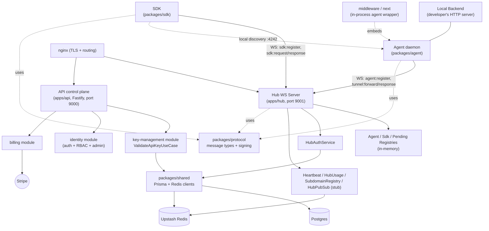
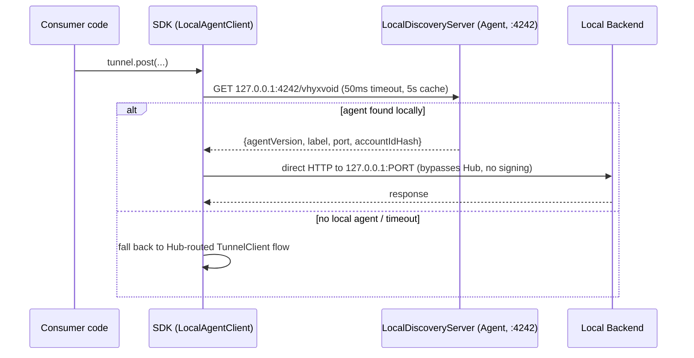
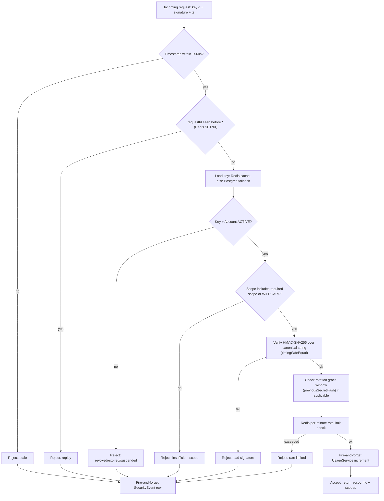

# Project Context

## Overview

This repository ("Black-Server" on disk, package scope `@vhyxvoid/*`) is **VhyxVoid**, a self-hosted tunnel / reverse-proxy platform in the spirit of ngrok. A small **Agent** daemon runs next to a developer's local backend and holds a persistent WebSocket connection to a central **Hub**. Any HTTP (and now WebSocket) request sent through the **SDK** by a consumer application is routed by the Hub to the correct Agent, forwarded to the developer's `localhost` backend, and the response is streamed back — typically in 10-70ms. A separate **API** service is the control plane: accounts, users, API keys (with HMAC-based signing/rotation), Stripe billing, admin RBAC, notifications, and feedback.

The project is mid-rename from an earlier codename **"BlackServer" / "BKSR"** to **"VhyxVoid"** — evidence of the old name (`bksr_live_...` key prefixes, `blackserver` in a stale npm lockfile, a dead `HubClient`/`blackserver-client.ts`) is scattered throughout, alongside the new `@vhyxvoid/*` scope and `VHYXVOID_*` env vars. The system is also mid-migration on a second axis: from a **WebSocket-tunnel model** (Agent+Hub+`TunnelClient`) toward a **subdomain HTTP model** (`SubdomainRegistry` on the Hub + `packages/sdk/src/client.ts`), and is growing **zero-config framework integrations** (`packages/middleware`, `packages/next`) that embed the Agent directly inside a consumer's Express/Fastify/Next.js process instead of running it as a separate CLI daemon.

Current state: functionally working core tunnel loop (agent registration → signed request → forward → response), a fairly complete control-plane API (DDD-style modules, seeded RBAC, Stripe billing, Prisma/Postgres), but with real gaps — an unauthenticated internal Hub endpoint, a stubbed cross-hub pub/sub (no horizontal Hub scaling), an unenforced email-verification check, a likely-misconfigured hub TLS cert, and very thin automated test coverage (4 e2e tests total, no unit tests in any app/package).

## Product Vision (from original build sessions)

VhyxVoid's goal is to become the default tunnel tool for full-stack development teams — not by being cheaper than ngrok, but by being deeply integrated into the workflow so developers stop thinking about tunnels as a separate tool. The core insight: cookie-domain sharing (`Domain=.vhyxvoid.com`) and a multi-label tunnel system mean an entire dev environment (frontend `acme--app`, backend `acme--default`, webhooks `acme--webhooks`) shares one domain, so auth/cookies/CORS just work without configuration.

"Done" for V1: a developer adds one line to their Express/Fastify/Next.js server (`withVhyxvoid(nextConfig)` or middleware equivalent) and their local backend is instantly reachable at a stable public URL — zero separate processes, zero CLI commands, zero config beyond an API key. Teammates hit the same URL from the shared dashboard.

"Done" for the platform: real usage in the dashboard, working billing, team collaboration, and the agent handling webhook testing end-to-end without anyone touching ngrok. Longer-term: the tunnel is the entry point, but the real product is the visibility/collaboration/control layer built on top of it — a developer infrastructure platform.

## Tech Stack

- **Language**: TypeScript throughout (strict mode), Node.js runtime.
- **Monorepo**: pnpm workspaces (`apps/*`, `packages/*`) orchestrated by Turborepo (`turbo.json`); `pnpm@10.6.2` pinned as `packageManager`.
- **API (control plane)**: Fastify 5, Prisma 6 → Postgres, `@upstash/redis` + `ioredis` (both present), `@fastify/jwt` + cookies for user auth, Stripe SDK, Resend (email), bcryptjs, zod. Root-level linting is ESLint 9 flat config (`eslint.config.ts`) — **not** `eslint-plugin-boundaries` (an earlier audit pass claimed that; confirmed wrong by reading the file directly): it's a plain `no-restricted-imports` rule banning deep imports into another workspace package's `src/` and cross-package relative imports.
- **Frontend (apps/web, `@vhyxvoid/web`)**: Next.js 16 / React 19 / MUI 7, moved into this monorepo 2026-09-09 from a standalone repo (was `vhyx-void`). Runs on port **4000** (not the default 3000). Deliberately kept OUT of the root TS project-reference graph (own `tsc --noEmit` script instead) and OUT of the root ESLint flat config (own ESLint 8 config) — see `decision.md` for both. Currently mid-migration off MUI/Vuexy onto VhyxUI, an in-house component library kept in a **separate** sibling repo and consumed via pnpm `link:` — see Configuration & Environment for the linking convention, and `decision.md` for the migration sequencing.
- **Hub (tunnel router)**: plain Node `http` module + `ws` (WebSocketServer in `noServer` mode) — `fastify`, `uWebSockets.js`, and `pg` are also listed as dependencies but are confirmed leftovers from two earlier rewrite attempts (uWebSockets.js → Fastify → plain http+ws), safe to remove. Imports `packages/shared`'s Prisma client directly (no HTTP call to the API).
- **Agent**: `ws` client, `axios` (backend proxy), `better-sqlite3` (durable queue, WAL mode), `commander` (CLI).
- **SDK**: `isomorphic-ws`, hand-rolled HMAC signing. Two live client implementations plus one dead one (see SDK Client Strategy below).
- **Build**: `tsc -b` composite TypeScript project references (root `tsconfig.json`, narrower `tsconfig.api.json`/`tsconfig.hub.json` for Docker builds) + `tsc-alias`; `agent`/`middleware`/`next` bundle with esbuild. Note: `packages/middleware` and `packages/next` sit outside this project-reference graph, so `tsc -b` doesn't build them as part of the standard flow.
- **Testing**: Vitest, config at `tests/vitest.config.ts`. Only 4 e2e tests exist repo-wide.
- **Deployment**: Docker (`Dockerfile.api`, `Dockerfile.hub`) + `docker-compose.yml` (api, hub, nginx, certbot — no Postgres/Redis containers, both external managed services) + nginx reverse proxy with TLS.

## Architecture

Three deployable services (`api`, `hub`, plus the developer-embedded `agent`) share two library packages: `packages/shared` (Prisma + Redis clients and `ValidateApiKeyUseCase`, imported directly by both `apps/api` and `apps/hub` — no HTTP hop between them) and `packages/protocol` (WebSocket wire-message types and the canonical-string HMAC signing helpers used by `agent`, `sdk`, and `hub`).

**The two-auth-scheme split is intentional and permanent** (confirmed by two independent build sessions): Agent registration uses a raw-secret HMAC check (`HubAuthService.authenticateAgent`) because it's a one-time connection handshake over a trusted, deliberately-run process — no replay risk since the connection itself is the session. SDK/API requests use full canonical-signature verification (`ValidateApiKeyUseCase`: timestamp window, replay protection via Redis, scope check, rotation-grace, rate limiting) because they're per-request calls over untrusted networks. These should **not** be unified — doing so would require agents to know the HMAC pepper, which was deliberately kept off the agent. The duplication is accepted tech debt, not a bug, but the two paths must be kept in sync by hand when either changes.



## Directory Structure

```
apps/
  api/            Control-plane REST API (Fastify + Prisma/Postgres). DDD-style modules.
    src/modules/  identity (auth+RBAC+admin), key-management (ApiKey issue/validate),
                  billing (Stripe), notification, feedback
    src/core/     config, DI container, errors, redis client, shared middleware/utils
    prisma/       schema.prisma + migrations (source of truth for the whole system's DB)
    archived/     dead pre-refactor RBAC/key-management code (gitignored, local only)
    NOTE: there is no apps/api/src/app.ts — Fastify app wiring lives elsewhere;
    the /me/password route is registered in identity.routes.ts, not account.routes.ts
    (account.routes.ts exists but is a different, narrower file)
  hub/            Tunnel router: WS server, registries, message router, auth, pubsub
    src/registry/     in-memory Agent/Sdk/Pending/WsConnection registries
    src/router/       Message.router.ts — dispatches by WS message type
    src/services/     HubAuth, HubUsage, Heartbeat, HubPubSub (stub), SubdomainRegistry
    src/repositories/ TunnelSession / TunnelRequest writes (via packages/shared's Prisma)
    prisma/schemaprisma.ts   NOT a real schema — stale dead Prisma model comments
  demo-backend/   Trivial test HTTP server (`/hello`, `/echo`) used to exercise a tunnel locally
  web/            Consumer-facing dashboard (`@vhyxvoid/web`). Next.js 16 / React 19 / MUI 7,
                  moved into the monorepo 2026-09-09. Talks to apps/api over normal HTTP —
                  not part of the tunnel protocol, so not shown in the Architecture diagram
                  above. Mid-migration off MUI/Vuexy onto VhyxUI (separate repo, linked via
                  pnpm `link:`); component migration not yet started as of this entry.

packages/
  protocol/       Wire message types, canonical-string HMAC signing, shared constants/errors.
                  No version negotiation despite a `v: "1"` field on every message (never checked).
  shared/         Prisma client + Redis client + ValidateApiKeyUseCase, imported directly
                  by both apps/api and apps/hub (no HTTP between them)
  agent/          The daemon: AgentClient state machine, MessageBatcher, BackendProxy,
                  ResponseCache, LocalDiscoveryServer, DurableQueue/NoOpQueue, CLI.
                  src/replay/replayQueue.ts — outbound replay works, inbound is partial (see Core Flows §1 note)
  sdk/            Developer-facing client: TunnelClient (WS, browser-oriented, narrowing scope),
                  client.ts (HTTP/subdomain model, confirmed fully implemented — ~198 lines,
                  real VhyxvoidClient class, this is now the primary/default surface),
                  blackserver-client.ts (dead legacy, should be deleted), demo.js (test file,
                  should not ship in published package)
  middleware/     Zero-config in-process Agent wrapper for Express (index.ts) and
                  Fastify (fastify.ts) + Next config (next.ts). Reuses the full CLI-oriented
                  AgentClient (including SQLite durable queue) — acknowledged architectural
                  overfit for an in-process context (see Design Notes).
  next/           Independent (duplicate) Next.js integration — reimplements
                  middleware/next.ts's logic rather than reusing it

archived/         Two prior generations of dead code: an old standalone agent
                  ("agentsdead") and a 742-line audit/refactor-planning doc (all.md)
                  that explains the shape of the current agent/protocol cleanup
tests/            Only 4 vitest e2e tests exist repo-wide (signature, queue replay, heartbeat)
```

## SDK Client Strategy (resolved — was previously contradictory across build sessions)

Two prior build sessions gave conflicting answers on whether `client.ts` (HTTP/subdomain) replaces `TunnelClient` (WebSocket) or the two coexist permanently. Both were reasoning from intent, not a settled decision — **this was genuinely never decided during the build.**

**Resolved direction (recommended by both sessions independently once pressed):**

- `client.ts` (HTTP) is the default, primary SDK surface — confirmed fully implemented, not a stub.
- `TunnelClient` (WebSocket) is narrowed to one legitimate remaining case: browser environments wanting a persistent bidirectional connection where per-request HTTPS overhead is unacceptable (e.g. a live-reload style dev tool). Not the common case.
- Proposed packaging: `@vhyxvoid/sdk` default export → HTTP client; `@vhyxvoid/sdk/ws` named export → TunnelClient.
- No hard deprecation yet, but no new features should land on TunnelClient going forward.
- This is a documentation/export-organization task, not a rewrite — action it before more consumers build against the wrong surface.

## Core Flows

### 1. Agent Registration & Handshake

The Agent daemon authenticates itself to the Hub with a raw shared secret (not the canonical-signature scheme used elsewhere) before it can receive tunneled traffic. This split is intentional (see Architecture).

```mermaid
sequenceDiagram
    participant CLI as agent CLI
    participant AC as AgentClient
    participant Hub as Hub (WS)
    participant Auth as HubAuthService
    participant Store as Postgres/Redis

    CLI->>AC: start() — state: IDLE -> CONNECTING
    AC->>Hub: WS connect
    AC->>Hub: agent:register {keyId, label, rawSecret, agentVersion}
    Hub->>Auth: authenticateAgent(keyId, rawSecret)
    Auth->>Store: load ApiKey (Redis cache, else Postgres + warm cache)
    Auth->>Auth: HMAC-SHA256(pepper, rawSecret) vs secretHash (timingSafeEqual)
    Auth-->>Hub: {accountId, scopes} or reject
    Hub->>Store: TunnelSession.upsert(status=CONNECTED)
    Hub->>Store: Redis SET hub:agent:{accountId}:{label} = hubInstanceId (TTL 25s)
    Hub-->>AC: hub:registered {agentId, accountId, replayPending}
    AC->>AC: state = CONNECTED; start heartbeat; replayQueue()
```

Side effects/non-obvious behavior: on WS close/error the Agent moves to `RECONNECTING` with exponential backoff (1s → 2s → 4s → ... capped at 300s); `AgentClient` never calls `LocalDiscoveryServer.setAccountIdHash()` despite receiving `accountId` in `hub:registered`, so the local-discovery account-verification feature described in code comments is not actually wired up. `hub:registered`'s `replayPending` field is **hardcoded to `false`** — the hub never actually queues inbound requests for an agent to replay; see the inbound-replay note below.

**Inbound replay — confirmed partial, not a full stub.** Outbound replay (agent queues responses while WS is down, drains them on reconnect) works correctly via `packages/agent/src/replay/replayQueue.ts`. Inbound replay (a `tunnel:forward` the hub sent while the agent was mid-reconnect) does not work: `PendingRegistry` (hub-side) holds in-flight requests with a timeout (default 30s); if the agent reconnects within that window it can still respond normally, but if it reconnects after, the request has already been rejected with `AGENT_TIMEOUT`/504 and there is nothing to replay — the agent has no way to know what it missed. If a stale-requestId response does eventually arrive from the agent, the hub silently drops it since the pending entry is gone. Net effect: for GET this is harmless (caller retries), but for POST/DELETE it's a real correctness gap — the local backend processes the mutation but the original caller already got an error. Acceptable for a dev tool today; flagged as the top reliability item before advertising "requests survive disconnects."

### 2. Tunneled HTTP Request (main value-prop flow)

```mermaid
sequenceDiagram
    participant App as Consumer code
    participant SDK as TunnelClient (SDK)
    participant Hub as Hub
    participant Pend as PendingRegistry
    participant Agent as AgentClient
    participant Backend as Local Backend

    App->>SDK: tunnel.post('/api/users', body)
    SDK->>SDK: sign request (canonical string + HMAC)
    SDK->>Hub: sdk:request {requestId, method, path, body, signature}
    Hub->>Hub: authenticateRequest() -> ValidateApiKeyUseCase
    Hub->>Pend: enqueue(requestId, resolve/reject, 30s timeout)
    Hub->>Agent: tunnel:forward {requestId, method, path, body}
    Agent->>Backend: axios request to 127.0.0.1:PORT
    Backend-->>Agent: status + body
    Agent->>Agent: MessageBatcher.add(tunnel:response)
    Agent->>Hub: agent:batch [tunnel:response] (flush at 50ms or 100 items)
    Hub->>Pend: resolve(requestId, {status, body}); clearTimeout
    Hub->>Hub: TunnelRequest.create(...) — fire-and-forget, errors swallowed
    Hub-->>SDK: sdk:response {status, body}
    SDK-->>App: resolved Promise
```

Non-obvious behavior: both the Hub's Postgres writes (`TunnelSession`/`TunnelRequest`) and the Agent's response caching are best-effort/fire-and-forget by design ("never block the tunnel") — DB hiccups are silently swallowed. `ResponseCache` keys only on `path+query`, not on `Authorization`/`Cookie` — **confirmed an oversight, not a conscious tradeoff**, that became acceptable only because the agent runs on a developer's local (assumed single-user) machine. Both original build sessions independently flag this as a real bug to fix (add auth-header hash to the cache key) before the agent is used in any shared/CI environment.

### 3. Local Discovery Fast Path

When the SDK and Agent are on the same machine, the SDK bypasses the Hub entirely for lower latency.



Gap: the `accountIdHash` field exists specifically so the SDK can confirm it's talking to _its own_ agent, but it's never populated by the Agent nor checked by the SDK — any process that can reach `127.0.0.1:4242` is routed through whichever agent is running, regardless of account/label. Low severity since it requires local machine access, but the security property implied by the field doesn't exist end-to-end.

### 4. API Key Validation (shared by Hub-SDK auth and direct API auth)



Note: this is the path used correctly for SDK↔Hub auth, but the Hub's own `HubAuthService.authenticateAgent` re-implements a _subset_ of this logic ad hoc for Agent registration rather than reusing it. Confirmed intentional (see Architecture) — not a bug, but must be kept in sync by hand.

**Rate limiting is a known stub**: `rateLimitPerMinute` in `ValidateApiKeyUseCase` always returns `-1` (unlimited); `buildCachePayload` hardcodes `Infinity`. Plan-based limits were never actually wired to a real check.

### 5. User Signup / Login / RBAC

```mermaid
sequenceDiagram
    participant User
    participant Api as apps/api (Fastify)
    participant Identity as identity module
    participant DB as Postgres

    User->>Api: POST /auth/signup {email, password}
    Api->>Identity: RegisterUser use-case
    Identity->>DB: User.create(); EmailVerificationToken.create()
    Identity->>Identity: notificationService.sendEmailVerification (AND console.log raw token — both happen)
    Api-->>User: verification email sent (Resend)

    User->>Api: POST /auth/login {email, password}
    Api->>Identity: Login use-case (bcrypt compare, lockout check via ensureCanLogin())
    Identity->>DB: Session.create(tokenHash); AccountMember lookup (roleLevel)
    Api-->>User: JWT via @fastify/jwt, set access_token cookie

    User->>Api: GET /account/... (Cookie: access_token)
    Api->>Api: userAuthGuard (jwtVerify)
    Api->>Identity: check Role/Ability via RoleAbility (account-scoped RBAC)
    Identity-->>Api: allow/deny
```

**Confirmed live gap: email verification is not enforced at login.** `ensureCanLogin()` (`User.entities.ts:119-134`) checks only `deletedAt`, `status`, and `lockedUntil` — no `isEmailVerified` check. The only `isEmailVerified`-gated throw in the codebase is dead, commented-out code (`User.entities.ts:309`). An unverified user can register and log in normally today. This needs a real fix, not just documentation — add the check to `ensureCanLogin()` or `Login.usecase.ts` directly.

Separate from this is a fully independent **Admin RBAC system** (`AdminUser`/`AdminRole`/`AdminAbility`/`AdminSession`, guarded by `adminAuthGuard`/`requireAbility`/`requireSuperAdmin`, all actions written to an immutable `AdminAuditLog`) — it does not share code with the regular-user RBAC above.

## Data Model

```mermaid
erDiagram
    USER ||--o{ SESSION : has
    USER ||--o{ ACCOUNT_MEMBER : "is member via"
    ACCOUNT ||--o{ ACCOUNT_MEMBER : has
    ACCOUNT ||--o{ ROLE : defines
    ROLE ||--o{ ROLE_ABILITY : grants
    ABILITY ||--o{ ROLE_ABILITY : "granted by"
    ACCOUNT ||--o{ API_KEY : owns
    API_KEY ||--o{ API_KEY_SCOPE : has
    ACCOUNT ||--o{ TUNNEL_SESSION : "connects agents"
    API_KEY ||--o{ TUNNEL_SESSION : authenticates
    ACCOUNT ||--o{ TUNNEL_REQUEST : logs
    API_KEY ||--o{ TUNNEL_REQUEST : logs
    ACCOUNT ||--|| SUBSCRIPTION : "billed via"
    SUBSCRIPTION ||--o{ INVOICE : generates
    ACCOUNT ||--o{ USAGE_AGGREGATE : meters
    API_KEY ||--o{ USAGE_AGGREGATE : meters
    ACCOUNT ||--o{ NOTIFICATION : receives
    USER ||--o{ FEEDBACK : submits
    USER ||--o{ AUDIT_LOG : generates
    API_KEY ||--o{ SECURITY_EVENT : flags

    ADMIN_USER ||--o{ ADMIN_USER_ROLE : has
    ADMIN_ROLE ||--o{ ADMIN_USER_ROLE : "assigned to"
    ADMIN_ROLE ||--o{ ADMIN_ROLE_ABILITY : grants
    ADMIN_ABILITY ||--o{ ADMIN_ROLE_ABILITY : "granted by"
    ADMIN_USER ||--o{ ADMIN_SESSION : has
    ADMIN_USER ||--o{ ADMIN_AUDIT_LOG : generates

    USER {
        string id
        string email
        string passwordHash
        bool isEmailVerified
        int failedLoginAttempts
        datetime lockedUntil
        int tokenVersion
        datetime deletedAt
    }
    ACCOUNT {
        string id
        string type "PERSONAL or ORGANIZATION"
        string status "ACTIVE PAST_DUE RESTRICTED SUSPENDED CANCELED DELETED"
        string slug
        string stripeCustomerId
    }
    API_KEY {
        string keyId "public id, vhyxvoid_dev_/live_ prefix"
        string secretHash
        string previousSecretHash "rotation support"
        string environment "DEV or PROD"
        string status "ACTIVE REVOKED EXPIRED"
        datetime rotationGraceEndsAt
    }
    TUNNEL_SESSION {
        string agentId
        string hubInstanceId
        string label
        string status "CONNECTED DISCONNECTED EVICTED"
    }
    TUNNEL_REQUEST {
        string requestId
        int status
        int durationMs
    }
    SUBSCRIPTION {
        string stripeSubscriptionId
        string plan "FREE PRO ENTERPRISE"
        string status
    }
    USAGE_AGGREGATE {
        string metric
        datetime periodStart
        int count
        datetime lockedAt "immutable once invoiced"
    }
```



`OAuthAccount` — **confirmed planned-but-never-started** (Google/GitHub login as an alternative to email/password; no use-case, route, or provider config anywhere). Safe to leave (no data, no harm) or drop via migration for schema cleanliness; build later if OAuth is prioritized. Several old model definitions are left commented out in `schema.prisma` (~15% of the file) rather than deleted.

## Configuration & Environment

| Variable                                                                                                                | Purpose                                                                                                                                                                                                                                           | Required?                      |
| ----------------------------------------------------------------------------------------------------------------------- | ------------------------------------------------------------------------------------------------------------------------------------------------------------------------------------------------------------------------------------------------- | ------------------------------ |
| `DATABASE_URL`                                                                                                          | Postgres connection string (shared by api & hub via `packages/shared`)                                                                                                                                                                            | Yes, both services             |
| `UPSTASH_REDIS_REST_URL` / `_TOKEN`                                                                                     | Redis (Upstash REST client) for caching, rate limiting, presence, pending mirror                                                                                                                                                                  | Yes, both services             |
| `SERVER_HMAC_PEPPER`                                                                                                    | Secret pepper mixed into every API-key HMAC (must be ≥32 chars — hub validates this at boot)                                                                                                                                                      | Yes, both services             |
| `PORT` (api) / `HUB_PORT` (hub)                                                                                         | Listen port — api defaults 9000, hub's fallback is inconsistent (main.ts logs 3001, actually binds 9001)                                                                                                                                          | Yes                            |
| `JWT_SECRET`, `JWT_EXPIRES_IN` (`JWT_ACCESS_SECRET`/`JWT_REFRESH_SECRET` in practice)                                   | User-session JWT signing (`@fastify/jwt`, HS256/symmetric — this is what's actually live)                                                                                                                                                         | Yes (api)                      |
| `PRIVATE_KEY`/`PUBLIC_KEY` (dev) vs `PRIVATE_KEY_B64`/`PUBLIC_KEY_B64` (prod) + `.pem` files under `apps/api/src/keys/` | **Confirmed unused.** Leftover from an abandoned plan to use RS256 (asymmetric) JWT signing instead of the HS256 symmetric scheme actually shipped. Safe to delete unless RS256 is revisited later (would need `sign.ts` in the SDK updated too). | No — dead                      |
| `STRIPE_SECRET_KEY`, `STRIPE_WEBHOOK_SECRET`, `STRIPE_PRO_PRICE_ID`, `STRIPE_ENTERPRISE_PRICE_ID`                       | Billing module / Stripe integration. Flat-rate price IDs only — see Billing note below.                                                                                                                                                           | Yes (api)                      |
| `RESEND_API_KEY`, `EMAIL_FROM`, `SUPPORT_EMAIL`, `ADMIN_FEEDBACK_EMAIL` (dev only)                                      | Transactional email                                                                                                                                                                                                                               | Yes (api)                      |
| `HUB_INTERNAL_URL` (dev only, api)                                                                                      | Used by `POST /api/v1/tunnelproxy/request` (`tunnelProxy.routes.ts`) to reach the Hub's `POST /internal/proxy` — a synchronous HTTP tunnel-request path, alternative to the SDK's WS/subdomain flow. A real caller exists (corrected 2026-09-13 — previously documented as unbuilt/no-caller, which was wrong); that caller was simply broken (missing auth header, fixed — see context.md item 40) and itself has no external callers yet. | Wired but unused end-to-end     |
| `HUB_INTERNAL_SECRET` (hub, and api once a real caller exists)                                                          | Added 2026-09-12. Shared secret required on every `/internal/proxy` request (`x-hub-internal-secret` header, checked via `crypto.timingSafeEqual`). Hub fails closed (503) when unset — see Known Risks #7.                                       | No — endpoint has no caller yet |
| `HUB_DOMAIN` (dev only, hub)                                                                                            | Public hostname for tunnel URLs / subdomain routing                                                                                                                                                                                               | Yes (hub, dev)                 |
| `HUB_DEBUG_LOGGING` (hub)                                                                                               | Added 2026-09-12. `true` enables verbose flow-debug logging (subdomain registration, per-request tunnel logs) via `apps/hub/src/utils/debug.ts`. Default off. Never gates secret-adjacent output — those lines were deleted outright, not flagged. | No — defaults off               |
| `CLIENT_123_SECRET`                                                                                                     | Oddly-named literal var in both api env files — likely a placeholder/test secret                                                                                                                                                                  | Flag for review                |
| `VHYXVOID_API_KEY`/`_SECRET`/`_PORT`/`_LABEL`/`_HUB_URL`/`_QUEUE_PATH`/`_WRITE_ENV`/`_ENV_KEY`                          | Agent CLI and `packages/middleware`/`packages/next` configuration                                                                                                                                                                                 | Yes, for agent/middleware/next |

**Project convention — VhyxUI linking.** `apps/web` consumes `@vhyxui/react` and `@vhyxui/tokens` from a **separate** repo (VhyxUI, not part of this monorepo) via pnpm's `link:` protocol, using **relative** paths (`link:../../../VhyxUI/packages/react`, `link:../../../VhyxUI/packages/tokens`), not absolute ones. This assumes VhyxUI is checked out as a **sibling directory** to this repo on disk — any contributor building `apps/web` needs both repos checked out side by side at that relative depth, or the link needs updating. This is the established pattern for any future workspace that consumes VhyxUI too, not a one-off for `apps/web` — don't rediscover this per-session. `apps/web/next.config.ts` also widens `turbopack.root` to the common parent of both repos (required for Turbopack to resolve a `link:` target outside its own root) and any VhyxUI component must be rendered from a `'use client'` boundary (VhyxUI's components aren't RSC-safe). See `apps/web/README.md` for the full setup and `decision.md`'s 2026-09-09 "VhyxUI stays a separate repo" entry for why this topology was chosen over vendoring or publishing.

**Dev vs Prod differences observed**: prod API env drops `JWT_SECRET`/`JWT_EXPIRES_IN`/`HUB_INTERNAL_URL`/`ADMIN_FEEDBACK_EMAIL` and renames the key-pair vars to base64 variants (`_B64`) for safer injection; prod Hub env drops `PRIVATE_KEY`/`PUBLIC_KEY`/`HUB_DOMAIN`. Neither Postgres nor Redis is containerized in `docker-compose.yml` — both point at external managed instances via connection strings.

**Local dev backend for functional testing** — see `LOCAL_DEV_BACKEND.md` (repo root). A local Postgres 16 database (`Black-server`, already migrated + already has real seeded org/member/tunnel/API-key data) already exists on this machine independent of `apps/api/.env`'s active (remote Neon) `DATABASE_URL`. Overriding `DATABASE_URL` for just the `apps/api` dev process (never editing `.env`) lets `apps/web` be functionally tested against a real running API with real role-gated data, instead of every request failing at the network level as in every migration-step session before 2026-09-10. Set up specifically because Steps 3 and 4 both hit UI that's impossible to verify without real admin/multi-member org data. See `decision.md`, 2026-09-10, "Local dev backend set up as standing test infrastructure".

**Nginx/TLS — SAN question resolved live 2026-09-12; a different, more urgent problem found instead.** The repo's `nginx.conf` points `hub.vhyxvoid.com`'s `ssl_certificate`/`ssl_certificate_key` at the `/etc/letsencrypt/live/api.vhyxvoid.com/...` path, which looked like a possible misconfiguration from reading the file alone. A live check from this sandbox (which turned out to have network egress) settled it: `openssl s_client -connect hub.vhyxvoid.com:443 -servername hub.vhyxvoid.com` shows the actual served certificate's SAN is `DNS:*.vhyxvoid.com, DNS:vhyxvoid.com` — a wildcard, so the `api.`-named lineage directory is a red herring; the cert itself covers `hub.` regardless of which domain name certbot filed it under. **The real, live, urgent problem found instead: this certificate expired on 2026-08-03** (checked against the live clock, 2026-09-12 — over 5 weeks ago), on both `hub.` and `api.` subdomains (same cert, same expiry). Both services are otherwise up (`curl -k .../health` → 200), so this is purely a TLS-validation failure, but it will reject any real client that doesn't skip certificate verification. This cannot be fixed from a repo/session — it requires direct access to the live server to check certbot's renewal automation (the `certbot` container in `docker-compose.yml` per the Tech Stack section) — its cron/systemd timer or container logs. See `decision.md`, 2026-09-12, and Known Risks #2.

## Known Risks / Gaps

**Reconciled 2026-09-12** against the original Phase 0-3 audit, then **audited in full for the Hub 2026-09-12** (security + reliability + the HubPubSub/inbound-replay questions — see `decision.md`'s many 2026-09-12 entries for full reasoning on every item below marked FIXED/resolved this pass). Status legend: **OPEN** (unchanged), **OPEN\*** (open, but situation shifted since the original description), **FIXED**, **STALE**.

### Confirmed by direct file/grep verification

1. **OPEN — Email verification not enforced at login.** Re-verified directly: `ensureCanLogin()` (`User.entities.ts:119-134`) still checks only `deletedAt`, `status`, `lockedUntil`; the only `isEmailVerified` check anywhere is the same dead, commented-out code (now around line 309). No session has touched this. Any account can be used unverified today.
2. **RESOLVED (live-checked) — Hub TLS cert.** The SAN theory in the original finding was wrong to worry about: live `openssl s_client` against both `hub.vhyxvoid.com` and `api.vhyxvoid.com` (this sandbox has network egress, checked 2026-09-12) shows the served cert's SAN is `DNS:*.vhyxvoid.com, DNS:vhyxvoid.com` — a wildcard, so `hub.` is covered regardless of the certbot lineage directory name. **But the certificate is expired**: `Not After: Aug 3 21:03:51 2026 GMT`, checked against the live clock `Sat Sep 12 08:32:46 UTC 2026` — over 5 weeks past expiry, on both subdomains (same cert). Services are up (`curl -k .../health` → 200 on both); only the TLS handshake's cert-validity check fails, which most real clients won't skip. **This is a live production issue requiring direct server access this session doesn't have** — certbot's renewal automation (the `certbot` container in `docker-compose.yml`) has evidently not run successfully in over a month. See decision.md, 2026-09-12, "nginx/TLS cert: the SAN theory was wrong, but the live cert is actually expired" for exact commands. **Action needed from the user directly on the live server**: check `certbot renew` / its cron or systemd timer / the `certbot` container's logs.
3. **DECIDED (accepted, not fixed) — Inbound replay is real but incomplete.** No longer an open "no consensus" question — decided 2026-09-12: accepted as-is for pre-launch/casual-dev-tool usage. Explicit trigger condition recorded for when to revisit: before onboarding any team relying on POST/DELETE reliability across reconnects, or before any product messaging implying "requests survive disconnects." See decision.md, 2026-09-12, "Inbound replay gap: accepted as-is for pre-launch."
4. **STALE — "Rate limiting is not actually enforced" is no longer accurate.** Re-read `ValidateApiKeyUseCase` and `PLAN_LIMITS` (`apps/api/src/modules/billing/domain/enums/index.ts`) directly: rate limiting **is** enforced end-to-end today — `cached.rateLimitPerMinute !== Infinity && count > cached.rateLimitPerMinute` gates every gateway request, and `PLAN_LIMITS` carries real per-tier values (FREE 60/min, PRO 1,000/min, ENTERPRISE genuinely `Infinity` by design, not a stub). The original claim ("`rateLimitPerMinute` always returns -1", "`buildCachePayload` hardcodes `Infinity`") does not match current code and can't be dated to a specific fixing session — likely already wrong at the time of the original audit, not a later fix. **Narrower gap remains**: `HardcodedPlanLimitService.getLimitsForAccount()` always returns the `PRO` tier for every account regardless of actual subscription (comment: "TODO: replace with Subscription lookup when billing is built") — so limits are real and enforced, just not yet plan-accurate. This is a billing-wiring gap, not a rate-limiting gap; see item 6.
5. **OPEN — `ResponseCache` keys only on `path+query`.** Re-read `packages/agent/.../ResponseCache.ts` directly: `buildKey()` is still `query ? \`${path}?${query}\` : path`, no auth-header/cookie component. Unchanged. (Separately, this same file's `CachedResponse` gained a `bodyEncoding` field 2026-09-12 as part of item 21's fix — unrelated to this cache-key gap.)
6. **OPEN — Billing/usage tracking is disconnected from Stripe.** Unchanged; no decision.md entry addresses a billing model. Compounded by item 4's narrower finding — `HardcodedPlanLimitService` is the concrete piece of code waiting on this decision.
7. **FIXED — Unauthenticated internal endpoint.** Fixed 2026-09-12: `POST /internal/proxy` now requires a `x-hub-internal-secret` header, checked via `crypto.timingSafeEqual` against `HUB_INTERNAL_SECRET` (new pure/tested helper: `apps/hub/src/utils/internalAuth.ts`). **Fails closed** — if `HUB_INTERNAL_SECRET` is unset (true today; correction 2026-09-13: a caller *does* exist, `POST /api/v1/tunnelproxy/request` — see item 40 — it's just that nothing calls that route yet), every request gets a 503, not silent bypass. See decision.md, 2026-09-12, "internal/proxy authentication." Tested: `tests/e2e/internalProxyAuth.test.ts`.
8. **FIXED — Debug logging leaks key material.** Fixed 2026-09-12. Deleted outright (not just gated, since these should never be printable): `HubAuth.service.ts`'s pepper-length/expectedHash/storedHash prints, and a worse, previously-unflagged line — `console.log('[hub-auth] received agent register:', JSON.stringify(msg))`, which logged the agent's **plaintext raw secret** (`msg.rawSecret`), not just a hash. Gated behind a new `HUB_DEBUG_LOGGING=true` env var (default off, `apps/hub/src/utils/debug.ts`): `Message.router.ts`'s subdomain-registration-flow lines, `AgentRegistry.register()`'s per-registration log (now logs `agentId`/`accountId`/`label` only, not the raw session/`ws` object it used to dump), and three previously-unflagged `HttpTunnelHandler.ts` lines that fired on every single incoming request/connection (`isTunnelRequest`, forward-send, browser-WS-connected). See decision.md, 2026-09-12, "Hub debug logging."
9. **DECIDED (confirmed safe, trigger condition recorded) — No horizontal Hub scaling.** `HubPubSub.ts` is still a confirmed no-op stub (unchanged). Investigated 2026-09-12 whether anything today assumes multi-hub behavior: confirmed **no** — `findAgentHub()`/`publishForward()` (the two methods that would matter) are never called anywhere; only lifecycle `start()`/`stop()` are. Safe as-is for single-instance deployment. **Recorded trigger, not open-ended**: build Phase 2 before running more than one Hub process in production for any reason, including a blue/green deploy — until then, a second instance would misroute (`AGENT_NOT_FOUND` for agents connected to the other instance), a confusing, load-balancer-dependent failure mode. See decision.md, 2026-09-12, "HubPubSub stub."
10. **OPEN, confirmed intentional — Auth-path divergence** (Agent HMAC vs SDK canonical signature). Matches `decision.md`'s 2026-09-09 "Agent/SDK auth schemes stay permanently separate" entry — not a bug, permanent by design.
11. **RESOLVED — Plaintext-looking credentials on disk.** `vhyxconfig.md` deleted 2026-09-12 — user confirmed the real credentials it contained were rotated manually outside any session. Confirmed via `git status`/`git log --all -- vhyxconfig.md` it was never tracked (clean local delete, no commit involved).
12. **OPEN\* — Three overlapping SDK client implementations.** Situation has shifted since the original finding, but the decided direction (`decision.md` 2026-09-09: `client.ts` becomes the default/primary export, `TunnelClient` narrows to a secondary `@vhyxvoid/sdk/ws` export) is still **not** actioned. Current `packages/sdk/src/index.ts` now exports both `TunnelClient` (still listed/positioned first, as "Existing WebSocket SDK") and `client.ts`'s `createClient`/`VhyxvoidClient` (added after, as "HTTP client SDK") from the **same** barrel — an improvement (client.ts is now actually reachable by consumers, previously true only per the SDK Client Strategy section's "confirmed fully implemented" note) but not the primary/secondary export-path split that was decided. `blackserver-client.ts` (dead legacy) is still present, untouched.
13. **OPEN — `packages/sdk/src/demo.js`.** Still present, unchanged.
14. **OPEN — Duplicated framework-integration logic** (`packages/middleware/src/next.ts` vs `packages/next/src/index.ts`). Unchanged.
15. **FIXED — Missing/misplaced workspace dependencies.** Both halves resolved 2026-09-13. `packages/agent` was declaring `@vhyxvoid/protocol` only under `devDependencies` despite runtime use — re-verified still true immediately before fixing, then moved to `dependencies`. `packages/middleware` and `packages/next` were both missing a real dependency declaration for `@vhyxvoid/agent` (their bare `import { AgentClient } from "@vhyxvoid/agent"` had no dependency-graph-correct type source), which is what made both fail `tsc -b` from a clean state (`'disableQueue' does not exist in type 'AgentConfig'`, confirmed reproducibly the day before) — fixed by adding `"@vhyxvoid/agent": "workspace:*"` to both `package.json`s, matching the existing convention (e.g. `apps/hub`'s `"@vhyxvoid/shared": "workspace:*"`). A repo-wide grep for every workspace package importing `@vhyxvoid/agent`/`@vhyxvoid/protocol`/`@vhyxvoid/shared`/`@vhyxvoid/sdk` without declaring it found no further instances beyond these three. **Verified**: `pnpm install` created real symlinks for all three (`packages/next/node_modules/@vhyxvoid/agent`, `packages/middleware/node_modules/@vhyxvoid/agent`); deleted `tsconfig.tsbuildinfo` and `dist/` for all three packages and rebuilt each from scratch — all clean, no errors. **Runtime-verified, not just type-checked**: confirmed via `tests/e2e/frameworkIntegrationDependency.test.ts` that both `packages/middleware`'s `vhyxvoid()` and `packages/next`'s `withVhyxvoid()` actually import and execute without throwing (with no credentials configured, exercising the documented safe/no-op path) — and separately confirmed by grepping the built `dist/index.js` output for `AgentClient`-only strings (e.g. `NoOpQueue`, `drainForReplay`) that esbuild was already correctly inlining `@vhyxvoid/agent`'s code into both bundles even before this fix, since neither package's esbuild `--external` list excludes it — meaning the missing declaration broke local `tsc -b`/dev-time type-checking but would **not** have broken a real end-user's installed package (the bundle is self-contained). CI's build step (`.github/workflows/ci.yml`) no longer excludes either package. See decision.md, 2026-09-13, "packages/next and packages/middleware: @vhyxvoid/agent dependency fix".
16. **OPEN — `withVhyxvoid` may start a tunnel during `next build`/CI.** Untouched.
17. **OPEN\* — `AgentClient` reused wholesale in `packages/middleware`, situation improved.** A `NoOpQueue` class was added (`packages/agent/src/queue/NoOpQueue.ts`, new file) and `AgentClient` now branches on a `disableQueue` config flag to use `NoOpQueue` instead of instantiating `DurableQueue`/SQLite at all when set (`packages/middleware/src/tunnel.ts:49` sets `disableQueue: true` with an explicit comment: "in-process agent reconnects automatically; no SQLite needed"). `replayQueue()` was also generalized to accept a `QueueLike` interface instead of a concrete `DurableQueue`, so it works with either. **Net effect: the specific complaint (SQLite durable queue instantiated inside an in-process middleware context) is now actually fixed**, not just patched around — no SQLite file gets created when middleware runs. The broader architectural point (a lighter, purpose-built `LightAgentClient` would still be a cleaner design than branching the full CLI-oriented class) remains a valid but non-urgent suggestion, not a live bug.
18. **OPEN — Account slug generation has no retry loop.** Untouched (out of scope for the 2026-09-12 Hub-only audit — this is apps/api).
19. **FIXED (partially — see caveat) — `onAgentClose` called without `await`.** Fixed 2026-09-12: the WS close handler is now `async` and awaits `router.onAgentClose(ws)` with a `try/catch` (previously a bare `.catch`). **Important caveat, recorded so this isn't assumed fully solved**: the documented race (a stale subdomain key from a slow async unregister briefly surviving into a new registration for the same label) is between two *independent* WS connections/event-loop turns — awaiting inside one handler cannot serialize it against a different connection's message handler. The `await` fix is a genuine correctness/observability improvement (deterministic completion, real error visibility) but does not eliminate the underlying race, which remains open and would need a per-(accountId,label) mutex or register-time check to actually close. See decision.md, 2026-09-12, "onAgentClose."
20. **FIXED — `AgentRegistry.findByAgentId` is O(n).** Fixed 2026-09-12: now `return this.byAgentId.get(agentId)` — the O(1) reverse-index map was already maintained by `register()`/`evict()`, just never used by this method. Tested: `tests/e2e/agentRegistry.test.ts`.
21. **FIXED (response path only) — `tunnel:forward`/`tunnel:response` body had no explicit encoding field.** Investigated 2026-09-12 and found this **understated the actual bug**: `BackendProxy.forward()` unconditionally did `bodyBuffer.toString("utf8")` on every backend response regardless of content type — a lossy, irreversible corruption of any binary response (images, PDFs, etc.), not just "fragile inference" on the decode side. Fixed: added optional `bodyEncoding?: 'utf8'|'base64'` to `TunnelResponseMsg`/`SdkResponseMsg` (protocol); `BackendProxy.forward()` now detects binary content-type and base64-encodes correctly (byte-for-byte round-trip verified in tests); `ResponseCache`'s `CachedResponse` preserves `bodyEncoding` too; `HttpTunnelHandler.writeResponse()` prefers the explicit field over content-type sniffing (falls back for an older agent). **Explicitly NOT fixed, confirmed-present follow-up items**: (a) the SDK client (`packages/sdk`) doesn't yet decode `bodyEncoding: 'base64'` on the `sdk:response`/WS path — the field now propagates through `Message.router.ts` but nothing consumes it client-side yet, so binary responses via that path (as opposed to the raw HTTP tunnel path) are still corrupted; (b) the *request* direction has the mirrored bug — `HttpTunnelHandler.readBody()` also unconditionally does `.toString('utf8')`, so a binary file uploaded through a tunneled subdomain would be corrupted before it reaches `TunnelForwardMsg.body`. Both flagged, not fixed — see decision.md, 2026-09-12, "bodyEncoding" for the full scoping rationale. Tested: `tests/e2e/backendProxyBodyEncoding.test.ts`.
22. **STALE — "Protocol has no real versioning" was already wrong before this session.** Checked 2026-09-12: `packages/protocol/src/serializer.ts`'s `parseMessage()` already throws `ProtocolError('VERSION_UNSUPPORTED', ...)` on any `v` mismatch, and has since the file's very first commit — not a later fix, the original claim was simply inaccurate. Both Hub and client side (`AgentClient.ts`, `TunnelClient.ts`) parse through this same shared function, so it's enforced consistently both directions. No code change needed; added a regression test since nothing previously verified it: `tests/e2e/protocolVersionCheck.test.ts`.
23. **OPEN\* — `PendingRegistry` is in-memory only, description corrected; severity assessed and accepted for now.** Re-read `Pending.registry.ts` directly: it does write a Redis mirror on `enqueue()`/`resolve()`/`reject()`/`rejectAllForAgent()` (`hub:pending:{requestId}`, TTL-bound) — this predates the current audit cycle (present since the file's original April commit) and was never reflected in the prior description. However, the Redis copy stores only `{accountId, agentLabel, ts}` metadata, **not** the `resolve`/`reject` closures (bound to a live WS connection, inherently unserializable) — so a hub crash still drops every in-flight request exactly as originally described. **Assessed and decided 2026-09-12**: acceptable risk for current single-instance/pre-launch deployment (bounded, client-retriable failures, not silent data loss) — tied explicitly to the same trigger condition as item 9 (HubPubSub Phase 2), since a real fix here and horizontal-scaling support are the same piece of work. See decision.md, 2026-09-12, "PendingRegistry crash gap."

### Cruft / cleanup, safe to act on directly

24. **OPEN — Two lockfiles.** `package-lock.json` still present at repo root, still not in `.gitignore` (grepped directly — no match). Unchanged.
25. **FIXED, scope expanded — Unused dependencies in `apps/hub/package.json`.** Fixed 2026-09-12: removed the three originally-named (`fastify`, `uWebSockets.js`, `pg`) plus six more found to be equally unused during the same verification pass — `bcryptjs`, `jsonwebtoken`, `pino`, `ioredis`, `zod`, and all six `@fastify/*` plugins (`compress`/`cookie`/`cors`/`helmet`/`jwt`/`rate-limit`) — plus their orphaned devDependencies (`@types/pg`, `@types/jsonwebtoken`, `pino-pretty`) and the now-dead `apps/hub/src/types/uWebSockets.d.ts`. Confirmed zero real imports for all nine before removing; `pnpm install` + `pnpm --filter @vhyxvoid/hub typecheck`/`build` both pass clean after. See decision.md, 2026-09-12, "apps/hub dependency cleanup."
26. **OPEN — Heavy AI-assisted-dev cruft.** Not re-audited file-by-file this pass, but no session_update.md entry claims a cleanup pass touched this — presumed unchanged.
27. **OPEN — Stale/dead files that could mislead a reader.** No session_update.md entry claims any of these were removed — presumed unchanged. (`apps/hub/src/registry/WsConnection.registry.ts` is a newly-noticed addition to this category — confirmed dead/never-instantiated, `HubServer.ts` has it commented out — not acted on this session, out of scope.)
28. **OPEN — Inconsistent lint/format setup** (`apps/hub`'s legacy ESLint 8 config). Unchanged.
29. **OPEN — `PRIVATE_KEY`/`PUBLIC_KEY` env vars and `.pem` files.** Re-checked directly: all four `.pem` files (`public.pem`, `private.pem`, `prod_public.pem`, `prod_private.pem`) still present under `apps/api/src/keys/`. Unchanged.
30. **STALE (no action needed) — `OAuthAccount` Prisma model.** Re-confirmed present in `schema.prisma` (`model OAuthAccount`, referenced from `User.oauthAccounts`). No data, no harm either way — this item was always "leave or drop, no urgency," not a risk; downgrading from the numbered risk list is not needed but the status is unchanged from "planned, never started."
31. **OPEN — `vhyxvoid_next` duplicate vs `middleware/next.ts`.** Same as item 14 — unchanged.

### New risks discovered since the last audit pass (surfaced by later bugfix/migration/Hub-audit sessions, never folded into this list until now)

32. **FIXED (2026-09-12 Hub audit) — `RedisApiKeyCacheService.get()`/`.markRequestId()` unguarded Redis calls, plus a correction to the premise.** The 2026-09-12 reconciliation pass had framed this as sitting "on the Hub's own request-validation path" — **investigated directly and found that premise false**: the Hub does not use `apps/api`'s `RedisApiKeyCacheService` at all. It uses a wholly separate, independently-duplicated `ValidateApiKeyUseCaseImpl` in `packages/shared/src/validateApiKey.ts`, which was **already** fail-soft on cache reads and fail-open on `markRequestId` (with an explicit "fail open — never block on Redis failure" comment already in the code). The Hub's real gateway path was never exposed to this bug. The literal file named IS real and was genuinely unguarded, but backs a different, currently-**dormant** path: `apps/api`'s own `ValidateApiKeyUseCase.usecase.ts`, wired only to `POST /gateway/v1/validate` — confirmed via repo-wide grep that nothing calls that route today. Fixed anyway (dormant code is still real code): `get()` now fails soft (returns null, falls through to the existing DB fallback); `markRequestId()` now fails OPEN (matches the already-live `packages/shared` copy's choice) — full tradeoff reasoning recorded in decision.md, 2026-09-12. **New risk surfaced by this investigation, not yet resolved**: two independent implementations of the identical `ValidateApiKeyUseCase` logic exist (`apps/api`'s and `packages/shared`'s) with no shared source of truth — one was already safer than the other purely by accident of who wrote it, and nothing keeps them in sync. See item 37. Tested: `tests/e2e/redisApiKeyCacheFailSoft.test.ts`.
33. **FIXED — `apps/api/src/server.ts` registered `setErrorHandler` after `registerPlugins`/`registerRoutes` completed.** Fixed 2026-09-12 (`decision.md`, "Bug 2 resolution"). Fastify resolves each nested plugin's inherited error handler at registration time, not lazily — so effectively the entire API surface (everything registered via `server.register(module, {prefix})`) was silently wired to Fastify's own default error handler instead of this app's custom one, for an unknown but likely long duration. Concrete effects while broken: every `ZodError` returned an opaque 500 instead of a clean 400; every `AppError` (`ForbiddenError`, `NotFoundError`, etc.) lost its intended `{success, code, message, data, requestId}` shape. This was also the true root cause misdiagnosed in an earlier session as a `RemoveMemberUseCase` bug (see decision.md's 2026-09-11 Step 5c entry, corrected 2026-09-12) — `RemoveMemberUseCase` itself needed no changes. Worth remembering as a class of risk: **Fastify plugin/error-handler registration order is load-bearing and easy to silently break again** if `server.ts` is restructured.
34. **OPEN — `GenericServerTable`'s internal query key is disjoint from the semantic query-key factories mutation hooks invalidate.** Discovered during the VhyxUI frontend migration (Step 5c, `decision.md` 2026-09-11): `GenericServerTable` runs its own `useQuery` keyed by `[tableKey, params]` (an ad hoc template-string convention each screen sets independently), completely separate from e.g. `memberKeys.list(...)`/`apiKeyKeys.lists(...)` query-key factories that mutation hooks call `invalidateQueries` against — so a successful mutation can return 200 and correctly persist, while the visible table silently never refreshes until a full page reload. Point-fixed for Members and API Keys (both screens' mutation hooks now also invalidate the table's literal `tableKey` string alongside their semantic key). **Tunnels is unaffected only because it has no mutations at all** — not because it avoids the pattern. The design gap itself, in `GenericServerTable` (`apps/web`), is unfixed and will recur on any future list screen that adds a mutation without remembering this convention. Suggested direction already on record: an exported `tableQueryKey(tableKey)` helper so mutation hooks can invalidate it directly.
35. **OPEN, operational (not a code bug) — zombie `ts-node-dev` supervisor processes accumulate across sessions.** Discovered 2026-09-12 (`decision.md`, "Bug 2" entry's closing note): stopping `apps/api`'s local dev server by killing the port-9000 listener only kills the `ts-node-dev --respawn` child, not the supervisor parent, which silently respawns and re-binds later. Six had accumulated across multiple past sessions before being found via `ps aux | grep ts-node-dev` (not just `lsof`). `LOCAL_DEV_BACKEND.md` has a corrected stop procedure, but nothing enforces it — a future session that forgets will hit the same `EADDRINUSE` crash-loop confusion.
36. **OPEN — `HardcodedPlanLimitService` always returns PRO-tier limits for every account.** Surfaced during the 2026-09-12 reconciliation pass while re-verifying item 4 (rate limiting). `getLimitsForAccount()`'s own comment: "TODO: replace with Subscription lookup when billing is built." Real, enforced numeric limits exist (see item 4) but are plan-blind — every account, regardless of actual `Subscription.plan`, is treated as PRO. Same root cause as item 6 (billing/Stripe wiring never completed) — worth closing both together once a billing-model decision is made.
37. **FIXED (2026-09-13, dedicated session) — Two independent `ValidateApiKeyUseCase` implementations, unified.** Surfaced 2026-09-12 while investigating item 32: `apps/api/src/modules/key-management/application/use-cases/ValidateApiKey.usecase.ts` and `packages/shared/src/validateApiKey.ts` independently reimplemented the identical timestamp/replay/cache/scope/HMAC/rate-limit logic. Full investigation this session found: (a) `packages/shared`'s copy is the Hub's real, live gateway path (confirmed via `apps/hub/src/main.ts` → `buildValidateApiKeyUseCase`/`buildDbApiKeyLoader`); (b) `apps/api`'s copy backed **two** routes, not one — `POST /gateway/v1/validate` (its registration was already commented out in `server.ts`; never actually mounted) and `POST /api/v1/tunnelproxy/request` (mounted and live-routable, but had zero real callers anywhere in the repo and would always fail downstream regardless, since it never sent the `x-hub-internal-secret` header the Hub's `/internal/proxy` requires — see item 40); (c) `gateway.routes.ts`'s own header comment documented the *original* architectural intent — the Hub calling apps/api over HTTP as "the data plane entry point" before every tunneled request — but the system evolved to the strictly better in-process/no-HTTP-hop design (`packages/shared` imported directly by both apps), leaving the HTTP route as a superseded, never-actually-wired leftover, not a deliberate separate trust boundary; (d) apps/api's copy additionally had its own undiscovered bug — on a cache-miss, `buildCachePayload(key, Infinity, key.accountId)` passed the key's own `accountId` as the `accountStatus` argument (no account-status join exists on `ApiKeyRepository.findByKeyId`), so a cold-cache validation would always fail with `SUSPENDED_ACCOUNT` regardless of the account's real status — never caught because nothing exercises this path today. **Decision: unify, don't keep separate** (see decision.md, 2026-09-13, "Unify ValidateApiKeyUseCase") — apps/api's `ValidateApiKeyUseCase` is now a thin adapter delegating to `packages/shared`'s canonical `buildValidateApiKeyUseCase` (wired with apps/api's own Redis + Prisma via `buildDbApiKeyLoader`, the same factory the Hub uses), adding only what's genuinely apps/api-specific: mapping the canonical generic-string failure code onto `SecurityEventType` (two codes needed an explicit map — `SCOPE_MISSING`→`SCOPE_VIOLATION`, `RATE_LIMITED`→`RATE_LIMIT_EXCEEDED`, the rest matched already) and writing the fire-and-forget `SecurityEvent` audit row apps/api's DDD module needs but `packages/shared` deliberately doesn't know how to do (stays Prisma-free by design). `packages/shared`'s `GatewayValidationFailure` gained an optional `accountId` field (populated from the point a key is loaded onward) specifically so this audit-logging wrapper doesn't lose per-rejection account attribution by delegating to a black-box `execute()`. `apps/api` now declares `@vhyxvoid/shared` as a real dependency (it never had before — same class of gap as item 15) and a project reference to it. `packages/shared/src/validateApiKey.ts`'s ~290-line dead first-draft comment block (a full duplicate of the file predating the current DI-based design) was deleted as drive-by cleanup. `/gateway/v1/validate` was removed outright (see item 39); `/api/v1/tunnelproxy/request`'s missing-header bug was fixed (see item 40). Tested: `tests/e2e/validateApiKeyUseCase.test.ts` (15 tests — the canonical logic: success, timestamp/replay/unknown-key/status/scope/signature/rotation-grace/rate-limit rejections, fail-soft cache read, fail-open replay check, accountId attribution), `tests/e2e/apiValidateApiKeyAdapter.test.ts` (6 tests — code mapping, audit-event attribution). Also fixed in passing: `packages/shared/package.json`'s `exports` map had `require`/`types` conditions but no `import` condition, so any ESM-first resolver (Vite/Vitest included) failed to resolve the bare `@vhyxvoid/shared` specifier at all — discovered while writing the new tests; added `import` pointing at the same CJS `dist/index.js` (harmless since the package emits CJS either way — this only fixes conditional-exports matching, not module format). New tests still import via relative `../../packages/shared/src/...` paths to match this suite's established convention (see `protocolVersionCheck.test.ts`), not the bare specifier.
38. **OPEN, real bug, high severity — Test suite was already completely broken; "4 e2e tests exist" undersold how bad this is.** Discovered 2026-09-12 while establishing a baseline before adding new Hub-audit tests: running `npx vitest run --config tests/vitest.config.ts` shows **all 4 pre-existing test files fail at the import stage** — `heartbeat.test.ts` imports `apps/hub/src/ws_heartbeat` (doesn't exist), `queueReplay.test.ts` imports `apps/agent/src/utils/queue` (wrong path entirely — should be `packages/agent`, and that file doesn't exist either), `signature-success.test.ts`/`verifySignature.test.ts` both import `apps/hub/src/auth`/`apps/hub/src/store` (replaced by `HubAuthService`/the registry classes at some past restructuring, never updated). Real test coverage of this codebase, as of 2026-09-12, is **zero**, not "thin." Not fixed this session (out of explicit scope — diagnosing what each was originally meant to test against current architecture is separate, nontrivial work). This session added 5 new, real, passing test files instead (21 tests total — internal-proxy auth, AgentRegistry O(1) lookup, RedisApiKeyCacheService fail-soft/open, protocol version enforcement, BackendProxy body-encoding correctness) and added the `vite-tsconfig-paths` plugin to `tests/vitest.config.ts` (new devDependency) so tests can actually import `apps/hub`/`apps/api` source through their respective `@/...` aliases. See decision.md, 2026-09-12, "Test infrastructure." **Correction, noticed in passing 2026-09-13**: this item's own "OPEN" label is stale — the 2026-09-13 broken-test-repair session replaced all 4 files with real, passing tests and the 2026-09-13 agent-dependency-fix session added 2 more (35/35 passing at that point; now 56/56 after this session's additions). Left the historical text above as-is rather than rewriting it; treat this item as resolved.

39. **FIXED (2026-09-13) — `POST /gateway/v1/validate` removed.** Part of item 37's unification. Confirmed dead two ways over, not just "no callers": its registration in `apps/api/src/server.ts` was already commented out (never mounted in the running app at all), and even if it were, a repo-wide grep found no caller. It also duplicated a security-sensitive surface (unauthenticated-at-the-route-level key-validation probing, differentiated error reasons that could leak key-existence/status information) for zero functional benefit once `packages/shared`'s in-process path was confirmed to be the real, working design. Deleted `gateway.routes.ts` and its dead commented-out import/registration in `server.ts`.

40. **FIXED (2026-09-13) — `POST /api/v1/tunnelproxy/request` was reachable but always failed: missing the Hub's required internal-auth header.** Discovered while investigating item 37/39: this route (registered live at `/api/v1/tunnelproxy`, unlike item 39's route) is a distinct, legitimate feature — a synchronous HTTP-only alternative to the SDK's WS/subdomain tunnel flow — with a real intended caller path (it forwards to the Hub's `POST /internal/proxy`), but its `fetch()` call never sent the `x-hub-internal-secret` header that endpoint's 2026-09-12 auth fix (item 7) requires, so every call would fail closed (503) or with a mismatch (401) regardless of a valid API key. This also corrects the Configuration table's `HUB_INTERNAL_URL` entry and the "What is `HUB_INTERNAL_URL` for?" open question below — both said "no caller currently exists in apps/api"; a caller does exist (this route), it was simply broken. Fixed: added `"x-hub-internal-secret": process.env.HUB_INTERNAL_SECRET ?? ""` to the forwarded request. Still has zero real external callers today (nothing in the SDK, docs, or tests calls `/api/v1/tunnelproxy/request`) — kept, not removed, since unlike item 39 there's a clear, undocumented-but-plausible intended use (a plain-HTTPS tunnel path for callers that can't/don't want to run the WS-based SDK) and the only thing wrong with it was one missing header, not a superseded design. Not verified end-to-end against a real Hub (would need `HUB_INTERNAL_SECRET` configured identically on both sides in a real environment) — flagged as a follow-up if this route is ever actually wired up to a real caller.

## Open Questions (resolved or narrowed since the last audit pass)

- ~~Is Agent HMAC auth meant to converge with SDK canonical signatures?~~ **Resolved: no, intentional permanent split.**
- ~~Is `client.ts` meant to replace `TunnelClient`?~~ **Resolved: `client.ts` becomes primary/default; `TunnelClient` narrows to a browser-persistent-connection niche. Was genuinely undecided during the build — now decided, needs to be actioned (export reorg + docs).**
- ~~Is billing wired to the Redis usage counters?~~ **Resolved: no. Tracked correctly through Postgres, never reaches Stripe (flat-rate price IDs, no metered subscription-item wiring).**
- ~~What is `HUB_INTERNAL_URL` for?~~ **Corrected 2026-09-13 (previous answer was wrong): it's used by a real, mounted route — `POST /api/v1/tunnelproxy/request` — not an unbuilt feature with no caller. That caller was broken (missing the Hub's required auth header) until this session fixed it; it still has no external callers of its own. See context.md item 40.**
- ~~What are the `PRIVATE_KEY`/`PUBLIC_KEY` vars for?~~ **Resolved: abandoned RS256 JWT plan. Confirmed unused in code. Safe to delete.**
- ~~Is `OAuthAccount` planned or dead?~~ **Resolved: planned, never started. No use-case anywhere.**
- ~~Why does the hub depend on fastify/uWebSockets.js/pg?~~ **Resolved: leftovers from two earlier rewrite attempts. Confirmed unused. Safe to remove.**
- ~~Is the nginx TLS cert setup for `hub.<domain>` intentional or a misconfiguration?~~ **Resolved 2026-09-12 via a live check (this sandbox has network egress): the SAN is fine (wildcard `*.vhyxvoid.com`, covers `hub.` regardless of lineage directory name) — but the live certificate is expired (since 2026-08-03). Not a repo-fixable issue; requires the user to check certbot renewal on the actual server. See Known Risks #2.**
- ~~Does the inbound-replay gap need a real fix before any production/team use?~~ **Decided 2026-09-12: accepted as-is for now, with an explicit trigger condition for revisiting (see Known Risks #3) — no longer an open "no consensus" question.**
- ~~`Message.router.ts`'s `tunnel:ws:error` routing path — reachable or dead code?~~ **Resolved 2026-09-12: traced directly, confirmed reachable. One `HttpTunnelHandler` singleton is shared by `HubServer` and `MessageRouter` via constructor injection; no staleness.**
- ~~Exact SAN list / actual live-server nginx config?~~ **Resolved 2026-09-12 — see Known Risks #2. The SAN question is settled; the cert-expiry finding is new and still needs the user's direct action.**
- ~~Is rate limiting actually enforced?~~ **Resolved (2026-09-12 reconciliation pass): Yes**, contrary to the original audit. Real per-plan values, real enforcement in `ValidateApiKeyUseCase`. The remaining gap is narrower: plan-tier lookup is hardcoded to PRO for every account (see Known Risks #4, #36), not that limiting itself is a stub.
- ~~Was `vhyxconfig.md`'s real credential material ever actually rotated?~~ **Resolved 2026-09-12: yes, confirmed by the user (done manually outside any session). File deleted — see Known Risks #11.**
- **Still open, newly surfaced**: is `PendingRegistry`'s Redis mirror (item #23) used for anything beyond `HubPubSub.findAgentHub`-style cross-hub visibility, or could it be repurposed as a starting point for real crash recovery later? Not investigated in depth — noted as a possible starting point for whenever items #9/#23's shared trigger condition fires.
- **Still open, newly surfaced**: does the SDK (`packages/sdk`) already assume/handle binary request bodies anywhere in its own signing/sending path? Needed before item #21's request-direction corruption (readBody()) can be fixed — unverified this session, flagged as a prerequisite investigation, not assumed either way.
