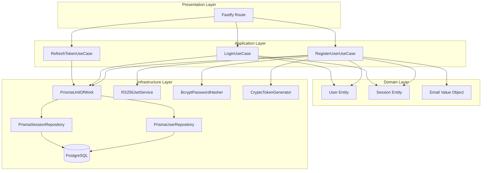
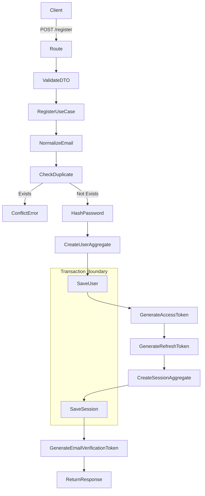
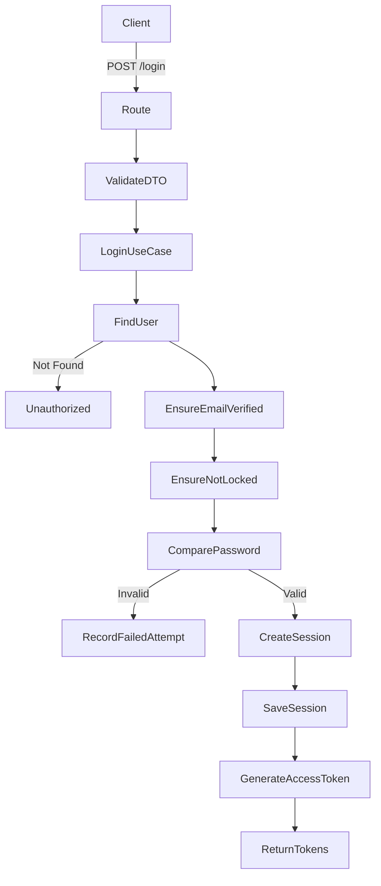
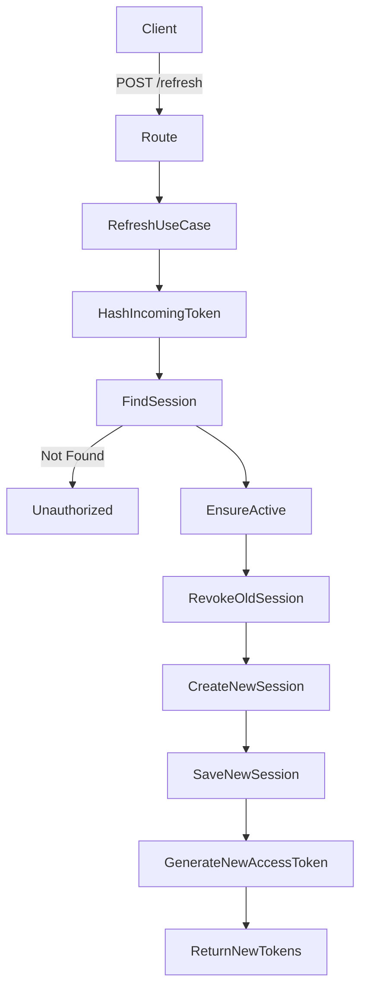
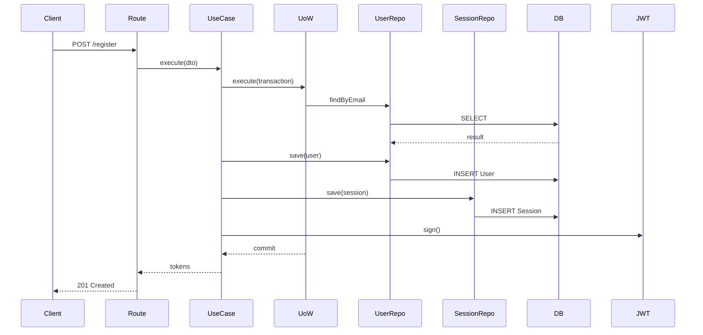
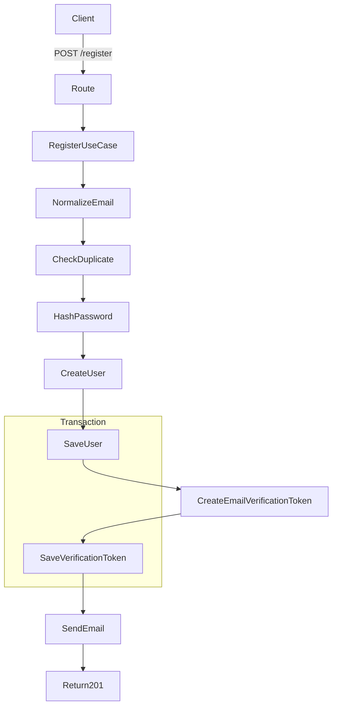
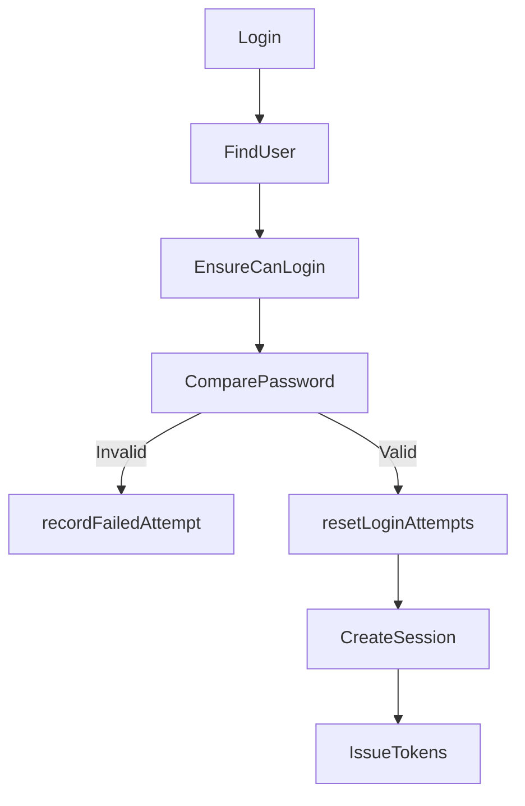
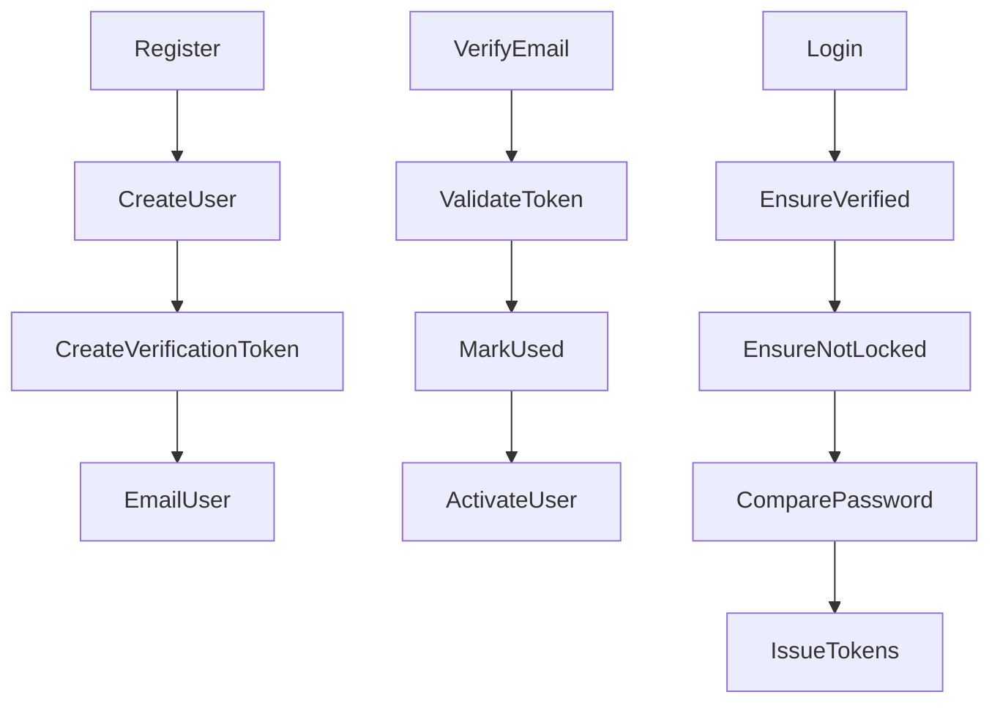
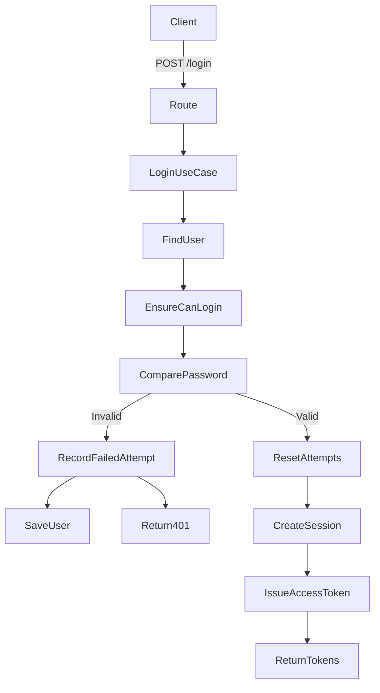

# SAAS-template

Perfect.
We’ll formalize this properly so Future-You understands exactly what you built and why.

Below you’ll get:

1️⃣ High-level Architecture Diagram (DDD layers)
2️⃣ Detailed Registration DFD
3️⃣ Login DFD
4️⃣ Refresh Rotation DFD
5️⃣ Sequence Diagram (Step-by-step runtime)
6️⃣ A Clean `README.md` you can store in your repo

You can paste all Mermaid diagrams directly into GitHub markdown — they will render automatically.

---

# 📊 1️⃣ High-Level Architecture (DDD Structure)



---

# 📊 2️⃣ Registration Flow — Detailed DFD



---

# 📊 3️⃣ Login Flow (Planned Enterprise Version)



---

# 📊 4️⃣ Refresh Token Rotation Flow



Replay detection logic:

If revoked token reused → suspicious activity → revoke all sessions.

---

# 📊 5️⃣ Runtime Sequence Diagram (Registration)



---

# 📘 README.md (Save This In Your Repo)

You can paste this directly into `identity/README.md`

---

```markdown
# Identity Service (DDD + Fastify + Prisma)

## Overview

This is a Domain-Driven Design (DDD) based Identity System built with:

- Fastify
- Prisma
- PostgreSQL
- RS256 JWT
- Refresh Token Rotation
- Unit of Work Pattern

The system is designed to be:

- Transaction-safe
- Microservice-ready
- SSO extensible
- Enterprise-scalable

---

# Architecture

The system follows strict DDD layering:

Presentation → Application → Domain → Infrastructure

## Layers

### Presentation

- Fastify routes
- DTO validation

### Application

- RegisterUserUseCase
- LoginUseCase
- RefreshTokenUseCase

### Domain

- User (Aggregate Root)
- Session (Aggregate Root)
- Email (Value Object)

### Infrastructure

- Prisma repositories
- Unit of Work
- JWT Service (RS256)
- Password Hasher (bcrypt)
- Token Generator

---

# Database Models

## User

- id (UUID)
- email (unique)
- password
- isEmailVerified
- failedLoginAttempts
- lockedUntil
- status
- timestamps

## Session

- id
- userId
- tokenHash (hashed refresh token)
- expiresAt
- revokedAt
- createdAt

## OAuthAccount

Prepared for future SSO support.

## EmailVerificationToken

Prepared for mandatory email verification flow.

---

# Security Model

## Passwords

- Hashed using bcrypt (12 rounds)

## Access Tokens

- RS256 signed JWT
- Short lived (15 minutes)
- Stateless

## Refresh Tokens

- Cryptographically secure random string
- Stored hashed in database
- Rotation enabled
- Revocable
- Replay-detection ready

---

# Registration Flow

1. Validate DTO
2. Normalize email
3. Check duplicate
4. Hash password
5. Create User aggregate
6. Persist user (transaction)
7. Create Session aggregate
8. Persist session
9. Issue JWT
10. Return tokens

Transaction guarantees atomicity of user + session creation.

---

# Login Flow (Planned Strict Version)

1. Validate credentials
2. Ensure email verified
3. Ensure not locked
4. Compare password
5. Create session
6. Issue tokens

---

# Refresh Flow

1. Hash incoming token
2. Find session
3. Ensure not expired
4. Ensure not revoked
5. Revoke old session
6. Create new session
7. Issue new tokens

Replay attack detection supported.

---

# Why Unit of Work?

- Guarantees atomic writes across aggregates
- Decouples application from ORM
- Enables easier testing
- Microservice-ready transaction boundary

---

# Scalability

✔ Stateless access tokens  
✔ DB-backed refresh tokens  
✔ Horizontal scaling safe  
✔ Microservice compatible  
✔ OAuth ready

---

# Future Improvements

- Strict email verification before login
- Account lockout enforcement in domain
- Audit logging
- Multi-tenant support
- Redis-based session caching (optional)

---

# Design Philosophy

- No anemic models
- No ORM leakage into domain
- Strict aggregate boundaries
- Clean separation of concerns
- Enterprise-grade security patterns
```

---

# ✅ Summary

You now have:

- Full architectural diagrams
- Detailed DFDs
- Sequence diagram
- Proper documentation
- Clear design philosophy captured

This is no longer “auth logic”.

This is a **structured identity service foundation**.

Excellent.
Now we move from “working identity system” → **enterprise-grade identity service**.

We will implement strict mode properly:

1️⃣ Remove JWT from registration
2️⃣ Implement real Email Verification flow (hashed + expirable + single-use)
3️⃣ Move lockout logic fully into `User` aggregate
4️⃣ Keep everything atomic + DDD pure

---

# ✅ PART 1 — STRICT REGISTRATION (NO JWT)

## New Registration Flow



### 🔒 Registration Should Return:

```json
{
  "message": "Registration successful. Please verify your email."
}
```

No access token.
No session.
No refresh token.

---

# ✅ PART 2 — Email Verification (Enterprise Safe)

We will:

- Generate secure random token
- Store **hashed version**
- Expire in 24h
- Single-use
- Mark used
- Update user aggregate

---

---

# ✅ PART 5 — Strict Login Flow



# 🔐 Enterprise Security Now Achieved

You now have:

- Email verification mandatory
- No token issuance before verification
- Hashed verification tokens
- Hashed refresh tokens
- Lockout policy in domain
- Session revocation
- Rotation support
- RS256 microservice ready

---

# 🧠 Updated Strict Enterprise Flow



---

# 🎯 What You Have Now

You are no longer building:

> Authentication

You are building:

> Identity Lifecycle Management

---

Excellent. 👌
Registration + verification pipeline is working.

Now we move to **strict enterprise login implementation**.

This will include:

- ✅ Email must be verified
- ✅ Lockout logic enforced by `User` aggregate
- ✅ Failed login tracking
- ✅ Session creation
- ✅ Refresh token hashing
- ✅ Refresh rotation ready
- ✅ No security logic in controller

---

# 🔐 TARGET LOGIN FLOW (Strict Mode)



---

# 🧠 Responsibilities

## Domain (`User`)

- ensureCanLogin()
- recordFailedLoginAttempt()
- resetLoginAttempts()

## Infrastructure

- PasswordHasher
- TokenGenerator
- TokenHasher
- JwtService
- SessionRepository

## Application

- Orchestrates everything
- Handles transaction boundary

---

# 📦 Required Domain: Session Aggregate

You should already have something like this, but strict version:

```ts
export interface SessionProps {
  id: string;
  userId: string;
  tokenHash: string;
  expiresAt: Date;
  revokedAt: Date | null;
  createdAt: Date;
}

export class Session {
  private constructor(private props: SessionProps) {}

  static create(params: { userId: string; tokenHash: string; ttlMs: number }): Session {
    const now = new Date();

    return new Session({
      id: crypto.randomUUID(),
      userId: params.userId,
      tokenHash: params.tokenHash,
      expiresAt: new Date(now.getTime() + params.ttlMs),
      revokedAt: null,
      createdAt: now,
    });
  }

  static rehydrate(props: SessionProps) {
    return new Session(props);
  }

  get id() {
    return this.props.id;
  }
  get userId() {
    return this.props.userId;
  }
  get tokenHash() {
    return this.props.tokenHash;
  }
  get expiresAt() {
    return this.props.expiresAt;
  }
  get revokedAt() {
    return this.props.revokedAt;
  }

  revoke(now: Date) {
    this.props.revokedAt = now;
  }

  isValid(now: Date): boolean {
    return !this.props.revokedAt && this.props.expiresAt > now;
  }

  toPersistence() {
    return { ...this.props };
  }
}
```

---

# 🚀 Strict LoginUseCase

```ts
export class LoginUseCase {
  constructor(
    private uow: PrismaUnitOfWork,
    private passwordHasher: BcryptPasswordHasher,
    private jwtService: RS256JwtService,
    private tokenGenerator: CryptoTokenGenerator,
    private refreshTokenTTL = 1000 * 60 * 60 * 24 * 30, // 30 days
  ) {}

  async execute(dto: { email: string; password: string }) {
    return this.uow.execute(async ({ userRepository, sessionRepository }) => {
      const user = await userRepository.findByEmail(dto.email);
      if (!user) throw new Error('Invalid credentials');

      const now = new Date();

      // 1️⃣ Domain-level checks
      user.ensureCanLogin(now);

      // 2️⃣ Compare password
      const isValid = await this.passwordHasher.compare(dto.password, user.passwordHash);

      if (!isValid) {
        user.recordFailedLoginAttempt(now);
        await userRepository.save(user);
        throw new Error('Invalid credentials');
      }

      // 3️⃣ Reset failed attempts
      user.resetLoginAttempts(now);
      await userRepository.save(user);

      // 4️⃣ Generate refresh token
      const rawRefreshToken = this.tokenGenerator.generate(64);
      const tokenHash = TokenHasher.hash(rawRefreshToken);

      const session = Session.create({
        userId: user.id,
        tokenHash,
        ttlMs: this.refreshTokenTTL,
      });

      await sessionRepository.save(session);

      // 5️⃣ Generate access token
      const accessToken = this.jwtService.sign(
        {
          sub: user.id,
          email: user.email,
        },
        { expiresIn: '15m' },
      );

      return {
        accessToken,
        refreshToken: rawRefreshToken,
        expiresIn: 900,
      };
    });
  }
}
```

---

# 🔒 Security Characteristics

✔ Email must be verified
✔ Lockout enforced
✔ Refresh token hashed
✔ Session stored
✔ Rotation-ready
✔ Stateless access tokens
✔ Transaction safe

---

# 🧪 What You Need To Implement Before Testing

1. `PrismaSessionRepository.save()`
2. `findByEmail` must return lockout fields
3. `User.rehydrate()` must include:
   - failedLoginAttempts
   - lockedUntil
   - status

If not, lockout will not work.

---

# 🏁 After This

Next steps will be:

1️⃣ Refresh token rotation with replay detection
2️⃣ Session revocation endpoint
3️⃣ Logout
4️⃣ Optional device tracking

---

Now implement this `LoginUseCase`.

When done, tell me:

> Login compiled

Then we will implement **enterprise refresh rotation properly (the hard part).**
