# Project Context — apps/api

**Scope:** apps/api, the control-plane REST API (Fastify + Prisma/Postgres) — accounts, users, RBAC, API keys, Stripe billing, notifications, feedback, admin. See `internal-tools/shared/context.md` for the monorepo-wide Architecture diagram, the Agent/SDK auth-path-divergence note, and cross-cutting flows (tunneled HTTP request, local discovery, API key validation) — not duplicated here.

Migrated 2026-09-17 from the monorepo's single `.claude/context.md`.

## Tech Stack

- **API (control plane)**: Fastify 5, Prisma 6 → Postgres, `@upstash/redis` + `ioredis` (both present), `@fastify/jwt` + cookies for user auth, Stripe SDK, Resend (email), bcryptjs, zod. Root-level linting is ESLint 9 flat config (`eslint.config.ts`) — **not** `eslint-plugin-boundaries` (an earlier audit pass claimed that; confirmed wrong by reading the file directly): it's a plain `no-restricted-imports` rule banning deep imports into another workspace package's `src/` and cross-package relative imports.

## Directory Structure

```
apps/api/       Control-plane REST API (Fastify + Prisma/Postgres). DDD-style modules.
    src/modules/  identity (auth+RBAC+admin), key-management (ApiKey issue/validate),
                  billing (Stripe), notification, feedback
    src/core/     config, DI container, errors, redis client, shared middleware/utils
    prisma/       schema.prisma + migrations (source of truth for the whole system's DB)
    archived/     dead pre-refactor RBAC/key-management code (gitignored, local only)
    NOTE: there is no apps/api/src/app.ts — Fastify app wiring lives elsewhere;
    the /me/password route is registered in identity.routes.ts, not account.routes.ts
    (account.routes.ts exists but is a different, narrower file)
```

## Core Flows

### User Signup / Login / RBAC

```mermaid
sequenceDiagram
    participant User
    participant Api as apps/api (Fastify)
    participant Identity as identity module
    participant DB as Postgres

    User->>Api: POST /auth/signup {email, password}
    Api->>Identity: RegisterUser use-case
    Identity->>DB: User.create(); EmailVerificationToken.create()
    Identity->>Identity: notificationService.sendEmailVerification (AND console.log raw token — both happen)
    Api-->>User: verification email sent (Resend)

    User->>Api: POST /auth/login {email, password}
    Api->>Identity: Login use-case (bcrypt compare, lockout check via ensureCanLogin())
    Identity->>DB: Session.create(tokenHash); AccountMember lookup (roleLevel)
    Api-->>User: {accessToken} in JSON body; refresh token as httpOnly SameSite=Strict cookie

    User->>Api: GET /account/... (Authorization: Bearer accessToken)
    Api->>Api: userAuthGuard (reads Authorization header, RS256JwtService.verify — no cookie involved; then type=user + tokenVersion/active via AuthStateCache, see item 61)
    Api->>Identity: check Role/Ability via RoleAbility (account-scoped RBAC)
    Identity-->>Api: allow/deny
```

**Corrected 2026-09-15 — this diagram previously said login sets an `access_token` cookie and `userAuthGuard` verifies via that cookie; both were wrong, confirmed by reading the code directly rather than assumed.** The real flow: `Login`/`Register`/`RefreshSession` use-cases return `accessToken` in the JSON response body only (no `Set-Cookie` for it anywhere in the codebase — grepped `setCookie` calls across all of `apps/api/src`, exactly one exists, for the *refresh* token). `apps/web` keeps the access token in memory only (Zustand `auth.store.ts`, explicitly excluded even from its own `sessionStorage` persistence — restored via `/auth/refresh` on each fresh load) and sends it as `Authorization: Bearer <token>` on every request. `userAuthGuard.ts` (the real, live guard — used by every protected route: account, identity, tunnel, notification, feedback, apiKey, billing) reads only `request.headers.authorization`; it never touches cookies. A **second**, cookie-based JWT guard exists in the codebase (`core/middleware/auth.middleware.ts`'s `authenticate`, using Fastify's generic `req.jwtVerify()` against the `access_token` cookie name `register.plugin.ts` configures on `@fastify/jwt`) but is **fully dead — zero importers anywhere**, never wired onto any route. The only cookie in the whole session-auth flow is the refresh-token cookie (`REFRESH_COOKIE_NAME`, `httpOnly`, `sameSite: 'strict'`, `path: '/api/v1/auth'`) — already real, correctly-configured CSRF protection for the one endpoint that uses it, and moot for every other endpoint since they authenticate via an explicit header a cross-site page cannot make a victim's browser attach automatically. Investigated and confirmed while removing apps/web's client-side HMAC request signing — see "Missing Features"/Known Risks below and decision.md, 2026-09-15, "NEXT_PUBLIC_SECRET_KEY removal".

**Confirmed live gap: email verification is not enforced at login.** `ensureCanLogin()` (`User.entities.ts:119-134`) checks only `deletedAt`, `status`, and `lockedUntil` — no `isEmailVerified` check. The only `isEmailVerified`-gated throw in the codebase is dead, commented-out code (`User.entities.ts:309`). An unverified user can register and log in normally today. This needs a real fix, not just documentation — add the check to `ensureCanLogin()` or `Login.usecase.ts` directly.

Separate from this is a fully independent **Admin RBAC system** (`AdminUser`/`AdminRole`/`AdminAbility`/`AdminSession`, guarded by `adminAuthGuard`/`requireAbility`/`requireSuperAdmin`, all actions written to an immutable `AdminAuditLog`) — it does not share code with the regular-user RBAC above. **The backend side of this is real and complete; there is no frontend for it at all** — see "Missing Features" below.

**Flow 4 (API Key Validation), shared by Hub-SDK auth and direct API auth, is documented in `internal-tools/shared/context.md`** since `packages/shared`'s `ValidateApiKeyUseCase` is now the canonical implementation both apps/api and apps/hub use.

## Data Model

`prisma/schema.prisma` under `apps/api/` is the source of truth for the whole system's DB — apps/hub reads/writes the same tables via `packages/shared`'s Prisma client (no separate schema).

```mermaid
erDiagram
    USER ||--o{ SESSION : has
    USER ||--o{ ACCOUNT_MEMBER : "is member via"
    ACCOUNT ||--o{ ACCOUNT_MEMBER : has
    ACCOUNT ||--o{ ROLE : defines
    ROLE ||--o{ ROLE_ABILITY : grants
    ABILITY ||--o{ ROLE_ABILITY : "granted by"
    ACCOUNT ||--o{ API_KEY : owns
    API_KEY ||--o{ API_KEY_SCOPE : has
    ACCOUNT ||--o{ TUNNEL_SESSION : "connects agents"
    API_KEY ||--o{ TUNNEL_SESSION : authenticates
    ACCOUNT ||--o{ TUNNEL_REQUEST : logs
    API_KEY ||--o{ TUNNEL_REQUEST : logs
    ACCOUNT ||--|| SUBSCRIPTION : "billed via"
    SUBSCRIPTION ||--o{ INVOICE : generates
    ACCOUNT ||--o{ USAGE_AGGREGATE : meters
    API_KEY ||--o{ USAGE_AGGREGATE : meters
    ACCOUNT ||--o{ NOTIFICATION : receives
    USER ||--o{ FEEDBACK : submits
    USER ||--o{ AUDIT_LOG : generates
    API_KEY ||--o{ SECURITY_EVENT : flags

    ADMIN_USER ||--o{ ADMIN_USER_ROLE : has
    ADMIN_ROLE ||--o{ ADMIN_USER_ROLE : "assigned to"
    ADMIN_ROLE ||--o{ ADMIN_ROLE_ABILITY : grants
    ADMIN_ABILITY ||--o{ ADMIN_ROLE_ABILITY : "granted by"
    ADMIN_USER ||--o{ ADMIN_SESSION : has
    ADMIN_USER ||--o{ ADMIN_AUDIT_LOG : generates

    USER {
        string id
        string email
        string passwordHash
        bool isEmailVerified
        int failedLoginAttempts
        datetime lockedUntil
        int tokenVersion
        datetime deletedAt
    }
    ACCOUNT {
        string id
        string type "PERSONAL or ORGANIZATION"
        string status "ACTIVE PAST_DUE RESTRICTED SUSPENDED CANCELED DELETED"
        string slug
        string stripeCustomerId
    }
    API_KEY {
        string keyId "public id, vhyxvoid_dev_/live_ prefix"
        string secretHash
        string previousSecretHash "rotation support"
        string environment "DEV or PROD"
        string status "ACTIVE REVOKED EXPIRED"
        datetime rotationGraceEndsAt
    }
    TUNNEL_SESSION {
        string agentId
        string hubInstanceId
        string label
        string status "CONNECTED DISCONNECTED EVICTED"
    }
    TUNNEL_REQUEST {
        string requestId
        int status
        int durationMs
    }
    SUBSCRIPTION {
        string stripeSubscriptionId
        string plan "FREE PRO ENTERPRISE"
        string status
    }
    USAGE_AGGREGATE {
        string metric
        datetime periodStart
        int count
        datetime lockedAt "immutable once invoiced"
    }
```



`OAuthAccount` — **confirmed planned-but-never-started** (Google/GitHub login as an alternative to email/password; no use-case, route, or provider config anywhere). Safe to leave (no data, no harm) or drop via migration for schema cleanliness; build later if OAuth is prioritized. Several old model definitions are left commented out in `schema.prisma` (~15% of the file) rather than deleted.

## Configuration & Environment

Most env vars (DATABASE_URL, Redis, HMAC pepper, JWT, Stripe, Resend, HUB_INTERNAL_*) are documented in `internal-tools/shared/context.md`'s Configuration table, since several are shared with apps/hub. Nothing apps/api-specific needs a separate table here today.

## Missing Features (not bugs — unbuilt surfaces, discovered 2026-09-14)

**No admin frontend exists — the admin backend is now real (as of 2026-09-17), was NOT actually functional before that despite being structurally complete.** The backend detail (routes, RBAC, audit log — all real code, correctly structured) is below; **but see item 49**: until 2026-09-17, `fastify.jwtService`/`fastify.uow` were declared in types and read by every guard/route but never actually decorated, so every `adminAuthGuard`-gated request 403'd and every `fastify.uow`-touching route 500'd — meaning almost nothing below actually worked end-to-end until `apps/admin`'s scaffolding session found and fixed it via a real functional smoke test. The full context including the missing-frontend consequence lives in `internal-tools/user-frontend/context.md`'s Missing Features section; `internal-tools/admin-frontend/context.md` now tracks the actual frontend build.

- **Backend (real, functional, unaffected by this finding)**: `apps/api`'s Admin RBAC system is fully built — `POST /api/v1/admin/identity/auth/login` (separate admin login, own JWT/session via `AdminSession`, not the regular-user `/auth/login`), `POST /admin/auth/refresh`, `POST /admin/auth/logout`; admin-user CRUD (`POST/GET /admin/users`, `GET/PUT /admin/users/:id`, `POST /admin/users/:id/disable`|`/enable`); role CRUD + assignment (`POST/GET/PUT /admin/roles`, `POST /admin/users/:adminId/roles`, `DELETE /admin/users/:adminId/roles/:roleId`); ability CRUD + role-assignment (`POST/GET/DELETE /admin/abilities`, `POST/DELETE /admin/roles/:roleId/abilities`); `GET /admin/audit-logs` (filterable by adminId/action/targetId); `GET /admin/me`, `GET /admin/me/abilities`. Every mutating route is gated by `requireAbility('<resource>.<action>')` (e.g. `admin.create`, `role.assign`, `ability.delete`); `requireSuperAdmin` exists as a stricter gate (checks `request.admin.isSuperAdmin`) but no route in `admin.routes.ts` currently uses it — only `requireAbility`/`adminAuthGuard`. Every mutation writes an immutable `AdminAuditLog` row (action, targetType/targetId, before/after diff, ip/userAgent/statusCode).

## Known Risks / Gaps

Numbering is preserved from the original unified context.md so cross-references (`decision.md` entries, other component context.md files) keep working across files.

1. **OPEN — Email verification not enforced at login.** Re-verified directly: `ensureCanLogin()` (`User.entities.ts:119-134`) still checks only `deletedAt`, `status`, `lockedUntil`; the only `isEmailVerified` check anywhere is the same dead, commented-out code (now around line 309). No session has touched this. Any account can be used unverified today.
4. **STALE — "Rate limiting is not actually enforced" is no longer accurate.** Re-read `ValidateApiKeyUseCase` and `PLAN_LIMITS` (`apps/api/src/modules/billing/domain/enums/index.ts`) directly: rate limiting **is** enforced end-to-end today — `cached.rateLimitPerMinute !== Infinity && count > cached.rateLimitPerMinute` gates every gateway request, and `PLAN_LIMITS` carries real per-tier values (FREE 60/min, PRO 1,000/min, ENTERPRISE genuinely `Infinity` by design, not a stub). The original claim ("`rateLimitPerMinute` always returns -1", "`buildCachePayload` hardcodes `Infinity`") does not match current code and can't be dated to a specific fixing session — likely already wrong at the time of the original audit, not a later fix. **Narrower gap, FIXED 2026-09-13**: `HardcodedPlanLimitService.getLimitsForAccount()` used to always return the `PRO` tier for every account regardless of actual subscription — now a real lookup (renamed `SubscriptionPlanLimitService`); see item 6 for the fix. **Still over-broad as of 2026-09-22, corrected in `internal-tools/shared/context.md` Known Risk #57**: this item is true for direct API-key requests reaching `ValidateApiKeyUseCase`, but the hub applied a separate hardcoded limit (`PLAN_AGENT_LIMITS.PRO`) to every account's agent connections regardless of plan, and a cache reload after any rotation/update/revoke reset the rate limit to unlimited rather than the real plan value — both fixed in source by session S3 (`a967c03`, not yet deployed; `PLAN_LIMITS` also moved from this file's `domain/enums` to `packages/shared/src/planLimits.ts`, re-exported here so this item's own citation is unaffected). **Agents themselves are still not rate-limited** (an agent's own `tunnel:forward` traffic isn't a gateway request in the `ValidateApiKeyUseCase` sense), but **public tunnel-URL traffic now is** — session S5 (`shared/decision.md`, 2026-09-22, "S5 investigation and proposal" and "S5 implementation") added a per-account limiter directly in `HttpTunnelHandler.handle()`, separate from this per-key mechanism since a tunnel URL has no key to check. See `shared/context.md` Known Risk #57, E3.
6. **FIXED (2026-09-13) — Billing model decided and implemented: flat-rate tiers, usage tracking stays display-only.** The user formally decided the billing model this item was blocked on: flat-rate FREE/PRO/ENTERPRISE plans (already real — Stripe price IDs, `PLAN_LIMITS` per-tier values), no metered billing. `HardcodedPlanLimitService` (renamed `SubscriptionPlanLimitService`, `apps/api/.../domain/repositories/SubscriptionPlanLimitService.repositories.ts`) now does the real lookup: most-recent `Subscription` row for the account (matching `PrismaSubscriptionRepository.findByAccountId`'s existing "most recent wins" convention, since `accountId` isn't unique on that table), `PLAN_LIMITS[subscription.plan]`. Edge cases, decided explicitly rather than assumed: no `Subscription` row at all (a brand-new account — confirmed via `CreateOrganization.usecase.ts` that account creation never creates one; only the Stripe webhook's `customer.subscription.created` handler does) → `FREE`. `Account.status` of `SUSPENDED`/`RESTRICTED`/`CANCELED`/`DELETED` → downgraded to `FREE` regardless of `Subscription.plan`, since `Account.status` is already the canonical "not currently entitled" signal the Stripe-webhook state machine maintains (`HandleStripeWebhookUseCase.subscriptionStatusToAccountStatus()`) — confirmed nothing else in the `CreateApiKey`/`RotateApiKey`/`UpdateApiKey` call path already checks this, so this is the one real enforcement point, not a duplicate. `PAST_DUE` deliberately excluded from the downgrade list — that's the grace-period window (`GracePeriodWorker`/`GRACE_PERIOD_MS`/`Account.graceEndsAt`): the account keeps its real plan's limits until the grace period actually expires and the account is moved to `SUSPENDED`. **New gap surfaced by this investigation, not fixed this session**: `GracePeriodWorker` (a real, complete, correctly-written class) is never actually instantiated/scheduled anywhere in the codebase — confirmed by grep, zero references outside its own file, despite its own header comment saying "Register this in your billingPlugin" — so an account that goes `PAST_DUE` today has no automatic path to ever being moved to `SUSPENDED`; it would stay `PAST_DUE` (and keep its real plan's limits) indefinitely. See item 41. **Also decided this session**: `ReportUsageToStripeWorker`-shaped speculative infrastructure for metered billing (never built as an actual worker, but real orphaned plumbing existed for it — `UsageAggregate.markReportedToStripe()`, `UsageAggregateRepository.findUnreportedToStripe()`, both zero-caller) removed outright, since metered billing is now formally decided against. The `reportedToStripe`/`stripeUsageRecordId` Prisma columns were kept (not dropped — would need a real migration, not warranted just for this decision) but commented as vestigial. Two fully-commented-out, never-active schema models (`UsageAggregate` draft, `UsageReport`) describing the same abandoned design were deleted from `schema.prisma` as drive-by cleanup. **Confirmed, not touched**: the usage dashboard display (`GetApiKeyUsageUseCase`, `toUsageDTO`, and `apps/web`'s `useTunnelUsage`/`useUsageSummary` hooks) is genuinely read-only end to end — no speculative code path assumes usage data will drive billing; `toUsageDTO` doesn't even expose `reportedToStripe`/`isLocked` to the frontend. Tested: `tests/e2e/subscriptionPlanLimitService.test.ts`. See decision.md, 2026-09-13, "Billing model: flat-rate tiers."
18. **OPEN — Account slug generation has no retry loop.** Untouched (out of scope for the 2026-09-12 Hub-only audit — this is apps/api).
29. **CORRECTED (2026-09-17) — `PRIVATE_KEY`/`PUBLIC_KEY` env vars and `.pem` files: this item's premise (implicitly, "leftover unused files") was wrong.** Previously just noted the four `.pem` files (`public.pem`, `private.pem`, `prod_public.pem`, `prod_private.pem`) are still present under `apps/api/src/keys/`, without checking whether they're used — `internal-tools/shared/context.md`'s Configuration table separately (and incorrectly) called them dead. Investigated directly while scoping `apps/admin` (`internal-tools/admin-frontend/decision.md`, 2026-09-17): `RS256JwtService` (`infrastructure/crypto/JwtService.ts`) is constructed in `core.plugin.ts` from exactly these keys (`PRIVATE_KEY`/`PUBLIC_KEY` in dev, `_B64` variants in prod, via `resolveRsaKey()`) and is the real, live JWT signer/verifier for **both** the regular-user auth path (`userAuthGuard.ts`, `Login.usecase.ts`, `RefreshSession.usecase.ts`) and the Admin RBAC auth path (`AdminLogin.usecase.ts`, `AdminRefreshToken.usecase.ts`). These files and env vars are load-bearing, not safe to delete. Conversely, `JWT_SECRET`/`@fastify/jwt` (registered in `register.plugin.ts`) has no live consumer — its only user, `core/middleware/auth.middleware.ts`'s `authenticate`, is already-documented dead code. Full correction in `internal-tools/shared/context.md`'s Configuration table.
30. **STALE (no action needed) — `OAuthAccount` Prisma model.** Re-confirmed present in `schema.prisma` (`model OAuthAccount`, referenced from `User.oauthAccounts`). No data, no harm either way — this item was always "leave or drop, no urgency," not a risk; downgrading from the numbered risk list is not needed but the status is unchanged from "planned, never started."
32. **FIXED (2026-09-12 Hub audit) — `RedisApiKeyCacheService.get()`/`.markRequestId()` unguarded Redis calls, plus a correction to the premise.** The 2026-09-12 reconciliation pass had framed this as sitting "on the Hub's own request-validation path" — **investigated directly and found that premise false**: the Hub does not use `apps/api`'s `RedisApiKeyCacheService` at all. It uses a wholly separate, independently-duplicated `ValidateApiKeyUseCaseImpl` in `packages/shared/src/validateApiKey.ts`, which was **already** fail-soft on cache reads and fail-open on `markRequestId` (with an explicit "fail open — never block on Redis failure" comment already in the code). The Hub's real gateway path was never exposed to this bug. The literal file named IS real and was genuinely unguarded, but backs a different, currently-**dormant** path: `apps/api`'s own `ValidateApiKeyUseCase.usecase.ts`, wired only to `POST /gateway/v1/validate` — confirmed via repo-wide grep that nothing calls that route today. Fixed anyway (dormant code is still real code): `get()` now fails soft (returns null, falls through to the existing DB fallback); `markRequestId()` now fails OPEN (matches the already-live `packages/shared` copy's choice) — full tradeoff reasoning recorded in decision.md, 2026-09-12. **New risk surfaced by this investigation, not yet resolved**: two independent implementations of the identical `ValidateApiKeyUseCase` logic exist (`apps/api`'s and `packages/shared`'s) with no shared source of truth — one was already safer than the other purely by accident of who wrote it, and nothing keeps them in sync. See item 37. Tested: `tests/e2e/redisApiKeyCacheFailSoft.test.ts`.
33. **FIXED — `apps/api/src/server.ts` registered `setErrorHandler` after `registerPlugins`/`registerRoutes` completed.** Fixed 2026-09-12 (`decision.md`, "Bug 2 resolution"). Fastify resolves each nested plugin's inherited error handler at registration time, not lazily — so effectively the entire API surface (everything registered via `server.register(module, {prefix})`) was silently wired to Fastify's own default error handler instead of this app's custom one, for an unknown but likely long duration. Concrete effects while broken: every `ZodError` returned an opaque 500 instead of a clean 400; every `AppError` (`ForbiddenError`, `NotFoundError`, etc.) lost its intended `{success, code, message, data, requestId}` shape. This was also the true root cause misdiagnosed in an earlier session as a `RemoveMemberUseCase` bug (see decision.md's 2026-09-11 Step 5c entry, corrected 2026-09-12) — `RemoveMemberUseCase` itself needed no changes. Worth remembering as a class of risk: **Fastify plugin/error-handler registration order is load-bearing and easy to silently break again** if `server.ts` is restructured.
35. **FIXED (2026-09-14) — zombie `ts-node-dev` supervisor processes accumulate across sessions.** Discovered 2026-09-12 (`decision.md`, "Bug 2" entry's closing note): stopping `apps/api`'s local dev server by killing the port-9000 listener only kills the `ts-node-dev --respawn` child, not the supervisor parent, which silently respawns and re-binds later. Docs-only fix at the time (`LOCAL_DEV_BACKEND.md`'s corrected stop procedure) enforced nothing. **Real fix**: `apps/api/scripts/kill-zombie-dev.sh`, wired as a `predev` script in `apps/api/package.json` (pnpm/npm run this automatically before `dev`) — finds and force-kills any process whose command line matches both this repo's own directory name (`Black-Server`) and `ts-node-dev` (both substrings required, so a same-machine ts-node-dev process from an unrelated project, or this repo's own non-ts-node-dev processes like `apps/web`'s Next.js dev server, are never touched). This doesn't require anyone to remember the corrected stop command — a zombie from an incompletely-stopped previous session is cleaned up automatically the next time `pnpm dev` runs, before the new instance starts. **Verified for real, not just reasoned about**: ran three full start → wrong-stop (`lsof -ti :9000 | xargs kill -9`, killing only the port listener) → restart cycles against the actual local dev server on this machine; confirmed via `ps aux | grep ts-node-dev` after each wrong-stop that the zombie supervisor did survive (reproducing the original bug), and confirmed after each restart that `predev` found and killed it before the new instance started, leaving exactly one supervisor+worker pair alive each time. Final state after all three cycles confirmed clean (`lsof -ti :9000` and `ps aux | grep ts-node-dev` both empty). Not unit-tested — this is a shell script driving OS process management, not application logic; the three-cycle manual verification above is the appropriate check for this class of fix and was actually performed, not assumed. See decision.md, 2026-09-14, "Zombie ts-node-dev processes."
36. **FIXED (2026-09-13) — `HardcodedPlanLimitService` always returned PRO-tier limits for every account.** Fixed together with item 6 (same underlying class) — see item 6 for the full fix, edge-case handling, and the new gap it surfaced (`GracePeriodWorker` never scheduled, item 41).
39. **FIXED (2026-09-13) — `POST /gateway/v1/validate` removed.** Part of item 37's unification. Confirmed dead two ways over, not just "no callers": its registration in `apps/api/src/server.ts` was already commented out (never mounted in the running app at all), and even if it were, a repo-wide grep found no caller. It also duplicated a security-sensitive surface (unauthenticated-at-the-route-level key-validation probing, differentiated error reasons that could leak key-existence/status information) for zero functional benefit once `packages/shared`'s in-process path was confirmed to be the real, working design. Deleted `gateway.routes.ts` and its dead commented-out import/registration in `server.ts`.
40. **FIXED (2026-09-13) — `POST /api/v1/tunnelproxy/request` was reachable but always failed: missing the Hub's required internal-auth header.** Discovered while investigating item 37/39: this route (registered live at `/api/v1/tunnelproxy`, unlike item 39's route) is a distinct, legitimate feature — a synchronous HTTP-only alternative to the SDK's WS/subdomain tunnel flow — with a real intended caller path (it forwards to the Hub's `POST /internal/proxy`), but its `fetch()` call never sent the `x-hub-internal-secret` header that endpoint's 2026-09-12 auth fix (item 7) requires, so every call would fail closed (503) or with a mismatch (401) regardless of a valid API key. This also corrects the Configuration table's `HUB_INTERNAL_URL` entry and the "What is `HUB_INTERNAL_URL` for?" open question below — both said "no caller currently exists in apps/api"; a caller does exist (this route), it was simply broken. Fixed: added `"x-hub-internal-secret": process.env.HUB_INTERNAL_SECRET ?? ""` to the forwarded request. Still has zero real external callers today (nothing in the SDK, docs, or tests calls `/api/v1/tunnelproxy/request`) — kept, not removed, since unlike item 39 there's a clear, undocumented-but-plausible intended use (a plain-HTTPS tunnel path for callers that can't/don't want to run the WS-based SDK) and the only thing wrong with it was one missing header, not a superseded design. Not verified end-to-end against a real Hub (would need `HUB_INTERNAL_SECRET` configured identically on both sides in a real environment) — flagged as a follow-up if this route is ever actually wired up to a real caller.
41. **FIXED (2026-09-14) — `GracePeriodWorker` is a real, complete, correctly-written class that was never actually scheduled anywhere.** Surfaced 2026-09-13 while fixing item 6/36. Confirmed by grep: zero references outside `apps/api/src/modules/billing/infrastructure/workers/GracePeriod.worker.ts` itself. **Fixed**: instantiated and `.start()`ed in `billing.plugin.ts` (the class's own home module, matching where its header comment already said to register it), with `.stop()` wired into the plugin's `onClose` hook — matching the same instantiate/schedule/clean-up-on-close shape `apiKeyPlugin.ts` already uses for its own workers (`FlushUsageWorker`/`ExpireRotationGraceWorker`/`ExpireApiKeysWorker`), even though `GracePeriodWorker`'s own `start()`/`stop()` self-manage their interval internally rather than being externally `setInterval`-wrapped like those three — its public API is already self-contained by design, so wrapping it in a second, redundant interval would have been inventing complexity, not matching the pattern. **"Stale accounts on first deploy" question, decided**: no special backfill/migration needed — `start()` already runs an immediate sweep before its first hourly interval, so this fix's first deploy behaves exactly like any other restart (which was always safe to let the normal interval catch, per the class's own design) — already-stale `PAST_DUE` accounts (`graceEndsAt` already in the past) get caught on the very first tick after this fix ships, not up to an hour later. Tested: `tests/e2e/gracePeriodWorker.test.ts` — a `PAST_DUE` account past its `graceEndsAt` moves to `SUSPENDED`; no expired accounts is a no-op; multiple expired accounts all get swept in one pass; one account's update failing doesn't abort the sweep for the rest; `start()` itself performs the immediate sweep (the mechanism the first-deploy answer above relies on). See decision.md, 2026-09-14, "Schedule GracePeriodWorker." **Addendum 2026-09-22 (re-verified; a same-day admin-frontend note claiming it was "never instantiated" was wrong and is corrected):** scheduling is intact and unchanged since `31df389`, **but the worker cannot fire**: the Stripe webhook writes `graceEndsAt: null` on `customer.subscription.updated` (`HandleStripeWebhook.usecase.ts:335`) and skips `handleInvoicePaymentFailed`'s grace when the subscription is already PAST_DUE (`:473`), so `PAST_DUE` accounts have no deadline and are never suspended (ran against the real use case, both event orders). The test above mocks Prisma rows that already carry `graceEndsAt`, so it could not see this. Fix plan (session S1) in `internal-tools/shared/decision.md`, 2026-09-22; also see `shared/context.md` Known Risks #57. **S1 SHIPPED IN SOURCE (`c8b98e6`, 2026-09-22, not deployed):** the webhook now sets the deadline set-if-absent (`AccountBillingRepository.markPastDue`, guarded to ACTIVE/PAST_DUE accounts), clears it only on ACTIVE/CANCELED, and the worker's test now runs against webhook-written state.
49. **FIXED (2026-09-17) — `fastify.jwtService` and `fastify.uow` were declared in `fastify.d.ts` and read directly by route handlers, but neither was ever actually decorated — most of the Admin RBAC backend was broken, not "complete" as items 154 (Missing Features section) and every prior admin-endpoint summary claimed.** Discovered while wiring up `apps/admin`'s real login/authenticated-request flow against the live local dev backend (`internal-tools/admin-frontend/decision.md`, 2026-09-17) — a real functional smoke test, not a code-reading pass, is what surfaced this; every prior confirmation of the Admin RBAC system had read the route files and confirmed they *exist* and are *wired to guards*, but none had actually logged in and called a `fastify.uow`-touching route end-to-end. **Bug 1**: `adminAuthGuard.plugin.ts` reads `fastify.jwtService` (typed in `fastify.d.ts` as `RS256JwtService`) to verify the Bearer token — but nothing decorated it; `register.plugin.ts`'s own comment claiming `userUseCases` "decorates... fastify.jwtService" was simply wrong (grepped `user.plugin.ts` directly — it decorates seven other things, never `jwtService`). Every `adminAuthGuard`-gated request threw `InternalServerError("Server misconfiguration: JWT service not registered")` → 500 → caught by the guard's own catch-all and rethrown as a 403 "Unauthorized: Could not authenticate admin" — indistinguishable from a bad token unless you read the server log. Admin login/refresh themselves were unaffected (`AdminLogin`/`AdminRefreshToken` use cases resolve `RS256JwtService` from the DI container directly, not via this decorator), so a login always "succeeded" while every subsequent authenticated call silently 403'd — the worst kind of broken, since the failure looks like it could be the caller's fault. **Bug 2**: found immediately after fixing Bug 1 — `admin.routes.ts`'s handlers read `fastify.uow.<repo>` directly (not through a use case) for `GET /me`, `GET/PUT /users`, `GET /users/:id`, `GET/POST /roles`, `GET /roles/:id`, `GET /abilities`, `GET /roles/:roleId/abilities`, `GET /audit-logs`, and the disable/enable actions — but `fastify.uow` was *also* never decorated anywhere (the one near-miss found by grep, `api-key`'s `infrastructure/api.ts`, has it as a dead commented-out line, `// fastify.decorate('uow', {});`). Threw `TypeError: Cannot read properties of undefined (reading 'adminUserRepository')` on every one of those routes. The identity module's one regular-user route with the same direct-`fastify.uow` pattern, `identity.routes.ts`'s `/resend-verification`, has the identical latent bug — but it's a genuinely under-exercised path (email verification isn't enforced per item 1, and no session's functional testing ever specifically drove a resend), which is why months of extensive, real functional testing against members/tunnels/API-keys/billing (all going through properly DI-resolved use-case classes) never tripped over either bug. **Fixed**: `core.plugin.ts` now decorates both — `fastify.decorate("jwtService", container.resolve(RS256JwtService))` and `fastify.decorate("uow", container.resolve(PrismaUnitOfWork))`, placed right after each is registered in the container, so both are real singletons available before any route ever runs. **Verified for real** against the local dev Postgres (seeded via `pnpm seed`): full login → `GET /me` → `GET /me/abilities` → `GET /users` → `GET /roles` → `POST /auth/refresh` (confirmed token rotation, both tokens change) → reusing the pre-rotation refresh token correctly triggers reuse-detection ("Refresh token reuse detected. All sessions revoked.") → `POST /auth/logout` (204) → the just-logged-out refresh token also correctly rejected. Every admin screen's real data-fetching now actually works, not just "the route exists and is guarded." `pnpm turbo run typecheck`/`build --filter='!@vhyxvoid/web'` (10/10, 9/9) and the root test suite (19/19 files, 99/99 tests) all still pass after the fix. Not covered by a new automated test this session (out of scope — this was found and fixed as a blocking prerequisite for `apps/admin`'s own functional verification, not a dedicated apps/api hardening pass); flagged in backlog.md as a real, still-open gap. See `internal-tools/api/decision.md`, 2026-09-17, and `internal-tools/admin-frontend/decision.md`, same date, for the full discovery trail. **Addendum (2026-09-17, later the same day) — the "not covered by a test" gap is closed**: `tests/e2e/corePluginDecorators.test.ts` now guards both decorators directly (confirmed to actually fail against the pre-fix code, not just pass against the fix). A full sweep for any other instance of this exact bug class was also done — see item 50.

50. **RESOLVED (2026-09-17, sweep session) — Every `fastify.d.ts`-declared `FastifyInstance` property checked for the same "declared, read, never decorated" bug class as item 49. No second live bug found; 5 dead type declarations removed as a direct byproduct.** Item 49's own "not done" note flagged this as unaudited — its two bugs were found by hitting them at runtime, not a systematic sweep. This session read every property `fastify.d.ts` declares (55 total, all under `declare module "fastify" { interface FastifyInstance {...} }` — confirmed the only such augmentation block in `apps/api/src`, cross-checked `core/types/core/jwt-fastify.d.ts` separately and found it augments `@fastify/jwt`'s own `FastifyJWT` type, an unrelated, already-known-dead code path, not `FastifyInstance`), then cross-referenced each against every real (non-commented) `fastify.decorate(...)` call site in the codebase (grepped programmatically, handling multi-line calls, 54 real decorations found across `admin.plugin.ts`, `identity.plugin.ts`, `user.plugin.ts`, `apiKeyPlugin.ts`, `billing.plugin.ts`, `notification.plugin.ts`, `core.plugin.ts`, `container.plugin.ts`, `prisma.plugin.ts`, `redisPlugins.ts`, and the three guard plugins). **5 properties are declared but genuinely never decorated anywhere**: `TokenHasher`, `AdminAuditLog`, `membershipRepository`, `tunnelSessionRepository`, `tunnelRequestRepository`. **None of the 5 are a live bug** — the second half of the sweep (grep for `fastify.<name>`/`request.server.<name>` reads) found zero consumers for any of them, meaning they don't match item 49's actual bug shape (declared **and read** **and** never decorated). Investigated why each is dead rather than assuming: `TokenHasher`/`AdminAuditLog` are both consumed as statically-imported classes (`TokenHasher.hash(...)`, `AdminAuditLog.create(...)`, real, working, used in ~17+ call sites each) — the FastifyInstance declaration was a leftover from an earlier, abandoned DI-instance design that was never actually adopted for these two. `membershipRepository`/`tunnelSessionRepository`/`tunnelRequestRepository` are real and genuinely used — but nested under `fastify.uow.<name>` (`PrismaUnitOfWork`'s own public properties, confirmed by reading `PrismaUnitOfWork.ts` directly), not as their own top-level `FastifyInstance` properties; the top-level declarations were stale duplicates pointing at the wrong place. **Fixed**: deleted all 5 declarations (and their now-fully-unused imports) from `fastify.d.ts`, with a short comment at `uow`'s declaration explaining where the three repositories actually live, specifically to stop a future session from re-declaring them at the top level the way this confusion originally happened. Verified safe: `tsc --noEmit` clean before and after (nothing anywhere referenced the removed declarations), full monorepo typecheck/build (`--filter='!@vhyxvoid/web'`, 10/10, 9/9) and root test suite (20/20 files, 102/102 tests) all pass. **Separate, lower-priority, informational finding, not part of this item's core result**: the reverse gap also exists in 4 places — `apiKeyRepository`, `securityEventRepository`, `deactivateRoleUseCase`, `updateRoleUseCase` are all really decorated (`apiKeyPlugin.ts`, `admin.plugin.ts`) but **not declared** in `fastify.d.ts` at all. Checked whether this is a live problem: none of the 4 are read via `fastify.<name>` anywhere either — decorated and then never consumed, the mirror image of the 5 above, equally harmless today. Not fixed this session (a different bug shape than what was asked — declaration drift in the opposite direction — and zero live impact); flagged in backlog.md. **New regression test**: `tests/e2e/corePluginDecorators.test.ts` — registers the real `core.plugin.ts` against a fake `FastifyInstance` (real `.decorate()`, real `Container`, an in-memory RSA keypair) and asserts `fastify.uow`/`fastify.jwtService` are real, correctly-functioning instances (a round-tripped `sign()`/`verify()` call, not just "is defined") — confirmed this test genuinely fails against the pre-item-49-fix code (temporarily reverted the two `fastify.decorate()` calls, reran, watched all 3 assertions fail with the exact `undefined` shape the original bug produced, then restored the fix) before trusting it as a real regression guard. See `internal-tools/api/decision.md`, 2026-09-17 (sweep session entry).
51. **FIXED (2026-09-17, `apps/admin` Screen 3 session) — `GET /admin/identity/users/:id` and `POST /admin/identity/users/:id/disable` both destructured `adminId` from `request.params`, but the routes themselves are registered with a `:id` placeholder — a different mechanism than items 49/50's decorator bug, but the same class ("a type annotation claims one shape, the runtime object has another, and nothing catches the gap").** Found while building `apps/admin`'s Admin User detail view: `GET .../users/:id` threw a raw `PrismaClientValidationError` (`findById(undefined)`, a 500) on the very first real curl call; `POST .../users/:id/disable` threw a clean-looking but wrong 404 ("Admin not found") regardless of a valid target, for the identical reason. Fastify populates `request.params` by the route's own actual placeholder name (`id`, from `"/users/:id"`) — the handler's own generic type parameter (`fastify.get<{ Params: { adminId: string } }>`) is a compile-time-only assertion with zero effect on what `request.params` actually contains at runtime, so destructuring `adminId` from it was always `undefined`. **Checked systematically, not just the one hit**: cross-referenced every route in `admin.routes.ts` (path placeholders vs. what each handler destructures from `request.params`) — found exactly these two, confirmed every other route (`PUT /users/:id`, `POST /users/:id/enable`, `GET/PUT /roles/:id`, both role/ability-assignment route pairs) is correctly wired. **Fixed**: both routes' generic type params corrected to `{ id: string }` (matching the real placeholder) and their destructures changed to `const { id: adminId } = request.params` (keeping the internal variable name for a minimal diff). **Verified for real** against the local dev Postgres, using a second, non-super-admin test account created specifically so this testing wouldn't touch the only working admin login: `GET .../users/:id` now returns the real admin (including `roles: []`/populated roles); `POST .../disable` now actually disables the target and returns 200; confirmed disabling, re-enabling, assigning a role, and revoking a role all work end to end afterward. `pnpm turbo run typecheck`/`build --filter='!@vhyxvoid/web'` (10/10, 9/9) and the root test suite (21/21 files, 104/104 tests) all pass after the fix. **New regression test**: `tests/e2e/adminUsersRouteParams.test.ts` — registers the real `admin.routes.ts` plugin against a fake `FastifyInstance` (capturing each route's handler by method+path, the same pattern `corePluginDecorators.test.ts`/`userAuthGuard.test.ts` already established), invokes the two fixed handlers directly with a real `request.params = { id: ... }` shape, and asserts the repository methods receive the real id, not `undefined` — confirmed both tests genuinely fail against the pre-fix code before trusting them. **Not done**: no systematic sweep of the REST of the codebase (Hub, key-management, billing routes, etc.) for the same route-param-mismatch pattern — this item's own cross-reference was scoped to `admin.routes.ts` only, since that's the file this session was actually working in; flagged in backlog.md as a real, open follow-up, same shape as item 50's own sweep but for a different bug mechanism. See `internal-tools/api/decision.md`, 2026-09-17, and `internal-tools/admin-frontend/decision.md`, same date, for the full discovery trail.
52. **RESOLVED (2026-09-17, dedicated sweep session) — Every apps/api route file checked for the same route-param-mismatch pattern as item 51. No second instance found; the two already fixed in `admin.routes.ts` were isolated.** Item 51's own "not done" note flagged this as unchecked beyond `admin.routes.ts`. This session found and scanned all 10 route files (`admin.routes.ts`, `account.routes.ts`, `identity.routes.ts`, `tunnel.routes.ts`, `tunnelProxy.routes.ts`, `billing.routes.ts`, `webhook.routes.ts`, `apiKey.routes.ts`, `feedback.routes.ts`, `notification.routes.ts` — confirmed complete coverage two ways: the `*.routes.ts` naming convention and a separate full-source scan for any `fastify.<method>(` call, both agreeing on the same 10 files). Wrote a script adapting item 51's own method — cross-referencing every route's path `:placeholder`s against what its handler reads from `request.params` — but had to fix the script twice along the way: first for multi-line `fastify.post<{...}>(` generics (several files, including `billing.routes.ts`/`feedback.routes.ts`/`tunnel.routes.ts`/`apiKeyRoutes.ts`, spread the type annotation across several lines, which the first version of the cross-reference regex missed entirely — these files were silently absent from the first pass's output until caught), then for multi-line `xSchema.parse(\n  request.params,\n)` calls with a trailing comma (the initial "schema-only" detector required the call on one line). **The script's automated "MISMATCH" output was itself unreliable and required full manual verification, not trusted as-is** — 7 flagged "mismatches" turned out to be false positives, all caused by the same failure mode: the regex's search window for "the destructure following a schema.parse call" wasn't tightly scoped to that exact statement, so it matched a later, unrelated `const { id: userId } = getUserContext(request)` or a `request.body`/`request.query` destructure elsewhere in the same handler. Every one of the 7 was manually read and confirmed correct (`GET`/`PATCH /organizations/:accountId`, `GET /organizations/:accountId/members/:userId`, `DELETE .../invitations/:invitationId` in `account.routes.ts`; `GET .../billing/subscription`, `GET .../tunnels/usage`, `GET .../usage/summary` in `tunnel.routes.ts`) — none were real bugs, all correctly destructure `accountId`/the right compound key from the schema's parsed result, matching this item's own explicit "confirm it's a real live bug... before treating it as one" instruction. **Real, durable finding, not just "nothing to see here": every route outside `admin.routes.ts` reads params through a Zod schema's `.parse(request.params)` (confirmed by reading every referenced schema's own field definitions — `accountParamSchema`/`accountIdParamSchema`/`memberParamSchema`/`invitationParamSchema`/`sessionParamSchema`/`accountKeyParamSchema`/`feedbackIdParamSchema`/`notifParamSchema`, every field required, none `.optional()`), which makes this entire bug class structurally impossible there — a genuine placeholder/field-name mismatch would throw a loud `ZodError` immediately, not silently resolve to `undefined`. `admin.routes.ts` is the one file in the codebase using bare `const { x } = request.params` with no validation gate at all, which is exactly why it was the one file where this bug could exist silently — and every one of its own routes (beyond the two item 51 already fixed) was individually re-verified correct by direct reading. **No fix needed this session** (no bug found) — `pnpm --filter @vhyxvoid/api typecheck` and the root test suite (21/21 files, 104/104 tests) re-confirmed clean as a baseline sanity check, no functional re-verification needed since nothing changed. **Minor, out-of-scope finding noted in passing, not fixed:** `tunnel.routes.ts` has a commented-out duplicate registration of `/organizations/:accountId/usage/summary` (dead code, superseded by the live handler later in the same file) — flagged in backlog.md. See `internal-tools/api/decision.md`, 2026-09-17 (sweep session entry), for the full file-by-file trail.

53. **FIXED (2026-09-17, `apps/admin` Screen 7 session) — `GET /admin/feedback/:feedbackId` called `getUserContext(request)` (the `userAuthGuard` context helper) on a route gated by `adminAuthGuard`, a cross-guard mismatch distinct from items 49-52's bug shapes.** Found while building `apps/admin`'s Feedback Triage screen's functional-verification pass: every real admin token 401'd with "Not authenticated" on this one route, including a freshly-issued token that worked fine on the sibling `GET /admin/feedback` list route in the same session. `UserRoute.middleware.ts`'s `getUserContext()` throws when `request.user` is unset (its own docstring: "Call this inside any route protected by userAuthGuard"); `adminAuthGuard` sets `request.admin`, never `request.user` — so this call was guaranteed to always throw regardless of token validity. **Fixed**: swapped in `getAdminContext(request)` (`AdminRoute.middleware.ts`), the helper every route in `admin.routes.ts` already uses correctly for the same guard. Scope-checked: this is the only call site in `feedback.routes.ts` with the mismatch — the user-facing routes correctly use `getUserContext` under `userAuthGuard`, and the admin list/update handlers don't call either helper at all. **New regression test**: `tests/e2e/adminFeedbackDetailAuth.test.ts` — registers the real `adminFeedbackRoutes` plugin against a fake Fastify instance (a Prisma-shaped `feedback.findUnique` mock), asserts success with only `request.admin` set (no `request.user`) and confirms `getAdminContext`'s own contract still holds when `request.admin` is genuinely absent; confirmed both tests fail against the pre-fix code via a stash/re-run/restore cycle before trusting them. Verified live via curl: list → detail (post-fix) → a full status/priority/adminNotes update round-trip on two real feedback rows created through the actual user-facing submit flow. See `internal-tools/api/decision.md`, 2026-09-17, and `internal-tools/admin-frontend/decision.md`, same date (Screen 7 entry), for the full trail.

58. **FIXED IN SOURCE 2026-09-24 (`aff0c83`, pushed, not deployed) — wider than first found: Login also logged the user row (passwordHash), raw refresh token + hash and access token; Logout the refresh-token hash; RequestPasswordReset every raw reset token unconditionally (log access = reset any account); `PrismaAdminUserRepository.findAll` every admin passwordHash; `/me/password` the uow/hasher objects. All removed after an AST scan of every console/logger call in apps/api, apps/hub and packages/* (remaining hits checked: no secrets). `AdminLogin.usecase.ts` had no logging. Test: `tests/e2e/noSecretsInLogs.test.ts` (5, all fail pre-fix). Still to do after deploying: the production container's existing log history holds every password, refresh/access/reset token logged so far (test accounts only today) — truncate it, and treat any real credential ever typed there as exposed.** Original text: **OPEN, security, live in production — `Login.usecase.ts` logs the plaintext password on every login.** A leftover debug `console.log("now", now, this.jwtService, this.tokenGenerator, this.passwordHasher, email, password, ipAddress, userAgent)` at the top of the regular-user login (`apps/api/src/modules/identity/application/use-cases/user/Login.usecase.ts:105`, present since `604498c`/`9bfde9d`, April 2026). Every login attempt, successful or not, writes the submitted email and raw password to stdout, i.e. to `docker compose logs api` on the production server; confirmed the deployed `:0095ebe` image's compiled `Login.usecase.js` contains it. Found 2026-09-24 when the local api log showed a test account's password. Fix: delete the statement (nothing depends on it). Afterwards, the production container's existing log history still holds every password submitted so far; production has only test accounts today, but rotate any real credential that was ever typed there, and consider truncating the old container log. Admin login (`AdminLogin.usecase.ts`) was not checked for the same line.
59. **FIXED IN SOURCE 2026-09-24 (`a68f355`, `369f350`, `9840c8a`; not deployed) — no usage ever reached `UsageAggregate`.** Three stacked bugs between Redis and Postgres, each hiding the next: (1) `drainUsageCounters()` read ioredis `[err, value]` tuples from `@upstash/redis`'s `pipeline().exec()`, which returns plain values, so every counter was skipped and its key deleted; (2) the flush only visited accounts with an ACTIVE key; (3) once counters got through, every SDK-path counter failed `UsageAggregate_apiKeyId_fkey`, because Redis carries the public `keyId` and the column references `ApiKey.id`. All three fixed and verified end to end against real Upstash and the local dev database (a public-path row of 2 for 2 requests, and a keyed row of 3 under the real `ApiKey.id`). Until the api is redeployed, production's drain keeps deleting counters unread every 5 minutes. Full account in decision.md, 2026-09-24; remaining narrow loss windows in backlog.md.

61. **FIXED IN SOURCE 2026-09-24 (`bd62512`, not deployed) — access tokens lasted 100 h and nothing revoked them (audit H2).** `TTL.ACCESS_TOKEN_SEC` and `AdminTTL.ADMIN_TOKEN_TTL_SECONDS` were `6000 * 60` ("for testing"); refresh hard-coded its own 15 min. Now 15 min for both, from login and refresh. Both guards check each token against the subject's current state through `AuthStateCache` (`modules/identity/infrastructure/auth/`, Redis `auth:user:{id}` / `auth:admin:{id}`, 30 s TTL, Postgres on a miss): users by `tokenVersion` + active (status, not deleted); admins by active + the **real** `isSuperAdmin` (was the JWT claim, trusted by `requireAbility`/`requireSuperAdmin`). Logout and logout-all now bump `tokenVersion` (other devices refresh once, silently); logout, logout-all, password reset, password change and admin disable/enable invalidate the cache after committing. Tokens carry `type` and each guard accepts only its own (the user guard used to accept admin tokens). `adminAuthGuard` answers every authentication failure with 401 (was 403, which `apps/admin` never refreshed on). Verified live against the local api: logout, password change and admin disable revoke on the next request; a DB-edited demotion applies after the 30 s TTL; tokens are 900 s and refresh works after real expiry. **Still open:** admin logout doesn't revoke the admin's access token (no `AdminUser.tokenVersion`; bounded by 15 min); no API route changes `isSuperAdmin` or disables a super-admin at all (DB edits only, bounded by 30 s, or call `authStateCache.invalidateAdmin`). See `api/decision.md`, 2026-09-24, "H2".

63. **FIXED IN SOURCE 2026-09-25 (`41dc75d`, not deployed): `execute()` now opens a real interactive transaction (same `$transaction` detection as H10's `transaction()`, now an alias), with `afterCommit()` for side effects; all 27 call sites read and classified (api/decision.md, 2026-09-25, "#63"); proven with `txid_current()`, 16 tests (13 fail on the old code, 6 against real Postgres, opt-in), and live rollback of register, login and admin creation.** Original text: **OPEN, high severity, systemic — `PrismaUnitOfWork.execute()` has never opened a transaction.** It decides with `this.prisma instanceof PrismaClient === false` → "already in a transaction, just run". Prisma 6's generated client constructor returns a proxy, so that `instanceof` is **false even for the root client**, and every `uow.execute(...)` in the codebase (28 call sites: login, register, verify-email, password reset/change, org creation, invitations, admin flows, …) runs each statement on its own connection with no atomicity and no rollback. Proven 2026-09-25 with `txid_current()` (two statements inside one `execute()` got different transaction ids) and live (the refresh reuse path's revoke-all persisted although the use case then threw, which a real transaction would have rolled back). **Not fixed globally on purpose:** some callers write and then throw and rely on the write surviving (refresh reuse was one, now restructured), so a one-line fix changes behaviour everywhere. A real `PrismaUnitOfWork.transaction()` was added (detects an open transaction by the missing `$transaction`) and is used only by refresh rotation (H10). **Next step:** a dedicated session: audit each `execute()` caller for write-then-throw, move those writes out, then fix `execute()` (or migrate callers to `transaction()`) with tests per flow.
64. **FIXED IN SOURCE 2026-09-25 (`2d9530f` api + migration, `cf0c3c4` apps/web; not deployed) — refresh race (audit H10).** Two concurrent refreshes of one token both succeeded (two live sessions), and a token re-presented a second after rotation revoked every session (the multi-tab logout). Refresh now runs in a real transaction with `SELECT ... FOR UPDATE` on the session row; rotation stores `Session.replacedById` + the successor encrypted (`replacementTokenCipher`, AES-256-GCM, key from `SERVER_HMAC_PEPPER`); within 30 s of rotation (`REFRESH_ROTATION_GRACE_MS`) the same successor is returned if still active; logged-out tokens, tokens rotated >30 s ago and revoked successors still trigger revoke-all (done after the transaction). apps/web serializes refresh across tabs with `navigator.locks`. Verified live (2 and 5 concurrent → one identical successor, no extra sessions; +1 s → same successor; +35 s → revoke-all; logged-out +1 s → revoke-all). See `api/decision.md`, 2026-09-25, "H10". Admin refresh has the same race (backlog).
66. **FIXED IN SOURCE 2026-09-25 (`8babfbc`, docs `ff0d2ea`; not deployed) — a removed member kept their API keys and invitations (audit part2 G9, `audit-2026-09-24-part2.md`).** `RemoveMemberUseCase` deleted only the membership row. Now, inside the same transaction and only after every permission check passes (for removal and for leaving): every ACTIVE key the member created **in that account** is revoked (`revokedById` = actor, one `API_KEY_REVOKED` audit row per key, reason `member_removed`), their PENDING invitations there are cancelled, both counts go on the removal/leave audit entry, and after commit the keys' `apikey:data:*` cache entries are dropped (`invalidateApiKeyCache` in `registerAccount.presentation.usecase.ts`, Redis read lazily). The hub's key sweep (hub #62) then disconnects any agent on those keys within ~60 s. Revoke is the default because reassigning (the audit's other suggestion) doesn't cut access: the removed member still holds the secret; a future UI choice could offer "rotate and transfer to me". Verified live against a local api (2 keys revoked, 1 invitation cancelled, cache entry gone, other members' keys and invitations untouched). Tests: `removeMemberRevokesAccess.test.ts` (7; 5 fail on the old code).

## Open Questions

- ~~Is billing wired to the Redis usage counters?~~ **Resolved: no. Tracked correctly through Postgres, never reaches Stripe (flat-rate price IDs, no metered subscription-item wiring).** **Correction 2026-09-24:** "tracked correctly through Postgres" was false: no counter ever reached Postgres until item 59's fixes (not yet deployed).
- ~~What is `HUB_INTERNAL_URL` for?~~ **Corrected 2026-09-13 (previous answer was wrong): it's used by a real, mounted route — `POST /api/v1/tunnelproxy/request` — not an unbuilt feature with no caller. That caller was broken (missing the Hub's required auth header) until this session fixed it; it still has no external callers of its own. See context.md item 40.**
- ~~What are the `PRIVATE_KEY`/`PUBLIC_KEY` vars for?~~ **CORRECTED 2026-09-17 (the "Resolved" answer below was wrong): not an abandoned plan — `RS256JwtService` reads these and is the real, live JWT signer/verifier for both regular-user and admin auth. See item 29 and item 49.** ~~Resolved: abandoned RS256 JWT plan. Confirmed unused in code. Safe to delete.~~ (superseded, kept crossed out rather than deleted per this file's append-only-correction convention)
- ~~Is `OAuthAccount` planned or dead?~~ **Resolved: planned, never started. No use-case anywhere.**
- ~~Is rate limiting actually enforced?~~ **Resolved (2026-09-12 reconciliation pass): Yes**, contrary to the original audit. Real per-plan values, real enforcement in `ValidateApiKeyUseCase`. The remaining gap is narrower: plan-tier lookup is hardcoded to PRO for every account (see Known Risks #4, #36), not that limiting itself is a stub.
