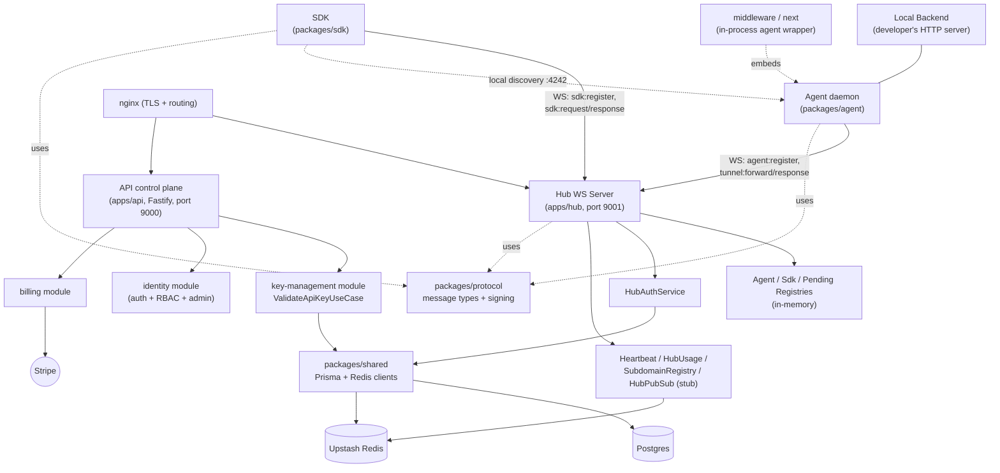
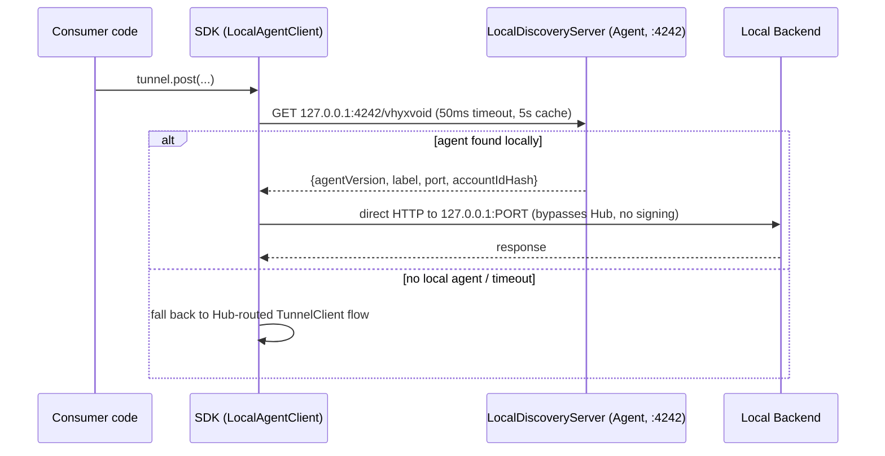
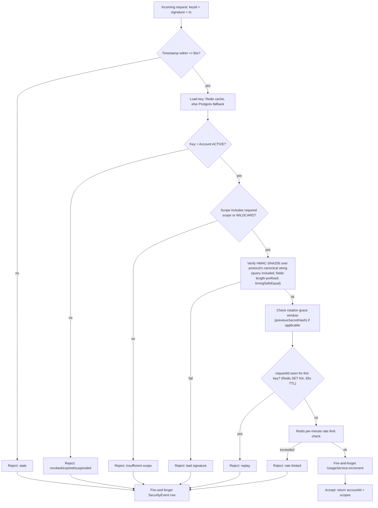

# Project Context — shared

**Scope:** cross-cutting monorepo architecture, packages/* (protocol/shared/agent/sdk/middleware/next), CI and test infra, deployment/infra, and anything that doesn't cleanly belong to one app. See `internal-tools/api/context.md`, `internal-tools/hub/context.md`, `internal-tools/user-frontend/context.md` for the per-app detail this file deliberately omits.

Migrated 2026-09-17 from the monorepo's single `.claude/context.md` — see this file's own decision.md for the reorg rationale.

## Overview

This repository ("Black-Server" on the local dev machine; `~/Vhyxvoid` on the production server since 2026-09-20; GitHub `vhyxara/Vhyxvoid`; package scope `@vhyxvoid/*`) is **VhyxVoid**, a self-hosted tunnel / reverse-proxy platform in the spirit of ngrok. A small **Agent** daemon runs next to a developer's local backend and holds a persistent WebSocket connection to a central **Hub**. Any HTTP (and now WebSocket) request sent through the **SDK** by a consumer application is routed by the Hub to the correct Agent, forwarded to the developer's `localhost` backend, and the response is streamed back — typically in 10-70ms. A separate **API** service is the control plane: accounts, users, API keys (with HMAC-based signing/rotation), Stripe billing, admin RBAC, notifications, and feedback.

The rename from the earlier codename **"BlackServer" / "BKSR"** to **"VhyxVoid"** is mostly done (investigated 2026-09-20): GitHub is renamed (`vhyxara/Vhyxvoid`, old URL redirects), every package is `@vhyxvoid/*`, the key prefix is already `vhyxvoid_live_` (no `bksr` anywhere), and the production server folder was moved `~/Black-Server` -> `~/Vhyxvoid` (crontab `cd` paths updated in both lines; compose project name pinned to `black-server` in `docker-compose.yml` so the `black-server_platform` network and image names are unchanged — do not remove that pin without recreating the stack; `platform-*` container names are also unchanged). **Still outstanding:** the dead `packages/sdk/src/blackserver-client.ts`/`demo.js` and stale root `package-lock.json`, a few comments/README lines and `apps/api/scripts/kill-zombie-dev.sh` (matches the local folder name), the local folder name and local Postgres DB `Black-server`, and the older `platform`/`@platform/demo-backend` leftovers. The system is also mid-migration on a second axis: from a **WebSocket-tunnel model** (Agent+Hub+`TunnelClient`) toward a **subdomain HTTP model** (`SubdomainRegistry` on the Hub + `packages/sdk/src/client.ts`), and is growing **zero-config framework integrations** (`packages/middleware`, `packages/next`) that embed the Agent directly inside a consumer's Express/Fastify/Next.js process instead of running it as a separate CLI daemon.

Current state: functionally working core tunnel loop (agent registration → signed request → forward → response), a fairly complete control-plane API (DDD-style modules, seeded RBAC, Stripe billing, Prisma/Postgres), but with real gaps — an unauthenticated internal Hub endpoint, a stubbed cross-hub pub/sub (no horizontal Hub scaling), an unenforced email-verification check, a likely-misconfigured hub TLS cert, and very thin automated test coverage (4 e2e tests total, no unit tests in any app/package).

## Product Vision (from original build sessions)

VhyxVoid's goal is to become the default tunnel tool for full-stack development teams — not by being cheaper than ngrok, but by being deeply integrated into the workflow so developers stop thinking about tunnels as a separate tool. The core insight: cookie-domain sharing (`Domain=.vhyxvoid.com`) and a multi-label tunnel system mean an entire dev environment (frontend `acme--app`, backend `acme--default`, webhooks `acme--webhooks`) shares one domain, so auth/cookies/CORS just work without configuration.

"Done" for V1: a developer adds one line to their Express/Fastify/Next.js server (`withVhyxvoid(nextConfig)` or middleware equivalent) and their local backend is instantly reachable at a stable public URL — zero separate processes, zero CLI commands, zero config beyond an API key. Teammates hit the same URL from the shared dashboard.

"Done" for the platform: real usage in the dashboard, working billing, team collaboration, and the agent handling webhook testing end-to-end without anyone touching ngrok. Longer-term: the tunnel is the entry point, but the real product is the visibility/collaboration/control layer built on top of it — a developer infrastructure platform.

## Tech Stack

- **Language**: TypeScript throughout (strict mode), Node.js runtime.
- **Monorepo**: pnpm workspaces (`apps/*`, `packages/*`) orchestrated by Turborepo (`turbo.json`); `pnpm@10.6.2` pinned as `packageManager`.
- **Build**: `tsc -b` composite TypeScript project references (root `tsconfig.json`, narrower `tsconfig.api.json`/`tsconfig.hub.json` for Docker builds) + `tsc-alias`; `agent`/`middleware`/`next` bundle with esbuild. Note: `packages/middleware` and `packages/next` sit outside this project-reference graph, so `tsc -b` doesn't build them as part of the standard flow.
- **Testing**: Vitest, config at `tests/vitest.config.ts`. Only 4 e2e tests exist repo-wide.
- **Deployment**: Docker (`Dockerfile.api`, `Dockerfile.hub`) + `docker-compose.yml` (api, hub, nginx, certbot — no Postgres/Redis containers, both external managed services) + nginx reverse proxy with TLS.

Agent and SDK are `packages/*` — shared, cross-app libraries, not owned by one deployable app, so documented here rather than under api/hub:

- **Agent**: `ws` client, `axios` (backend proxy), `better-sqlite3` (durable queue, WAL mode), `commander` (CLI).
- **SDK**: Node.js only (2026-09-19). `isomorphic-ws` (its `ws` half is what is used), hand-rolled HMAC signing via Node's `crypto`. Published as `@vhyxvoid/sdk` 1.1.0 (esbuild bundle, `index.js` + `index.mjs`, protocol inlined). Two live client implementations plus one dead one (see SDK Client Strategy below).

**Hub tech stack**: see `internal-tools/hub/context.md`. **API tech stack**: see `internal-tools/api/context.md`. **Frontend tech stack**: see `internal-tools/user-frontend/context.md`.

## Architecture

**This section is cross-cutting by nature — it describes how apps/api, apps/hub, the agent, and the SDK relate to each other and to packages/protocol and packages/shared. Read it regardless of which component you're working in.**

Three deployable services (`api`, `hub`, plus the developer-embedded `agent`) share two library packages: `packages/shared` (Prisma + Redis clients and `ValidateApiKeyUseCase`, imported directly by both `apps/api` and `apps/hub` — no HTTP hop between them) and `packages/protocol` (WebSocket wire-message types and the canonical-string HMAC signing helpers used by `agent`, `sdk`, and `hub`).

**The two-auth-scheme split is intentional and permanent** (confirmed by two independent build sessions): Agent registration uses a raw-secret HMAC check (`HubAuthService.authenticateAgent`) because it's a one-time connection handshake over a trusted, deliberately-run process — no replay risk since the connection itself is the session. SDK/API requests use full canonical-signature verification (`ValidateApiKeyUseCase`: timestamp window, replay protection via Redis, scope check, rotation-grace, rate limiting) because they're per-request calls over untrusted networks. These should **not** be unified — doing so would require agents to know the HMAC pepper, which was deliberately kept off the agent. The duplication is accepted tech debt, not a bug, but the two paths must be kept in sync by hand when either changes.



## Directory Structure

```
packages/
  protocol/       Wire message types, canonical-string HMAC signing, shared constants/errors.
                  No version negotiation despite a `v: "1"` field on every message (never checked).
  shared/         Prisma client + Redis client + ValidateApiKeyUseCase, imported directly
                  by both apps/api and apps/hub (no HTTP between them)
  agent/          The daemon: AgentClient state machine, MessageBatcher, BackendProxy,
                  ResponseCache, LocalDiscoveryServer, DurableQueue/NoOpQueue, CLI.
                  src/replay/replayQueue.ts — outbound replay works, inbound is partial (see Core Flows §1 note)
  sdk/            Developer-facing client: TunnelClient (WS, Node.js-only — CORRECTED 2026-09-19, was "browser-oriented"; narrowing scope),
                  client.ts (HTTP/subdomain model, confirmed fully implemented — ~198 lines,
                  real VhyxvoidClient class, this is now the primary/default surface),
                  blackserver-client.ts (dead legacy, should be deleted), demo.js (test file,
                  should not ship in published package)
  middleware/     Zero-config in-process Agent wrapper for Express (index.ts) and
                  Fastify (fastify.ts) + Next config (next.ts). Reuses the full CLI-oriented
                  AgentClient (including SQLite durable queue) — acknowledged architectural
                  overfit for an in-process context (see Design Notes).
  next/           Independent (duplicate) Next.js integration — reimplements
                  middleware/next.ts's logic rather than reusing it
archived/         Two prior generations of dead code: an old standalone agent
                  ("agentsdead") and a 742-line audit/refactor-planning doc (all.md)
                  that explains the shape of the current agent/protocol cleanup
tests/            Only 4 vitest e2e tests exist repo-wide (signature, queue replay, heartbeat)

apps/demo-backend/   Trivial test HTTP server (`/hello`, `/echo`) used to exercise a tunnel
                  locally end-to-end (agent+hub+sdk) — not owned by one component.
```

apps/api's, apps/hub's, and apps/web's own directory structure are documented in their own context.md files.

## SDK Client Strategy (resolved — was previously contradictory across build sessions)

Two prior build sessions gave conflicting answers on whether `client.ts` (HTTP/subdomain) replaces `TunnelClient` (WebSocket) or the two coexist permanently. Both were reasoning from intent, not a settled decision — **this was genuinely never decided during the build.**

**Resolved direction (recommended by both sessions independently once pressed):**

- `client.ts` (HTTP) is the default, primary SDK surface — confirmed fully implemented, not a stub.
- `TunnelClient` (WebSocket) is narrowed to one legitimate remaining case: a **Node.js** process wanting one persistent bidirectional connection to the hub instead of a new HTTPS request per call. Not the common case. **CORRECTED 2026-09-19: this bullet previously said "browser environments" (e.g. a live-reload dev tool). That never worked and cannot be made to work as-is:** the SDK imports Node's `crypto` (HMAC signing) and `http` (local-agent discovery), so `esbuild --platform=browser` fails even for `createClient` alone, and `TunnelClient` is configured with the API key secret, which must never ship in a browser bundle. The SDK is Node-only until a browser design solves bundling AND authentication together, as its own project; see decision.md, 2026-09-19, "SDK reclassified as Node-only".
- Proposed packaging: `@vhyxvoid/sdk` default export → HTTP client; `@vhyxvoid/sdk/ws` named export → TunnelClient.
- No hard deprecation yet, but no new features should land on TunnelClient going forward.
- This is a documentation/export-organization task, not a rewrite — action it before more consumers build against the wrong surface.

## Core Flows

**Flow 1 (Agent Registration & Handshake) is documented in `internal-tools/hub/context.md`. Flow 5 (User Signup/Login/RBAC) is documented in `internal-tools/api/context.md`.** The three flows below are genuinely cross-cutting (span agent+hub+sdk, or are shared by both Hub-SDK auth and direct API auth) and live here.

### Tunneled HTTP Request (main value-prop flow)

```mermaid
sequenceDiagram
    participant App as Consumer code
    participant SDK as TunnelClient (SDK)
    participant Hub as Hub
    participant Pend as PendingRegistry
    participant Agent as AgentClient
    participant Backend as Local Backend

    App->>SDK: tunnel.post('/api/users', body)
    SDK->>SDK: sign request (canonical string + HMAC)
    SDK->>Hub: sdk:request {requestId, method, path, body, signature}
    Hub->>Hub: authenticateRequest() -> ValidateApiKeyUseCase
    Hub->>Pend: enqueue(requestId, resolve/reject, 30s timeout)
    Hub->>Agent: tunnel:forward {requestId, method, path, body}
    Agent->>Backend: axios request to 127.0.0.1:PORT
    Backend-->>Agent: status + body
    Agent->>Agent: MessageBatcher.add(tunnel:response)
    Agent->>Hub: agent:batch [tunnel:response] (flush at 50ms or 100 items)
    Hub->>Pend: resolve(requestId, {status, body}); clearTimeout
    Hub->>Hub: TunnelRequest.create(...) — fire-and-forget, errors swallowed
    Hub-->>SDK: sdk:response {status, body}
    SDK-->>App: resolved Promise
```

Non-obvious behavior: both the Hub's Postgres writes (`TunnelSession`/`TunnelRequest`) and the Agent's response caching are best-effort/fire-and-forget by design ("never block the tunnel") — DB hiccups are silently swallowed. `ResponseCache` keys only on `path+query`, not on `Authorization`/`Cookie` — **confirmed an oversight, not a conscious tradeoff**, that became acceptable only because the agent runs on a developer's local (assumed single-user) machine. Both original build sessions independently flag this as a real bug to fix (add auth-header hash to the cache key) before the agent is used in any shared/CI environment.

### Local Discovery Fast Path

When the SDK and Agent are on the same machine, the SDK bypasses the Hub entirely for lower latency.



Gap: the `accountIdHash` field exists specifically so the SDK can confirm it's talking to _its own_ agent, but it's never populated by the Agent nor checked by the SDK — any process that can reach `127.0.0.1:4242` is routed through whichever agent is running, regardless of account/label. Low severity since it requires local machine access, but the security property implied by the field doesn't exist end-to-end.

### API Key Validation (shared by Hub-SDK auth and direct API auth)



**Updated 2026-09-24 (audit H8, `222546f`):** skew window 30 s (was 60), replay key written only after the signature verifies and namespaced per key (`apikey:replay:{keyId}:{requestId}`, TTL 65 s = 2 x window + margin), and the verifier now uses `packages/protocol`'s `buildCanonical` (query signed, fields length-prefixed behind a `vv2` tag) instead of its own copy. See `shared/decision.md`, 2026-09-24, "H8/H9".

Note: this is the path used correctly for SDK↔Hub auth, but the Hub's own `HubAuthService.authenticateAgent` re-implements a _subset_ of this logic ad hoc for Agent registration rather than reusing it. Confirmed intentional (see Architecture) — not a bug, but must be kept in sync by hand.

**Rate limiting was a known stub as of the original audit; no longer accurate.** `rateLimitPerMinute` in `ValidateApiKeyUseCase` used to always return `-1` (unlimited) and `buildCachePayload` hardcoded `Infinity`, with plan-based limits never wired to a real check anywhere. As of 2026-09-22 (sessions S1-S5), every gap this described is fixed in source (not yet deployed): the per-key SDK rate limit reads the real plan on every cache reload, the hub's agent limit and the public tunnel-URL path's own separate rate limit both read the real plan too, and the public path — previously with no check of any kind — now has a per-account per-minute limiter and monthly usage counting. See Known Risks #57 for the full detail and commit references.

## Data Model

The full ERD lives in `internal-tools/api/context.md` (schema.prisma is the source of truth for the whole system's DB, and lives under `apps/api/prisma/`) — `TUNNEL_SESSION`/`TUNNEL_REQUEST` are written by apps/hub via `packages/shared`'s Prisma client, but the schema itself is documented there, not duplicated here.

## Configuration & Environment

| Variable                                                                                                                | Purpose                                                                                                                                                                                                                                           | Required?                      |
| ----------------------------------------------------------------------------------------------------------------------- | ------------------------------------------------------------------------------------------------------------------------------------------------------------------------------------------------------------------------------------------------- | ------------------------------ |
| `DATABASE_URL`                                                                                                          | Postgres connection string (shared by api & hub via `packages/shared`)                                                                                                                                                                            | Yes, both services             |
| `UPSTASH_REDIS_REST_URL` / `_TOKEN`                                                                                     | Redis (Upstash REST client) for caching, rate limiting, presence, pending mirror                                                                                                                                                                  | Yes, both services             |
| `SERVER_HMAC_PEPPER`                                                                                                    | Secret pepper mixed into every API-key HMAC (must be ≥32 chars — hub validates this at boot)                                                                                                                                                      | Yes, both services             |
| `PORT` (api) / `HUB_PORT` (hub)                                                                                         | Listen port — api defaults 9000, hub's fallback is inconsistent (main.ts logs 3001, actually binds 9001)                                                                                                                                          | Yes                            |
| `JWT_SECRET`, `JWT_EXPIRES_IN` (`JWT_ACCESS_SECRET`/`JWT_REFRESH_SECRET` in practice)                                   | **CORRECTED 2026-09-17 (was previously documented backwards) — registered (`@fastify/jwt` in `register.plugin.ts`) but functionally dead.** Its only consumer, `core/middleware/auth.middleware.ts`'s `authenticate`, is itself already-known dead code (zero importers, superseded by `userAuthGuard` — see `internal-tools/user-frontend/context.md` item 42). Nothing live signs or verifies with this. | No — registered but inert      |
| `PRIVATE_KEY`/`PUBLIC_KEY` (dev) vs `PRIVATE_KEY_B64`/`PUBLIC_KEY_B64` (prod) + `.pem` files under `apps/api/src/keys/` | **CORRECTED 2026-09-17 (was previously documented backwards) — this is what's actually live.** `RS256JwtService` (`apps/api/.../infrastructure/crypto/JwtService.ts`) reads these via `resolveRsaKey()` in `core.plugin.ts` and is the real signer/verifier for **both** the regular-user auth path (`userAuthGuard`, `Login`/`RefreshSession` use cases) and the Admin RBAC auth path (`AdminLogin`/`AdminRefreshToken` use cases, `adminAuthGuard`) — confirmed by reading all of those files directly while scoping `apps/admin` (`internal-tools/admin-frontend/decision.md`, 2026-09-17; full trail in `internal-tools/api/decision.md`, same date). Not safe to delete; rotating these keys affects every login on the whole system, admin included. | Yes, both services (dev/prod variants) |
| `STRIPE_SECRET_KEY`, `STRIPE_WEBHOOK_SECRET`, `STRIPE_PRO_PRICE_ID`, `STRIPE_ENTERPRISE_PRICE_ID`                       | Billing module / Stripe integration. Flat-rate price IDs only — see Billing note below.                                                                                                                                                           | Yes (api)                      |
| `RESEND_API_KEY`, `EMAIL_FROM`, `SUPPORT_EMAIL`, `ADMIN_FEEDBACK_EMAIL` (dev only)                                      | Transactional email                                                                                                                                                                                                                               | Yes (api)                      |
| `HUB_INTERNAL_URL` (dev only, api)                                                                                      | Used by `POST /api/v1/tunnelproxy/request` (`tunnelProxy.routes.ts`) to reach the Hub's `POST /internal/proxy` — a synchronous HTTP tunnel-request path, alternative to the SDK's WS/subdomain flow. A real caller exists (corrected 2026-09-13 — previously documented as unbuilt/no-caller, which was wrong); that caller was simply broken (missing auth header, fixed — see context.md item 40) and itself has no external callers yet. | Wired but unused end-to-end     |
| `HUB_INTERNAL_SECRET` (hub, and api once a real caller exists)                                                          | Added 2026-09-12. Shared secret required on every `/internal/proxy` request (`x-hub-internal-secret` header, checked via `crypto.timingSafeEqual`). Hub fails closed (503) when unset — see Known Risks #7.                                       | No — endpoint has no caller yet |
| `HUB_DOMAIN` (dev only, hub)                                                                                            | Public hostname for tunnel URLs / subdomain routing                                                                                                                                                                                               | Yes (hub, dev)                 |
| `HUB_DEBUG_LOGGING` (hub)                                                                                               | Added 2026-09-12. `true` enables verbose flow-debug logging (subdomain registration, per-request tunnel logs) via `apps/hub/src/utils/debug.ts`. Default off. Never gates secret-adjacent output — those lines were deleted outright, not flagged. | No — defaults off               |
| `CLIENT_123_SECRET`                                                                                                     | Oddly-named literal var in both api env files — likely a placeholder/test secret                                                                                                                                                                  | Flag for review                |
| `VHYXVOID_API_KEY`/`_SECRET`/`_PORT`/`_LABEL`/`_HUB_URL`/`_QUEUE_PATH`/`_WRITE_ENV`/`_ENV_KEY`                          | Agent CLI and `packages/middleware`/`packages/next` configuration                                                                                                                                                                                 | Yes, for agent/middleware/next |

**Project convention — VhyxUI linking.** `apps/web` consumes `@vhyxui/react` and `@vhyxui/tokens` from a **separate** repo (VhyxUI, not part of this monorepo) via pnpm's `link:` protocol, using **relative** paths (`link:../../../VhyxUI/packages/react`, `link:../../../VhyxUI/packages/tokens`), not absolute ones. This assumes VhyxUI is checked out as a **sibling directory** to this repo on disk — any contributor building `apps/web` needs both repos checked out side by side at that relative depth, or the link needs updating. This is the established pattern for any future workspace that consumes VhyxUI too, not a one-off for `apps/web` — don't rediscover this per-session. `apps/web/next.config.ts` also widens `turbopack.root` to the common parent of both repos (required for Turbopack to resolve a `link:` target outside its own root) and any VhyxUI component must be rendered from a `'use client'` boundary (VhyxUI's components aren't RSC-safe). See `apps/web/README.md` for the full setup and `decision.md`'s 2026-09-09 "VhyxUI stays a separate repo" entry for why this topology was chosen over vendoring or publishing.

**Same pattern, second sibling repo, added 2026-09-15**: `apps/web` also consumes `@vhyx/api-kit` (shared `createHttpClient`/`createQueryKeys`/`createQueryClient` conventions extracted per `TABLE_API_ARCHITECTURE_COMPARISON.md`'s Phase 1) from `link:../../../vhyx-api-kit` — a separate, single-package sibling repo at `/Users/tanveer/Documents/tanveer/vhyx-api-kit`, with its own fresh git history. No further `next.config.ts` change was needed since `turbopack.root` was already widened to the common parent directory, which already covers this new sibling too. See context.md item 44 and decision.md, 2026-09-15.

**Dev vs Prod differences observed**: prod API env drops `JWT_SECRET`/`JWT_EXPIRES_IN`/`HUB_INTERNAL_URL`/`ADMIN_FEEDBACK_EMAIL` and renames the key-pair vars to base64 variants (`_B64`) for safer injection; prod Hub env drops `PRIVATE_KEY`/`PUBLIC_KEY`/`HUB_DOMAIN`. Neither Postgres nor Redis is containerized in `docker-compose.yml` — both point at external managed instances via connection strings.

**Local dev backend for functional testing** — see `LOCAL_DEV_BACKEND.md` (repo root). A local Postgres 16 database (`Black-server`, already migrated + already has real seeded org/member/tunnel/API-key data) already exists on this machine independent of `apps/api/.env`'s active (remote Neon) `DATABASE_URL`. Overriding `DATABASE_URL` for just the `apps/api` dev process (never editing `.env`) lets `apps/web` be functionally tested against a real running API with real role-gated data, instead of every request failing at the network level as in every migration-step session before 2026-09-10. Set up specifically because Steps 3 and 4 both hit UI that's impossible to verify without real admin/multi-member org data. See `decision.md`, 2026-09-10, "Local dev backend set up as standing test infrastructure".

**Nginx/TLS — SAN question resolved live 2026-09-12; a different, more urgent problem found instead.** The repo's `nginx.conf` points `hub.vhyxvoid.com`'s `ssl_certificate`/`ssl_certificate_key` at the `/etc/letsencrypt/live/api.vhyxvoid.com/...` path, which looked like a possible misconfiguration from reading the file alone. A live check from this sandbox (which turned out to have network egress) settled it: `openssl s_client -connect hub.vhyxvoid.com:443 -servername hub.vhyxvoid.com` shows the actual served certificate's SAN is `DNS:*.vhyxvoid.com, DNS:vhyxvoid.com` — a wildcard, so the `api.`-named lineage directory is a red herring; the cert itself covers `hub.` regardless of which domain name certbot filed it under. **The real, live, urgent problem found instead: this certificate expired on 2026-08-03** (checked against the live clock, 2026-09-12 — over 5 weeks ago), on both `hub.` and `api.` subdomains (same cert, same expiry). Both services are otherwise up (`curl -k .../health` → 200), so this is purely a TLS-validation failure, but it will reject any real client that doesn't skip certificate verification. This cannot be fixed from a repo/session — it requires direct access to the live server to check certbot's renewal automation (the `certbot` container in `docker-compose.yml` per the Tech Stack section) — its cron/systemd timer or container logs. See `decision.md`, 2026-09-12, and Known Risks #2.

VhyxUI's and vhyx-api-kit's link: conventions are apps/web-specific — see `internal-tools/user-frontend/context.md` for that narrative detail (kept here only in the table above since it's a real env/config fact).

## Missing Features

No admin frontend exists, despite a complete, working admin backend — see `internal-tools/api/context.md` (backend detail) and `internal-tools/user-frontend/context.md` (frontend-gap detail, since that's where a future admin-frontend build would land).

## Known Risks / Gaps

Numbering is preserved from the original unified context.md so cross-references (`decision.md` entries, other component context.md files, `grep`) keep working across files. This is not a contiguous 1..N list — items owned by other components are simply absent here.

**Correction, 2026-09-22 (S4 session):** every prior entry in this file and in decision.md saying a finding "cannot be fixed/verified from a repo/session" or "requires direct server access this session doesn't have" was accurate for that session, but the premise no longer holds generally — this environment has a working SSH alias (`blackserver`, in `~/.ssh/config`, key already present) to the production server. Verified live 2026-09-22: `git log`, `docker compose ps`/`docker exec` into the running containers (confirming what's actually compiled and running, not just committed), `docker compose logs`, and reading `.env.production` files (read-only) all work. Used to confirm S1-S3 were genuinely deployed and running before starting S4 (`decision.md`, 2026-09-22, "S4", prerequisite-check paragraph) and to run one narrow, scoped write (a real Upstash Redis SET/GET/DEL cycle on a scratch key, cleaned up by its own DEL, entirely within the SSH session so the token never left the server). A future session needing to check live production state should try this before assuming it's unavailable — but treat every write as carefully as any other hard-to-reverse, outward-facing action: read-only by default, and confirm before anything that touches real state (this cycle's own production database still has zero customer rows, per the 2026-09-22 "Production database" decision entry, which lowers the stakes of a mistake today but won't always be true).

2. **RESOLVED (live-checked) — Hub TLS cert.** The SAN theory in the original finding was wrong to worry about: live `openssl s_client` against both `hub.vhyxvoid.com` and `api.vhyxvoid.com` (this sandbox has network egress, checked 2026-09-12) shows the served cert's SAN is `DNS:*.vhyxvoid.com, DNS:vhyxvoid.com` — a wildcard, so `hub.` is covered regardless of the certbot lineage directory name. **But the certificate is expired**: `Not After: Aug 3 21:03:51 2026 GMT`, checked against the live clock `Sat Sep 12 08:32:46 UTC 2026` — over 5 weeks past expiry, on both subdomains (same cert). Services are up (`curl -k .../health` → 200 on both); only the TLS handshake's cert-validity check fails, which most real clients won't skip. **This is a live production issue requiring direct server access this session doesn't have** — certbot's renewal automation (the `certbot` container in `docker-compose.yml`) has evidently not run successfully in over a month. See decision.md, 2026-09-12, "nginx/TLS cert: the SAN theory was wrong, but the live cert is actually expired" for exact commands. **Action needed from the user directly on the live server**: check `certbot renew` / its cron or systemd timer / the `certbot` container's logs.
5. **FIXED IN SOURCE 2026-09-19 (commit 603a783), NOT YET PUBLISHED — `ResponseCache` keyed only on `path+query`, and it leaked one caller's response to another.** Reproduced end to end on 2026-09-19 through the published agent (two requests, different cookies, backend `Cache-Control: max-age=60`: the second got the first's response as `x-vhyxvoid-cache: HIT`). The cache key now carries a SHA-256 digest of the caller's credential headers (`Authorization`, `Proxy-Authorization`, `Cookie`, and any header whose name contains auth/token/key/secret/session/csrf/xsrf/api), responses with `Set-Cookie` or `Vary: *` are never stored, and other `Vary` headers are honoured. A custom credential header outside those name patterns is still not recognised (backends using one should send `Vary`/`no-store`). Tests: `tests/e2e/agentResponseCacheCallers.test.ts` (12 of 14 fail against the old cache). The published agent 1.0.18 still has the bug. Original text (kept): **OPEN — `ResponseCache` keys only on `path+query`.** Re-read `packages/agent/.../ResponseCache.ts` directly: `buildKey()` is still `query ? \`${path}?${query}\` : path`, no auth-header/cookie component. Unchanged. (Separately, this same file's `CachedResponse` gained a `bodyEncoding` field 2026-09-12 as part of item 21's fix — unrelated to this cache-key gap.)
10. **OPEN, confirmed intentional — Auth-path divergence** (Agent HMAC vs SDK canonical signature). Matches `decision.md`'s 2026-09-09 "Agent/SDK auth schemes stay permanently separate" entry — not a bug, permanent by design.
11. **RESOLVED — Plaintext-looking credentials on disk.** `vhyxconfig.md` deleted 2026-09-12 — user confirmed the real credentials it contained were rotated manually outside any session. Confirmed via `git status`/`git log --all -- vhyxconfig.md` it was never tracked (clean local delete, no commit involved).
12. **OPEN\* (2026-09-19 update: the `dist/index.mjs`-never-emitted ESM gap noted below is FIXED AND PUBLISHED — sdk 1.1.0 (confirmed live on npm) builds real `index.js` + `index.mjs`, protocol inlined, `crypto` placeholder dependency dropped, binary responses are Buffers. The `/ws` subpath split (b) is still not done.) — Three overlapping SDK client implementations. Narrower now: the barrel-export gap is FIXED (2026-09-13), the primary/secondary path split is still not done.** Previously this item conflated two different things — (a) `client.ts`'s exports being unreachable from `packages/sdk`'s actual public entry point, and (b) the decided `@vhyxvoid/sdk` (default) / `@vhyxvoid/sdk/ws` (secondary) packaging split (`decision.md`, 2026-09-09) not being implemented. Investigated directly (2026-09-13, prompted by the previous session's report flagging an "unrelated diff" sitting uncommitted on `packages/sdk/src/index.ts`): that diff was not unrelated at all — it was this exact fix, already written (by an earlier, unidentified session) and already described by this item's prior text, just never committed. Verified it was complete and correct (all of `client.ts`'s exports present — `createClient`, `VhyxvoidClient`, `ClientError`, plus the `ClientConfig`/`ClientResponse` types — and `TunnelClient`/`TunnelError`/`TunnelTimeoutError`'s existing exports undisturbed), then committed it. **(a) is now FIXED**: a consumer importing from `@vhyxvoid/sdk`'s barrel can reach both `createClient` and `TunnelClient` today — verified with a real smoke test (construct, don't just import) rather than assuming the diff worked. **(b) remains OPEN, deliberately not actioned in this pass**: both are still exported from the *same* path (`packages/sdk/package.json`'s `exports` field has no `/ws` subpath at all, confirmed by reading it directly, not assumed) — `TunnelClient` is not narrowed to a secondary import path, and the barrel's own comments still list it first as "Existing WebSocket SDK" with the HTTP client positioned as the addition, the inverse of the decided primary/secondary framing. This is a real, separate, larger repackaging task (new subpath export, docs, migration guidance for existing internal consumers) intentionally left for its own session rather than folded into this narrow fix — see decision.md, 2026-09-13. `blackserver-client.ts` (dead legacy) is still present, untouched. Separately noted, not part of this item: `packages/sdk/package.json`'s `exports` field declares an `"import": "./dist/index.mjs"` condition but the build script (`tsc -b`) never emits `dist/index.mjs` — a pre-existing, unrelated ESM-build gap (confirmed present before this fix too), flagged for whoever next touches this package's build tooling. Tested: `tests/e2e/sdkBarrelExports.test.ts`.
13. **OPEN — `packages/sdk/src/demo.js`.** Still present, unchanged.
14. **OPEN — Duplicated framework-integration logic** (`packages/middleware/src/next.ts` vs `packages/next/src/index.ts`). Unchanged.
15. **FIXED — Missing/misplaced workspace dependencies.** Both halves resolved 2026-09-13. `packages/agent` was declaring `@vhyxvoid/protocol` only under `devDependencies` despite runtime use — re-verified still true immediately before fixing, then moved to `dependencies`. `packages/middleware` and `packages/next` were both missing a real dependency declaration for `@vhyxvoid/agent` (their bare `import { AgentClient } from "@vhyxvoid/agent"` had no dependency-graph-correct type source), which is what made both fail `tsc -b` from a clean state (`'disableQueue' does not exist in type 'AgentConfig'`, confirmed reproducibly the day before) — fixed by adding `"@vhyxvoid/agent": "workspace:*"` to both `package.json`s, matching the existing convention (e.g. `apps/hub`'s `"@vhyxvoid/shared": "workspace:*"`). A repo-wide grep for every workspace package importing `@vhyxvoid/agent`/`@vhyxvoid/protocol`/`@vhyxvoid/shared`/`@vhyxvoid/sdk` without declaring it found no further instances beyond these three. **Verified**: `pnpm install` created real symlinks for all three (`packages/next/node_modules/@vhyxvoid/agent`, `packages/middleware/node_modules/@vhyxvoid/agent`); deleted `tsconfig.tsbuildinfo` and `dist/` for all three packages and rebuilt each from scratch — all clean, no errors. **2026-09-19 correction: `"@vhyxvoid/agent": "workspace:*"` under `dependencies` was the wrong category** — both packages inline the agent with esbuild, so it is a build-time input; under `dependencies`, `npm publish` ships `workspace:*` unrewritten (uninstallable) and the *published* 1.0.3 manifests had `"dependencies": {}` anyway. Now `devDependencies`; see item 54. **Runtime-verified, not just type-checked**: confirmed via `tests/e2e/frameworkIntegrationDependency.test.ts` that both `packages/middleware`'s `vhyxvoid()` and `packages/next`'s `withVhyxvoid()` actually import and execute without throwing (with no credentials configured, exercising the documented safe/no-op path) — and separately confirmed by grepping the built `dist/index.js` output for `AgentClient`-only strings (e.g. `NoOpQueue`, `drainForReplay`) that esbuild was already correctly inlining `@vhyxvoid/agent`'s code into both bundles even before this fix, since neither package's esbuild `--external` list excludes it — meaning the missing declaration broke local `tsc -b`/dev-time type-checking but would **not** have broken a real end-user's installed package (the bundle is self-contained). CI's build step (`.github/workflows/ci.yml`) no longer excludes either package. See decision.md, 2026-09-13, "packages/next and packages/middleware: @vhyxvoid/agent dependency fix".
16. **OPEN — `withVhyxvoid` may start a tunnel during `next build`/CI.** Untouched.
17. **OPEN\* — `AgentClient` reused wholesale in `packages/middleware`, situation improved.** A `NoOpQueue` class was added (`packages/agent/src/queue/NoOpQueue.ts`, new file) and `AgentClient` now branches on a `disableQueue` config flag to use `NoOpQueue` instead of instantiating `DurableQueue`/SQLite at all when set (`packages/middleware/src/tunnel.ts:49` sets `disableQueue: true` with an explicit comment: "in-process agent reconnects automatically; no SQLite needed"). `replayQueue()` was also generalized to accept a `QueueLike` interface instead of a concrete `DurableQueue`, so it works with either. **Net effect: the specific complaint (SQLite durable queue instantiated inside an in-process middleware context) is now actually fixed**, not just patched around — no SQLite file gets created when middleware runs. **Correction 2026-09-19: "fixed" was true only of the uncommitted working tree.** The published `@vhyxvoid/middleware@1.0.3` predates it and still builds a `DurableQueue`, crashing at startup (`Could not locate the bindings file`). The fix was committed 2026-09-19 (`ecb9cde`, `eb4b2c6`) and is still unpublished; see item 54. The broader architectural point (a lighter, purpose-built `LightAgentClient` would still be a cleaner design than branching the full CLI-oriented class) remains a valid but non-urgent suggestion, not a live bug.
21. **FIXED (fully — both follow-ups closed 2026-09-13) — `tunnel:forward`/`tunnel:response` body had no explicit encoding field.** Investigated 2026-09-12 and found this **understated the actual bug**: `BackendProxy.forward()` unconditionally did `bodyBuffer.toString("utf8")` on every backend response regardless of content type — a lossy, irreversible corruption of any binary response (images, PDFs, etc.), not just "fragile inference" on the decode side. Fixed then: added optional `bodyEncoding?: 'utf8'|'base64'` to `TunnelResponseMsg`/`SdkResponseMsg` (protocol); `BackendProxy.forward()` now detects binary content-type and base64-encodes correctly; `ResponseCache`'s `CachedResponse` preserves `bodyEncoding` too; `HttpTunnelHandler.writeResponse()` prefers the explicit field over content-type sniffing (falls back for an older agent). Two follow-ups were explicitly left unfixed at the time — both closed out 2026-09-13:
22. **STALE — "Protocol has no real versioning" was already wrong before this session.** Checked 2026-09-12: `packages/protocol/src/serializer.ts`'s `parseMessage()` already throws `ProtocolError('VERSION_UNSUPPORTED', ...)` on any `v` mismatch, and has since the file's very first commit — not a later fix, the original claim was simply inaccurate. Both Hub and client side (`AgentClient.ts`, `TunnelClient.ts`) parse through this same shared function, so it's enforced consistently both directions. No code change needed; added a regression test since nothing previously verified it: `tests/e2e/protocolVersionCheck.test.ts`.
24. **OPEN — Two lockfiles.** `package-lock.json` still present at repo root, still not in `.gitignore` (grepped directly — no match). Unchanged.
26. **OPEN — Heavy AI-assisted-dev cruft.** Not re-audited file-by-file this pass, but no session_update.md entry claims a cleanup pass touched this — presumed unchanged.
31. **OPEN — `vhyxvoid_next` duplicate vs `middleware/next.ts`.** Same as item 14 — unchanged.
37. **FIXED (2026-09-13, dedicated session) — Two independent `ValidateApiKeyUseCase` implementations, unified.** Surfaced 2026-09-12 while investigating item 32: `apps/api/src/modules/key-management/application/use-cases/ValidateApiKey.usecase.ts` and `packages/shared/src/validateApiKey.ts` independently reimplemented the identical timestamp/replay/cache/scope/HMAC/rate-limit logic. Full investigation this session found: (a) `packages/shared`'s copy is the Hub's real, live gateway path (confirmed via `apps/hub/src/main.ts` → `buildValidateApiKeyUseCase`/`buildDbApiKeyLoader`); (b) `apps/api`'s copy backed **two** routes, not one — `POST /gateway/v1/validate` (its registration was already commented out in `server.ts`; never actually mounted) and `POST /api/v1/tunnelproxy/request` (mounted and live-routable, but had zero real callers anywhere in the repo and would always fail downstream regardless, since it never sent the `x-hub-internal-secret` header the Hub's `/internal/proxy` requires — see item 40); (c) `gateway.routes.ts`'s own header comment documented the *original* architectural intent — the Hub calling apps/api over HTTP as "the data plane entry point" before every tunneled request — but the system evolved to the strictly better in-process/no-HTTP-hop design (`packages/shared` imported directly by both apps), leaving the HTTP route as a superseded, never-actually-wired leftover, not a deliberate separate trust boundary; (d) apps/api's copy additionally had its own undiscovered bug — on a cache-miss, `buildCachePayload(key, Infinity, key.accountId)` passed the key's own `accountId` as the `accountStatus` argument (no account-status join exists on `ApiKeyRepository.findByKeyId`), so a cold-cache validation would always fail with `SUSPENDED_ACCOUNT` regardless of the account's real status — never caught because nothing exercises this path today. **Decision: unify, don't keep separate** (see decision.md, 2026-09-13, "Unify ValidateApiKeyUseCase") — apps/api's `ValidateApiKeyUseCase` is now a thin adapter delegating to `packages/shared`'s canonical `buildValidateApiKeyUseCase` (wired with apps/api's own Redis + Prisma via `buildDbApiKeyLoader`, the same factory the Hub uses), adding only what's genuinely apps/api-specific: mapping the canonical generic-string failure code onto `SecurityEventType` (two codes needed an explicit map — `SCOPE_MISSING`→`SCOPE_VIOLATION`, `RATE_LIMITED`→`RATE_LIMIT_EXCEEDED`, the rest matched already) and writing the fire-and-forget `SecurityEvent` audit row apps/api's DDD module needs but `packages/shared` deliberately doesn't know how to do (stays Prisma-free by design). `packages/shared`'s `GatewayValidationFailure` gained an optional `accountId` field (populated from the point a key is loaded onward) specifically so this audit-logging wrapper doesn't lose per-rejection account attribution by delegating to a black-box `execute()`. `apps/api` now declares `@vhyxvoid/shared` as a real dependency (it never had before — same class of gap as item 15) and a project reference to it. `packages/shared/src/validateApiKey.ts`'s ~290-line dead first-draft comment block (a full duplicate of the file predating the current DI-based design) was deleted as drive-by cleanup. `/gateway/v1/validate` was removed outright (see item 39); `/api/v1/tunnelproxy/request`'s missing-header bug was fixed (see item 40). Tested: `tests/e2e/validateApiKeyUseCase.test.ts` (15 tests — the canonical logic: success, timestamp/replay/unknown-key/status/scope/signature/rotation-grace/rate-limit rejections, fail-soft cache read, fail-open replay check, accountId attribution), `tests/e2e/apiValidateApiKeyAdapter.test.ts` (6 tests — code mapping, audit-event attribution). Also fixed in passing: `packages/shared/package.json`'s `exports` map had `require`/`types` conditions but no `import` condition, so any ESM-first resolver (Vite/Vitest included) failed to resolve the bare `@vhyxvoid/shared` specifier at all — discovered while writing the new tests; added `import` pointing at the same CJS `dist/index.js` (harmless since the package emits CJS either way — this only fixes conditional-exports matching, not module format). New tests still import via relative `../../packages/shared/src/...` paths to match this suite's established convention (see `protocolVersionCheck.test.ts`), not the bare specifier.
38. **OPEN, real bug, high severity — Test suite was already completely broken; "4 e2e tests exist" undersold how bad this is.** Discovered 2026-09-12 while establishing a baseline before adding new Hub-audit tests: running `npx vitest run --config tests/vitest.config.ts` shows **all 4 pre-existing test files fail at the import stage** — `heartbeat.test.ts` imports `apps/hub/src/ws_heartbeat` (doesn't exist), `queueReplay.test.ts` imports `apps/agent/src/utils/queue` (wrong path entirely — should be `packages/agent`, and that file doesn't exist either), `signature-success.test.ts`/`verifySignature.test.ts` both import `apps/hub/src/auth`/`apps/hub/src/store` (replaced by `HubAuthService`/the registry classes at some past restructuring, never updated). Real test coverage of this codebase, as of 2026-09-12, is **zero**, not "thin." Not fixed this session (out of explicit scope — diagnosing what each was originally meant to test against current architecture is separate, nontrivial work). This session added 5 new, real, passing test files instead (21 tests total — internal-proxy auth, AgentRegistry O(1) lookup, RedisApiKeyCacheService fail-soft/open, protocol version enforcement, BackendProxy body-encoding correctness) and added the `vite-tsconfig-paths` plugin to `tests/vitest.config.ts` (new devDependency) so tests can actually import `apps/hub`/`apps/api` source through their respective `@/...` aliases. See decision.md, 2026-09-12, "Test infrastructure." **Correction, noticed in passing 2026-09-13**: this item's own "OPEN" label is stale — the 2026-09-13 broken-test-repair session replaced all 4 files with real, passing tests and the 2026-09-13 agent-dependency-fix session added 2 more (35/35 passing at that point; now 56/56 after this session's additions). Left the historical text above as-is rather than rewriting it; treat this item as resolved.
43. **OPEN, flagged not fixed — `kautilyan-admin` and `kautilyan-frontend` share the identical `NEXT_PUBLIC_SECRET_KEY`-in-browser-bundle pattern** (per `TABLE_API_ARCHITECTURE_COMPARISON.md`, confirmed in both sibling repos' `http.ts`). Item 42's fix only touched VhyxVoid — those two repos need the same investigation-then-removal applied separately, outside this session's reach (different repos, different sessions). Before removing there, re-verify their own backend's signature-checking wiring the same way this session did for `apps/api` — kautilyan-admin's/kautilyan-frontend's backends were not investigated for whether their signature checks are actually live (unlike `apps/api`'s, confirmed dead) — don't assume the same "verified by nothing" conclusion transfers without checking.

54. **FIXED IN SOURCE 2026-09-19, NOT YET PUBLISHED — six bugs found by running the published agent/next/middleware against a stand-in hub (docs Integrations session).** Root cause shared by two of them: the esbuild step of the agent, next and middleware builds wrote back into tsc's own `dist/` and used it as input, so once a bundle existed `tsc -b` (incremental) considered it up to date and esbuild re-bundled the *old bundle* — stale code and a stale inlined `package.json` survived every later build. Builds now bundle from `src/` (`eb4b2c6`). One commit per fix: (1) `ecb9cde` `disableQueue`/`NoOpQueue` committed (+ `6d1be51` records agent 1.0.18 / sdk 1.0.1 versions); (2) `eb4b2c6` next/middleware published with no dependencies yet requiring `better-sqlite3` at load — fixed by requiring it lazily inside `DurableQueue`'s constructor (so in-process use never needs the native module) and moving `@vhyxvoid/agent` to `devDependencies`, NOT by declaring `better-sqlite3` in the wrappers (see decision.md); verified by installing packed tarballs into a project with no `better-sqlite3`/`ws`/`axios`; (3) `78f5c1c` `vhyxvoid init` exited 0 mid-wizard on Node 24 (a second readline interface on stdin, closed after the secret prompt, left stdin paused so the event loop emptied) — replaced by a single stdin-owning prompter, verified on a real pty; (4) `779e0d9` the agent reported `1.0.16` to the hub and its own `--version`: one `AGENT_VERSION` from the agent's package.json, plus a build-time guard (`scripts/check-dist.mjs`) that fails if `dist/cli.js --version` differs from package.json or a bundle requires `better-sqlite3` at load; (5) `c608b2f` per-message `[agent]`/`[batcher]` debug lines gated behind `VHYXVOID_DEBUG_LOGGING=true` / `--debug` (hub-style exact-`"true"` convention); (6) `603a783` response cache cross-caller leak (item 5). New tests: `agentDisableQueue`, `publishedManifests`, `agentInitCommand`, `agentPrompt`, `agentVersion`, `agentDebugLogging`, `agentResponseCacheCallers` (suite 22 → 29 files, 106 → 149 tests). **PUBLISHED 2026-09-19** (confirmed by the user, re-verified from the registry): `@vhyxvoid/agent` 1.0.19, `@vhyxvoid/next` 1.0.4, `@vhyxvoid/middleware` 1.0.4 carry all six fixes; publish prep also moved the agent's `@vhyxvoid/protocol` to `devDependencies` (its `workspace:*` made the packed tarball uninstallable) and added `prepublishOnly` to next/middleware. `@vhyxvoid/sdk` 1.0.1 is unchanged and still has the ESM-import bug and the stale-build binary-response bug.

55. **OPEN, investigated 2026-09-20 (design only, nothing implemented) — WebSocket relay over tunnel subdomains already exists but is untested and loses data.** The "Phase 2 gap / hub only accepts `/agent` and `/sdk` / tunnel WS upgrades 502" premise is **wrong**: `handleWebSocket` (`HttpTunnel.handler.ts`), agent `BackendProxy.openWebSocket`, and `tunnel:ws:open|message|close|error` were built in `6cac7b7`; nginx's wildcard block already forwards Upgrade; a live upgrade to an unregistered tunnel host returns the hub's own `404`. The comment at `HubServer.ts:317-320` ("that is Phase 2") is stale. Driving the real hub handler/router + real agent proxy/batcher against a real `ws` backend showed one isolated echo works but: **(D1) WS frames inside an `agent:batch` are silently dropped** (any 2+ frames within 50 ms — `handleAgentBatch` has no `tunnel:ws:message` case); (D2) close can overtake buffered frames, +50 ms latency per frame; (D3) 101 is sent before the backend WS exists so the first browser frame is lost and backend rejections can't surface as HTTP statuses; (D4) subprotocols break (Vite HMR `vite-hmr` -> `1011 Server sent a subprotocol but none was requested`); (D5) agent-link drop leaks browser sockets on the hub and backend sockets on the agent; (D6) WS frames enter the durable queue; (D7) `ws.close(1005/1006/1015)` throws and is swallowed, leaving the browser socket open; (D8) no caps/keepalive/backpressure/accounting; (D9) zero tests; (D10) no agent-ownership check on `tunnel:ws:*`. Full evidence, target design (new `TunnelWsRegistry`, deferred-101 handshake with `tunnel:ws:opened`, un-batched ordered relay, capability-gated back-compat), the auth trade-off, open decisions, and a 5-phase plan are in `internal-tools/shared/ws-tunnel-design.md`. **Phase 1 DONE 2026-09-20 (`8c74574`, not yet deployed): D1, D2, D5, D7, D10 and the D3 information leak are fixed and covered by `tests/e2e/tunnelWsRelay.test.ts` (16) + `tunnelWsRegistry.test.ts` (23); still open: D3's 101-before-backend / early-frame loss, D4 (subprotocols), D6 (replayQueue check), D8 (limits/keepalive), all Phases 2-5.** Deploy the hub before the agent. **2026-09-21: agent 1.0.20 / next 1.0.5 / middleware 1.0.5 prepared at 377c924 with the timeout fix (473b4ff) and Phase 1's agent half; NOT yet published, handoff in `internal-tools/shared/publish-agent-1.0.20-next-middleware-1.0.5.md`.** Do not document WS-through-tunnel as supported until Phase 4 of that plan passes. **2026-09-21: the docs now describe it as partly working with the failing cases named (Troubleshooting, Limitations), see `internal-tools/docs/decision.md`; revise that text when an agent with Phase 1 is published and after Phases 2 and 4.**

57. **FIXED IN SOURCE (S1 `c8b98e6`, S2 `9f246be`, S3 `a967c03`/`48ef739`, S4 `2465450`/`d7caf33`, S5 `3bbada4`/`3220de9`; NOT YET DEPLOYED): all of E1-E7 are now fixed in source — plan-limit enforcement gaps E1-E7, and the account-status lifecycle behind E6/E7, verified against current code 2026-09-22.** Each line below was re-read in the code and, where marked "ran", executed with scratch scripts (kept outside the repo). Full evidence, fix plan and sequencing: `decision.md`, 2026-09-22, "E1-E7 plan-limit enforcement: verified state and fix plan"; S5's own design and implementation: `decision.md`, 2026-09-22, "S5 investigation and proposal" and "S5 implementation". Production has no customer rows (all tables empty as of 2026-09-22), so behavior changes cost nothing yet; that is the reason to fix before the first customer, not after.
    - **E7 — CORRECTED, then FIXED IN SOURCE (S1, `c8b98e6`, not deployed; everything in this bullet describes the state BEFORE the fix; the fix is at the end of it).** `GracePeriodWorker` **is** instantiated, `.start()`ed and stopped on `onClose` in `billing.plugin.ts` (commit `31df389`, 2026-09-14, never touched since; `register.plugin.ts:39` registers the plugin and `server.ts:47` calls it; compiled into `dist`; `31df389` is an ancestor of the server checkout `e1f6f4d`). The 2026-09-22 "never instantiated (re-grepped)" claim was wrong; there was no regression. **But the worker cannot fire in practice:** it selects `status = PAST_DUE AND graceEndsAt <= now`, and the Stripe webhook leaves `graceEndsAt` null in both realistic event orders (ran: `invoice.payment_failed` then `customer.subscription.updated(past_due)` gives `graceEndsAt = null`, because the upsert writes `graceEndsAt: null` at `HandleStripeWebhook.usecase.ts:335-336`; the reverse order gives null too, because `handleInvoicePaymentFailed` skips when the subscription is already PAST_DUE, `:473`). Only a lone `payment_failed` sets it (7 days). A `PAST_DUE` account therefore stayed `PAST_DUE` indefinitely. **S1 fix:** `AccountBillingRepository.markPastDue` is set-if-absent and only acts on ACTIVE/PAST_DUE accounts (so a Stripe retry cannot resurrect an account the worker already suspended); `handleSubscriptionUpsert` uses it for PAST_DUE and clears the deadline only for ACTIVE/CANCELED; `handleInvoicePaymentFailed` no longer skips when the subscription is already PAST_DUE and emails only when it starts the clock; `incomplete`/`paused`/unknown statuses now leave the account untouched (they used to map to PAST_DUE); `pnpm backfill:grace-ends-at` (dry run by default, `--apply` to write) gives any pre-existing stuck PAST_DUE account `updatedAt + 7d`. Verified with the real use case, repository and worker against both event orders (fail-first against the old code: 17 tests), and the repository/backfill/worker SQL against the local dev Postgres inside a rolled-back transaction. NOT verified: a real or `stripe trigger` test-mode event. **Still true after S1:** the hub refuses PAST_DUE (E6), so until S4 a PAST_DUE account is refused for its 7 days and then suspended, i.e. the deadline is real but the 'grace' does not yet keep service running.
    - **E6 — FIXED IN SOURCE (S4, `2465450`, docs `d7caf33`; not deployed).** Was: `PAST_DUE` (and SUSPENDED/CANCELED) refused at the agent handshake (`HubAuthService.authenticateAgent`, `AUTH_FAILED "Account is not active"`, ran, all four statuses; the agent treats `AUTH_FAILED` as fatal and stops); the same test duplicated in `packages/shared/src/validateApiKey.ts` (SDK path); status came from the `apikey:data:*` Redis entry (5 min TTL) that nothing invalidated on a status change, so changes reached the hub up to 5 min late; and no status check existed on live traffic at all — `HttpTunnelHandler` never looked at account status and nothing evicted a connected agent, so a suspended account with a connected agent kept serving indefinitely. **Fix, in the plan's own three parts:** (a) a new `AccountKeyCacheInvalidator` (`apps/api`) resolves an account's real API keys and invalidates each one's cache entry via the existing per-key `invalidate()` — called from every place `Account.status` actually changes (the webhook's status transitions, guarded on the repository call's own changed-signal so a no-op retry doesn't churn the cache; `GracePeriodWorker`'s suspension); (b) a new `AccountStatusSweepService` (`apps/hub`, same shape as `HeartbeatService`, ~60s interval) batch-checks every connected account's real current status and evicts any that's no longer connectable, sending a real `hub:error {code: AUTH_FAILED, message: "Account is not active", fatal: true}` first (reusing the agent's existing fatal-stop handling) rather than a bare disconnect; (c) a new shared `CONNECTABLE_ACCOUNT_STATUSES = [ACTIVE, PAST_DUE]` (`packages/shared/src/accountStatus.ts`) replaces both hand-written `!== 'ACTIVE'` tests (`HubAuthService`, `validateApiKey.ts`) — done only after (a) and (b) were built and tested, per the plan's ordering. `PAST_DUE` is now genuinely connectable, matching the seven-day-grace promise; a live connection is evicted within one sweep interval of its account becoming non-connectable, whatever the reason. Verified: 47 new tests (unit + a true end-to-end test driving the real webhook, worker, hub router, registry and sweep together over one shared fake account table), fail-first (17 assertions across 6 files fail against the pre-fix code — several files fail to even import, since the shared connectable-status module the sweep depends on didn't exist yet), real SQL against the local dev Postgres (the sweep's batched status lookup and the cache invalidator against a real account's real API keys, in a rolled-back transaction), and — new for this session — a real SET/GET/DEL cycle run directly on the production server against the real Upstash Redis instance, using only a scratch key, confirming the exact mechanism the invalidator depends on.
    - **E1 — FIXED IN SOURCE (S3, `a967c03`, not deployed).** Was: `Message.router.ts:229` `const limit = PLAN_AGENT_LIMITS.PRO;` applied 5 to every plan (FREE promised 1, ENTERPRISE unlimited); two sources of truth for the same numbers (protocol `PLAN_AGENT_LIMITS`, api `PLAN_LIMITS.maxAgents`); the count included the same-label session a reconnect would replace. **Fix:** `PLAN_AGENT_LIMITS` deleted (confirmed byte-identical to `PLAN_LIMITS[plan].maxAgents` first); `Plan`/`PLAN_LIMITS` moved to `packages/shared/src/planLimits.ts`, the one place both apps can import; a new `resolvePlanForAccount`/`getPlanLimitsForAccount` (`packages/shared/src/planResolver.ts`) reuses `SubscriptionPlanLimitService`'s exact rule; `Message.router.ts` looks up the real plan via a new `TunnelSessionRepository.findPlanLimitsForAccount` and excludes the replaced same-label session from the count before checking, with no `await` between the check and `register()` so two racing registrations can't both pass. `PLAN_LIMITS.FREE.maxAgents` was already `1` in the moved source — the bug was only that the hub never read it, so FREE genuinely drops to 1 agent with no separate numeric edit (per Tanveer's approval, `decision.md`, "Answers to the E1-E7 open questions"). A failed plan lookup falls back to the old PRO limit (5), logged, rather than refusing or unlimiting the account. Tested (11 tests, fail-first: 9/11 fail against the pre-fix code, 2 don't distinguish by construction): FREE first-agent-ok/second-refused/reconnect-ok/racing-serializes, PRO 5-then-6th-refused/reconnect-at-limit-ok, ENTERPRISE unlimited, PAST_DUE keeps its plan, SUSPENDED gets FREE, plan-lookup-failure fallback.
    - **E2 — PARTIALLY FIXED IN SOURCE (S3, `a967c03`, not deployed); the write-side sub-bug E2b fully fixed by S1, a second instance of it found and fixed here too.** Was: `rowToCache()`/`buildDbApiKeyLoader()` (`packages/shared/src/clients.ts`, `validateApiKey.ts`) returned `rateLimitPerMinute: -1` on every DB reload regardless of plan; only `CreateApiKey` seeded the real value, and rotate/update/revoke/expiry invalidate the cache entry, so a rotated key was unlimited from its very next request (the earlier "create/rotate-seeded" wording was wrong for rotate). **S3 fix:** `buildDbApiKeyLoader` now looks up the account's real plan (same resolver as E1) on every reload, so invalidate-then-reload yields the plan's real limit immediately, not `-1`; a second instance of E2b was caught by this same fix's own test (the loader returned `Infinity` unnormalized for ENTERPRISE) and closed by exporting `toStoredRateLimit` from `validateApiKey.ts` and reusing it. The read side (`validateApiKey.ts`'s rate-limit check) now treats any non-finite/negative/wrong-type cached value as unlimited rather than a limit of 0, defensively, even though nothing should produce one now. **Still open, out of S3's scope:** if the plan lookup itself fails during a reload, the key reloads unlimited (matches the pre-S3 failure mode, not changed); E3/E6's reach (agents and the tunnel URL are never rate-limited at all, only `TunnelClient` SDK requests are) is unchanged — S5. Tested (12 tests, fail-first for the cases that matter: the `null`-from-serialized-`Infinity` case genuinely fails pre-fix; a couple of edge values pass either way by JS-coercion coincidence, noted not hidden).
    - **E3 — FIXED IN SOURCE (S5, `3bbada4`, docs `3220de9`; not deployed).** Was: `HttpTunnelHandler.handle()` resolves subdomain to agent to forward with no key, status or rate check at all (`agent.keyId` is only stored on the pending entry) — correctly by design (public URLs for webhooks and teammates, callers hold no key), so "validate a key here" was always the wrong frame; the gap was the complete absence of any per-account limit. **Fix:** a new `PublicPathUsageLimiter` (`apps/hub/src/services`), checked in `HttpTunnelHandler.handle()` right after the subdomain resolves (using `entry.accountId`, already on hand — no new lookup) and before the agent lookup, so a flood aimed at a URL with no agent connected is still capped. Two mechanisms, not one: (a) a real-time, in-process, per-minute abuse limiter (`FREE 100/min, PRO 3,000/min, ENTERPRISE unlimited`, new `publicPathRateLimitPerMinute` in `PLAN_LIMITS`) — in-process rather than Redis-backed since the hub is single-instance and this traffic can be high-volume/unsigned, and a Redis command per request would cost real money for no real benefit; a refused request gets `429` with a `Retry-After` header and a `retryAfterSeconds` body field, matching the existing `sendError` envelope. (b) a batched monthly usage counter, accumulated in-process and flushed every ~30s into the exact same Redis-then-Postgres pipeline the SDK path already uses (`HubUsageService` -> `apps/api`'s `FlushUsageWorker` -> `UsageAggregate`), via a new `PUBLIC_USAGE_SENTINEL` (`packages/shared`) standing in for `apiKeyId` in the Redis key, mapped back to a real `null` by `RedisApiKeyCacheService.drainUsageCounters()` before it reaches Postgres — `UsageAggregate.apiKeyId`'s documented "account-level rollup" shape, unused until this session. Plan lookup is cached in-process (60s TTL) via the same `TunnelSessionRepository.findPlanLimitsForAccount` S3 added for the agent limit; a failed lookup falls back to PRO's number, logged, matching S3's identical precedent for E1. **Found and fixed alongside it:** `UsageAggregateRepository.upsertQuantity`'s compound-unique `where` clause used `apiKeyId ?? ""` while `create()` wrote a real `null` — those can never match each other (and Prisma's compound-unique `where` shorthand rejects a literal `null` outright, confirmed by `tsc`), so every flush of a null-`apiKeyId` row would have inserted a fresh duplicate instead of accumulating; never triggered before this session because `apiKeyId` was always a real key id until now. Fixed with a plain find-then-write path for the null case specifically. Tested (27 new tests across 5 files: the limiter's FREE/PRO/ENTERPRISE thresholds and monthly accumulator, the handler's 429 shape, `drainUsageCounters`' sentinel mapping, and the `upsertQuantity` null-rollup accumulation), fail-first throughout, plus real-Postgres verification of the `upsertQuantity` fix (three flushes into the same period land in one row summed to the right total) in a rolled-back transaction against the local dev database.
    - **E4 — FIXED IN SOURCE (S3, `a967c03`, not deployed) by removal, not a comment.** `HubAuthResult.rateLimitPerMinute` (`HubAuth.service.ts`) and every place that set it (`-1` on the agent path, `result.rateLimitPerMinute` on the two SDK paths) are deleted. Confirmed before removing: hub-internal type, no exported public surface, not part of `packages/protocol`'s wire messages, neither call site in `Message.router.ts` ever read it. Chose deletion over a "known unused" comment because the field's presence was itself misleading (it looked like the agent path had a rate limit when it never did).
    - **E5, checked independently.** `maxMembers` — **FIXED IN SOURCE (S2, `9f246be`, docs `ec835e8`; not deployed).** Was: `CheckPlanLimitsService.canAddMember` and the `"maxMembers"` guard key existed with **zero callers** (`buildPlanLimitGuard` is built once, for `maxApiKeys`; `InviteMember`/`AcceptInvitation` had no plan check). **Fix:** `canAddMember` is now called from `InviteMember` (counting current members plus pending invitations, so an account can't send more invites than it has room for) and independently from `AcceptInvitation` (counting current members only, the real backstop for a downgrade or two invitations accepted close together — tested). New `MembershipRepository.count(accountId)`. Neither guard is retroactive — an account already over its limit keeps its existing members; only the next new one is blocked (confirmed against a real over-limit account in the local dev DB, `Acme Corp`). **Found and fixed alongside it, not originally part of E5:** `CheckPlanLimitsService.getLimits` had its own non-canonical plan-resolution rule (the Subscription entity's own status, not the Account's), the same class of bug S3 fixed elsewhere — under it a `PAST_DUE` account read as `FREE`, contradicting the grace-period policy, and this was **already live** via `apiKeyLimitGuard` gating real API-key creation. Now a thin adapter over the same canonical `packages/shared` resolver as everything else. `maxRequestsPerMonth` — **FIXED IN SOURCE (S5, `62ddc08` dedup + `3bbada4` counting, docs `3220de9`; not deployed).** Was: the HTTP tunnel path never counted a request at all, and the SDK path counted every successfully-forwarded request **twice** into the same Redis key `usage:{account}:{key}:requests:{5-min bucket}` — once by `ValidateApiKeyUseCase.incrementUsage` (inside `authenticateRequest`, step 1 of `handleSdkRequest`) and again by `Message.router.ts`'s own `usageService.increment(...)` right after forwarding (line drifted `:565` to `:595` since the original finding — same bug, unrelated intervening edits). Confirmed the double count was real by tracing the full call path (not just grepping for the two call sites) before fixing. **Fix, in two parts:** (1) deleted `Message.router.ts`'s redundant call — `ValidateApiKeyUseCase.incrementUsage` is the sole, correct counter for every key-authenticated path, confirmed by also checking a third caller of the canonical validator (`apps/api`'s `tunnelProxy.routes.ts` -> hub `/internal/proxy`) that was already correctly single-counted and must stay that way. (2) the public tunnel-URL path now counts too, via the new `PublicPathUsageLimiter` (see E3 above) — a request refused by the per-minute limiter does not count, since it never reached an agent. **Still true, unchanged, and correctly so per the decided semantics (`decision.md`, "Answers to the E1-E7 open questions", #6):** the monthly total is counted and will eventually be shown, but nothing blocks a request for exceeding it — it's informational until there's real usage data to size a hard limit against. **Also done in S5:** raised FREE's `maxRequestsPerMonth` from 1,000 to 10,000, since the old number was set before either path counted anything real and would have looked like every normal FREE account was already far over its limit the moment counting started. Tested: see E3's test list (the dedup fix and the new counting share the same test files). `customDomains`: unchanged, field only, the feature does not exist (no schema, route or code) — confirmed still true, re-grepped 2026-09-22. `analyticsRetentionDays`: unchanged, field only, no cleanup job exists (data is kept forever, the safe direction) — confirmed still true, re-grepped 2026-09-22. Per `decision.md`'s S5/S6 entries, neither is being built now (no product demand for `customDomains`; a retention job deletes data and needs its own dry-run session) — the public-facing plan copy was updated to say "planned"/"not yet available" instead of implying either is enforced, in the same docs pass as the rate-limit changes.
    - **Open questions answered 2026-09-22** (`decision.md`, "Answers to the E1-E7 open questions"): PAST_DUE connectable during grace; FREE to 1 agent approved (S3); FREE `maxMembers: 1` = no invites; monthly request cap soft; no retention job; per-account rate-limit numbers left to S5. **Hard prerequisite for S4/admin-suspend — FIXED IN SOURCE (`069f3d9`, docs `bfe660b`; not deployed).** Was: any Stripe `active`/`trialing` event set a SUSPENDED (or RESTRICTED/CANCELED/DELETED) account back to ACTIVE unconditionally, in both `handleSubscriptionUpsert` and (via a guard that read the Subscription row's own status, not the Account's, so it didn't actually protect a worker-suspended account) `handleInvoicePaymentSucceeded`. Fix: a new `AccountBillingRepository.markActiveFromPastDue`, a single conditional update guarded to `WHERE status = 'PAST_DUE'` (same discipline as `markPastDue`), used at both call sites; `Account.status` confirmed to have no reason field (full `model Account` re-read), so nothing auto-reactivates a SUSPENDED account regardless of cause — un-suspending is left as a deliberate action until such a field exists. Tested (10 new tests, fail-first: the 6 bug-case assertions fail pre-fix, the 4 recovery-case ones pass in both states); a pre-existing test that had encoded the bug as correct (`stripeWebhookGracePeriod.test.ts`, "paying afterwards still reactivates it") was updated in place, not left red or deleted. Real SQL verified against the local dev Postgres in a rolled-back transaction. The prerequisite is satisfied; S4 and admin-suspend are unblocked on this specific point (S4 still needs S1 deployed first, per its own ordering).
    - **Addendum 2026-09-24 — the counting above never reached Postgres.** Both paths' counters landed in Redis correctly (the dedup is confirmed live: one count per SDK request), but `apps/api`'s drain read the wrong result shape from Upstash and deleted every counter unread, the flush skipped accounts with no ACTIVE key, and SDK-path rows then failed `UsageAggregate`'s `ApiKey.id` foreign key. Fixed in source (`a68f355`, `369f350`, `9840c8a`, api only, not deployed); see `internal-tools/api/context.md` item 59. Also found: `sdk:register` counts as a request (shared/backlog.md).
    - **Not a bug, but it constrains the fix:** the API resolves a plan two different ways (`CheckPlanLimitsService.getLimits` = FREE unless subscription active/trialing; `SubscriptionPlanLimitService` = latest subscription's plan unless account SUSPENDED/RESTRICTED/CANCELED/DELETED, decided 2026-09-13). The hub must reuse the second one.

60. **MITIGATED IN SOURCE 2026-09-24 (`ffb80a0`, docs `90d9ac3`; not deployed); full fix (audit A1) deferred — tunnel cookie rewrite and credentialed CORS reflection (audit `audit-2026-09-24.md` C3/C4).** Was: `HttpTunnel.handler.ts` rewrote every backend `Set-Cookie` to `Domain=.<hubDomain>; SameSite=None; Secure`. `vhyxvoid.com` is not on the Public Suffix List, so a cookie set by one tenant's tunnel was sent by the browser to every other tenant's tunnel host (an attacker's agent receives it in `Cookie`), any tunnel could set cookies for `.vhyxvoid.com` (cookie tossing onto other tunnels and `api.`), `SameSite` protection was removed, and `__Host-` cookies became invalid. The hub also answered every `OPTIONS` itself with the caller's `Origin` + `Access-Control-Allow-Credentials: true`, and on every response dropped the backend's own `access-control-*`/`Vary` headers and substituted the same reflected Origin with credentials, so any website could make credentialed requests to any tunnel and read the response. **Mitigation (the audit's own short-term recommendation):** the backend's `Set-Cookie`, `Access-Control-*` and `Vary` headers now pass through unmodified (hop-by-hop still stripped), the hub adds no CORS headers of its own, and `OPTIONS` is forwarded to the backend like any other request, so the backend's policy decides. Verified before changing that nothing implements or depends on cookie-domain sharing: no per-tunnel opt-in exists anywhere (hub, agent, protocol, api, web), apps/web's own cookies are its API's host-only cookies, and the only doc describing the old behaviour was `reference/http-status-codes.mdx` (updated). Tests: `tests/e2e/tunnelCookieCorsPassthrough.test.ts` (7; real `HttpTunnelHandler` into the real agent `BackendProxy` and a local backend; 6 fail against the old code, the 7th cannot distinguish by construction). Verified end to end with the real `HubServer`, real `AgentClient` over WS and a real backend (Redis/Prisma faked in memory, nothing shared touched), before and after. **Consequences to know:** (a) this reverses the Product Vision's "cookie-domain sharing ... auth/cookies/CORS just work" premise for now: sharing cookies across an account's labels needs the per-account scoping of **A1** (tunnels on their own PSL-registered domain, host format `<label>.<slug>.<tunnel-domain>`, cookies scoped to `.<slug>.<tunnel-domain>`), a separate, deliberate project, not started; (b) developers whose browser pages call a tunnel cross-origin now need their own server to send CORS headers; (c) public `OPTIONS` requests now pass the per-minute limiter and count as usage. Deploy note in `backlog.md`. Still open from the same audit and related, not changed here: guessable tunnel URLs (H11), no tunnel access control (F2).

65. **FIXED IN SOURCE 2026-09-25 (`4319aa6` G1, `2f90df4` G3, `6ad687e` G4, `bd02394` G7; docs `ff0d2ea`; not published) — four agent/middleware findings from the second-pass audit (`audit-2026-09-24-part2.md`).** **G1:** `DurableQueue` returned snake_case columns to camelCase readers, so `maxAttempts` was undefined and nothing was ever dead-lettered (failing items retried forever); all item SELECTs now alias. **G3:** while offline the agent wrote every `tunnel:response` (full bodies: tokens, PII) unencrypted to `~/.vhyxvoid/queue.db`. Now held in memory only (100 responses / 20 MB / the hub's 120 s pending window) and sent after `hub:registered`; outbound rows left by older agents are purged when the queue opens; `replayQueue` deletes any outbound item unsent; `DurableQueue.enqueueOutbound`/`NoOpQueue.enqueueOutbound` removed (public API). Holding still matters: after a half-open drop a same-label reconnect replaces the hub session without rejecting its pending requests, so a response inside that window is delivered (in-process agents now deliver them too; they used to drop them). **Found while fixing: nothing in the agent calls `enqueueInbound`, so inbound replay has no producer and, after G3, the SQLite queue has no live writer at all** (backlog: delete it or wire it). **G4:** batches had no byte limit; eleven ~10 MB responses in one 50 ms window made a ~150 MB frame and the hub closed the agent with 1009 (reproduced). Batches are now capped at 1 MB and a message over 1 MB is sent alone, order kept; each message is serialized once. **G7 (breaking for the next `@vhyxvoid/middleware` release):** the tunnel started whenever `NODE_ENV !== 'production'` (unset/test/staging/CI exposed a server if the key was in its environment); now only when `NODE_ENV === 'development'` and `CI` is unset/`false`/`0`; `enabled: true` forces it. `@vhyxvoid/next` doesn't have the CI check (backlog). Tests: 24 new across 4 files, 17 fail against the old code (the rest cannot distinguish by construction). The agent, next and middleware must be republished for any of this to reach users (bump: agent minor for the removed `enqueueOutbound`, middleware minor/major for G7).

## Open Questions

- ~~Is Agent HMAC auth meant to converge with SDK canonical signatures?~~ **Resolved: no, intentional permanent split.**
- ~~Is `client.ts` meant to replace `TunnelClient`?~~ **Resolved: `client.ts` becomes primary/default; `TunnelClient` narrows to a persistent-connection niche for Node.js processes (2026-09-19: originally written as a "browser" niche; see SDK Client Strategy). Was genuinely undecided during the build — now decided, needs to be actioned (export reorg + docs).**
- ~~Is the nginx TLS cert setup for `hub.<domain>` intentional or a misconfiguration?~~ **Resolved 2026-09-12 via a live check (this sandbox has network egress): the SAN is fine (wildcard `*.vhyxvoid.com`, covers `hub.` regardless of lineage directory name) — but the live certificate is expired (since 2026-08-03). Not a repo-fixable issue; requires the user to check certbot renewal on the actual server. See Known Risks #2.**
- ~~Exact SAN list / actual live-server nginx config?~~ **Resolved 2026-09-12 — see Known Risks #2. The SAN question is settled; the cert-expiry finding is new and still needs the user's direct action.**
- ~~Was `vhyxconfig.md`'s real credential material ever actually rotated?~~ **Resolved 2026-09-12: yes, confirmed by the user (done manually outside any session). File deleted — see Known Risks #11.**
- **Still open, newly surfaced**: does the SDK (`packages/sdk`) already assume/handle binary request bodies anywhere in its own signing/sending path? Needed before item #21's request-direction corruption (readBody()) can be fixed — unverified this session, flagged as a prerequisite investigation, not assumed either way.
