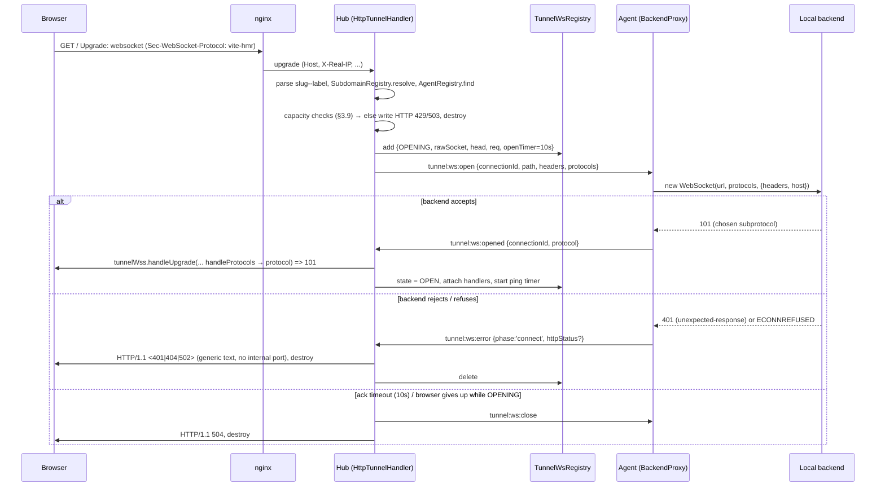

# WebSocket through tunnel subdomains — investigation + design

**Date:** 2026-09-20 · **Status:** investigation complete, NO implementation done · **Owner of follow-up:** next sessions (phased plan in §6)
**Scope:** cross-cutting — `apps/hub`, `packages/protocol`, `packages/agent` (and therefore `packages/next`/`packages/middleware`, which inline the agent).

---

## 0. TL;DR — the brief's premise was wrong, and that changes the job

The brief describes a "Phase 2 gap": *hub only accepts WS upgrades on `/agent` and `/sdk`; tunnel-subdomain upgrades 502*.
**That is not true of the current code.** WebSocket relay over tunnel subdomains was built in commit `6cac7b7` ("websocket connection 1") and is wired end-to-end on both sides:

| Layer | What already exists |
|---|---|
| protocol | `tunnel:ws:open` / `:message` / `:close` / `:error` (`packages/protocol/src/messages.ts:193-223`) |
| hub | `HubServer.ts:309-315` routes tunnel-host upgrades to `HttpTunnelHandler.handleWebSocket`; `activeBrowserWs` map; router cases for `tunnel:ws:message/close/error` |
| agent | `AgentClient.onWsOpen/onWsMessage/onWsClose`; `BackendProxy.openWebSocket/sendWebSocketMessage/closeWebSocket/closeAllWebSockets` |
| nginx | wildcard block already forwards `Upgrade`/`Connection` via `$connection_upgrade` |

The comment at `HubServer.ts:317-320` ("that is Phase 2 … reject cleanly") is **stale**; the code above it (309-315) already does the forwarding. The docs never describe it, there are **zero tests**, and nobody had exercised it — which is why it looked missing.

**So the real work is not "design WS tunneling from scratch"; it is "make an untested, partly-working relay correct".** I drove the real hub `HttpTunnelHandler` + real `MessageRouter` + real agent `BackendProxy`/`MessageBatcher` against a real `ws` backend (harness in §7) and found the relay **works for one isolated echo but silently loses data or leaks connections in ten realistic situations** (§2). The design below fixes those, adds the missing lifecycle/limits/keepalive, and is phased so that the data-loss fixes ship first, with no protocol change.

---

## 1. Part 1 — the exact current behaviour (verified, not assumed)

### 1.1 Hub upgrade handling (`apps/hub/src/HubServer.ts:293-323`)
Order of checks in the `upgrade` handler:
1. `req.url === '/agent' | '/sdk'` → main `wss` (control channels).
2. `httpTunnelHandler.isTunnelRequest(req)` (Host ends with `.vhyxvoid.com`, not apex) → `handleWebSocket(req, socket, head)`; `.catch` writes **`502 Bad Gateway`** and destroys the socket.
3. Otherwise `400 Bad Request`.

`handleWebSocket` (`HttpTunnel.handler.ts:257-337`): parse `slug--label` from Host → `SubdomainRegistry.resolve` (Redis) → `AgentRegistry.findByAgentId` → `tunnelWss.handleUpgrade` (a private `WebSocketServer({noServer:true})`) → **completes the 101 immediately** → sends `tunnel:ws:open` to the agent → relays.
Status codes it can emit itself: `400` (bad host format), `404` (no registered tunnel), `503` (registered but agent not connected). **The only `502` in the hub is the `.catch` in step 2** — i.e. `handleWebSocket` *rejected* (e.g. Upstash Redis `resolve` throwing).

### 1.2 Live check (this sandbox has network egress)
`curl` upgrade to `zz--probe.vhyxvoid.com` (no such tunnel) → **`HTTP/1.1 404 Not Found`, empty body, `Server: nginx/1.29.8`**. Empty body + chunked = the hub's own `socket.write('HTTP/1.1 404 …\r\n\r\n')` relayed by nginx. Therefore, in production **today**: (a) nginx *does* pass the Upgrade to the hub for tunnel hosts, and (b) the deployed hub *does* contain `handleWebSocket` (a pre-`6cac7b7` build would answer `400`). Wildcard cert on the tunnel host verifies (SAN `*.vhyxvoid.com`, valid to **2026-12-19**, `ssl_verify_result=0`).

**I could not reproduce a 502.** Plausible sources, if one was really observed: hub `.catch` (Redis failure), or nginx itself returning 502 while the hub container was down/restarting (deploy window). The brief's "returns 502" most likely came from reading the stale comment. If a real 502 is ever seen, capture the `Server:` header and hub logs to tell the two apart.

### 1.3 nginx (`nginx.conf`) — tunnel block is fine for WS
`server_name *.vhyxvoid.com` block: `proxy_http_version 1.1`, `Upgrade $http_upgrade`, `Connection $connection_upgrade` (the top-level `map $http_upgrade $connection_upgrade` **is** applied here, not only to hub), `proxy_buffering off`, `proxy_read/send_timeout 3600s`, `X-Real-IP`, `X-Forwarded-For`, `X-Forwarded-Proto`. Differences from the `hub.` block: hub uses a hard-coded `Connection "Upgrade"` and includes `cloudflare-ips.conf`; the wildcard block does **not** include the Cloudflare real-IP file. No nginx change is needed for WS. (One consequence to design for: nginx closes a WS after **3600 s with no bytes from upstream** → keepalive pings, §3.7.)

---

## 2. Verified defects in the existing relay

Every row was reproduced with the harness in §7 unless marked otherwise. "E#" = experiment id.

| # | Defect | Evidence | Real-world effect |
|---|---|---|---|
| **D1** | **Frames inside an `agent:batch` are silently dropped.** Agent sends backend→browser frames through `MessageBatcher` (50 ms window). If ≥2 items land in a window they're wrapped in `agent:batch`; hub's `handleAgentBatch` (`Message.router.ts:341`) only handles `tunnel:response`, `tunnel:agent-error`, `agent:pong` — **no case for `tunnel:ws:message`, no default**. `AgentBatchMsg.messages` type also excludes it. | E2: backend sends 5 frames on connect → **0 received**. E2b: two frames 300 ms apart both arrive; two back-to-back → **both lost**. | Any burst (socket.io handshake, HMR payload + follow-up, chat) loses frames. Even a lone frame coinciding with the 15 s heartbeat pong is lost. Works in a demo, fails in use. |
| **D2** | **Ordering + latency.** WS frames go via the batcher (up to +50 ms per frame) but `tunnel:ws:close`/`:error` go via `sendRaw` immediately → a close can overtake a still-buffered final frame, which then hits a closed browser socket. | code read (`AgentClient.ts:399` vs `:410`); latency from `TIMING.BATCH_WINDOW_MS=50` | Last message before close lost (e.g. socket.io `disconnect` packet). +≤50 ms on every server→browser frame — noticeable for HMR/interactive. |
| **D3** | **101 is sent before the backend WS exists**, and `sendWebSocketMessage` drops frames when the backend socket isn't `OPEN`. | E3: browser sends a frame in its `open` handler → echo never returns. E4: unreachable backend → browser sees `OPEN` then `close 1011 "connect ECONNREFUSED 127.0.0.1:<port>"`. | First client message lost (socket.io's `2probe` — it silently falls back to long-polling, so it *looks* like it works). A backend that rejects the upgrade (401/403/404) can never be reported as an HTTP status; raw internal error text (incl. local port) is sent to the browser. |
| **D4** | **Subprotocols broken.** Hub forwards `sec-websocket-protocol` as a plain header; agent calls `new WebSocket(url, {headers})` without the `protocols` arg, so `ws` rejects the backend's chosen subprotocol. Hub also picks the first offered protocol for the browser *without asking the backend*. | E1: `Sec-WebSocket-Protocol: vite-hmr` → **`1011 "Server sent a subprotocol but none was requested"`**; browser had already "negotiated" `vite-hmr`. | **Vite HMR, graphql-ws, MQTT-over-WS, any subprotocol user is broken.** |
| **D5** | **Agent↔hub link drop leaks both ends.** Hub `onAgentClose` never touches `activeBrowserWs` (no connectionId→agent index) → browser sockets stay open forever, map entries leak. Agent `AgentClient.onClose` never calls `proxy.closeAllWebSockets()` → backend sockets stay open, orphaned. | E5: after `onAgentClose`, browser socket **not closed**; backend WS **still OPEN**. | Zombie connections on hub, agent, and dev's backend; dev sees "connected" HMR that never updates. |
| **D6** | **WS frames enter the durable queue.** While the hub link is down, `MessageBatcher` diverts anything non-pong to `DurableQueue.enqueueOutbound`; WS frames qualify. | E6: `tunnel:ws:message` observed in the queue fallback. | Stale frames for dead `connectionId`s are persisted to SQLite and replayed on reconnect (hub drops them silently). Wasteful; **`replayQueue` handling of a non-response payload is unverified — check in Phase 1.** |
| **D7** | **Abnormal/no-code closes leave the browser socket open.** Agent forwards the backend's close code; hub calls `ws.close(msg.code)` inside `try/catch`. `ws` **throws** for 1005/1006/1015 (verified: `First argument must be a valid error code number`); the catch swallows it, the map entry is deleted, the browser socket stays open. `ws` reports **1005** whenever a peer closes without a status code and **1006** on abnormal termination. | direct `ws` check above; code read `HttpTunnel.handler.ts:508-517`. (Not in the E-harness; reasoning + isolated `ws` verification.) | Backend calls `ws.close()` or dies → browser socket hangs open with no map entry. **Very common trigger.** |
| **D8** | **No caps, no keepalive, no backpressure, no accounting.** No limit on concurrent tunnel WS (per agent/account/global); `tunnelWss` uses `ws`'s default 100 MiB `maxPayload`; no ping/pong to browser (dead peer leaks until TCP notices); unbounded `agent.ws.send`; WS connections don't touch `TunnelRequest`/usage. | code read | Resource-exhaustion surface (see §4), silent leaks. |
| **D9** | **Zero tests; undocumented; stale comment.** No test references `tunnel:ws`; docs are silent; `HubServer.ts:317-320` says "Phase 2". | grep | Why D1–D8 went unnoticed. |
| D10 | `tunnel:ws:*` from an agent is not ownership-checked: any authenticated agent that learns a `connectionId` can inject frames into another account's browser socket. IDs are 128-bit random so exploitation is impractical, but the check is one line. | code read (`Message.router.ts:395-403` passes straight through) | Defence in depth. |

**Hypothesis I tested and refuted:** duplicate handshake headers (`Sec-WebSocket-Key`/`-Extensions` forwarded *and* regenerated by `ws`) breaking the backend handshake. E0 shows the backend receives single values: Node's `setHeader` is case-insensitive and `ws` spreads its own headers last. No fix needed; do not spend Phase time on it.

**Not verified (needs a real framework, Phase 4):** whether Vite (≥5.4.12/6 origin/host checks on WS) and Next dev (`allowedDevOrigins`) accept the tunnel `Origin` (`https://slug--label.vhyxvoid.com`) — the agent rewrites `Host` to `127.0.0.1:<port>` but forwards `Origin` untouched.

---

## 3. Part 2 — target design

Guiding rule: **build on the existing message family and registries; add the minimum protocol; keep it backward compatible** (`parseMessage` checks only `v`, and the agent's router ignores unknown hub message types, so additive types are safe in one direction only — see §3.8).

### 3.1 State ownership — one new hub registry, agent stays in `BackendProxy`

Do **not** put this in `PendingRegistry`. Its contract is request/response with a timeout (`resolve/reject`, `rejectAllForAgent` → 504/502) and a Redis mirror; a WS tunnel has no response and lives for hours. Do **not** reuse `AgentRegistry` (one row per agent, keyed `accountId:label`).

New `apps/hub/src/registry/TunnelWs.registry.ts` (replaces the dead, never-instantiated `WsConnection.registry.ts` — that file's `socket/head/buffer` shape belongs to an earlier "buffer frames until agent opens" idea that the deferred-101 design below makes unnecessary; delete it in Phase 1):

```ts
type TunnelWsState = 'OPENING' | 'OPEN' | 'CLOSING';
interface TunnelWsEntry {
  connectionId: string;          // `ws_<uuid>` — hub-generated, sole correlation key
  accountId: string;
  agentId: string;               // owner — used for cleanup + frame-ownership check (D10)
  label: string; accountSlug: string;
  state: TunnelWsState;
  browserWs?: WebSocket;         // set at OPEN
  rawSocket?: Socket; head?: Buffer; req?: IncomingMessage; // held during OPENING only
  openTimer?: NodeJS.Timeout;    // ack timeout (§3.3)
  alive: boolean;                // ping/pong liveness (§3.7)
  openedAt: number; lastDataAt: number;
  framesIn: number; framesOut: number; bytesIn: number; bytesOut: number;  // accounting/diagnostics
}
class TunnelWsRegistry {
  add(e); get(id); delete(id);
  byAgent(agentId): TunnelWsEntry[];   // Map<agentId, Set<connectionId>> index
  countByAgent(id); countByAccount(id); size();
  closeAllForAgent(agentId, code, reason): number;
}
```
`HttpTunnelHandler` keeps `handleWebSocket` (move relay logic into a small `TunnelWsRelay` class next to it if the file gets unwieldy) but stores state only in this registry, replacing `activeBrowserWs`. Constructed once in `HubServer` and injected into `HttpTunnelHandler` **and** `MessageRouter` (router's `onAgentClose` needs it) — same singleton-injection pattern already verified for the handler (hub decision 2026-09-12, `tunnel:ws:error` routing).

Agent side keeps `BackendProxy.wsConnections: Map<connectionId, WebSocket>`. Reuse assessment: `AgentClient`'s own hub connection (state machine, reconnect/backoff, registration, batcher, queue) is **not reusable** for a per-connection relay — different lifecycle and no reconnect wanted. The only shared pieces are the `ws` library and `debugLog`. It is genuinely separate logic, correctly placed in `BackendProxy` (it owns the backend port); extend it, don't create a new class.

### 3.2 Protocol changes (`packages/protocol`, all optional/additive, `v` stays `"1"`)

```ts
// hub → agent  (extends existing)
interface TunnelWsOpenMsg {
  v:"1"; type:"tunnel:ws:open"; connectionId:string;
  path:string; query:string;
  headers: Record<string,string>;      // as today (hop-by-hop stripped; Sec-WebSocket-* stripped by hub — see below)
  protocols?: string[];                // NEW: parsed Sec-WebSocket-Protocol offer
}
// agent → hub  (NEW)
interface TunnelWsOpenedMsg {
  v:"1"; type:"tunnel:ws:opened"; connectionId:string;
  protocol?: string;                   // subprotocol the backend selected ('' if none)
}
// agent → hub  (extends existing)
interface TunnelWsErrorMsg {
  v:"1"; type:"tunnel:ws:error"; connectionId:string; message:string;
  phase?: 'connect'|'relay';           // NEW: 'connect' = before backend accepted
  httpStatus?: number;                 // NEW: backend's HTTP status when it rejected the upgrade
}
// unchanged: TunnelWsMessageMsg {connectionId,data,isBinary}, TunnelWsCloseMsg {connectionId,code,reason}
// agent:register gains  capabilities?: string[]   e.g. ['ws-relay/2']  (see §3.8)
```
Also widen `AgentBatchMsg.messages` and `BatchableMsg` **only for defence in depth on the hub** (so old agents that still batch WS frames work — §3.8); the *new* agent stops batching them.

Add to `packages/protocol`: `toSendableCloseCode(code:number):number` — maps 1005/1006/1015 (and any code `ws` rejects) to `1000`/`1011`, passes 1000-1003, 1007-1014, 3000-4999 through. **Both** hub and agent use it (fixes D7 and the agent's current partial sanitisation). Also a `LIMITS`/`TIMING` block for the constants in §3.9.

### 3.3 Open handshake — defer the 101 until the backend accepted


Consequences: D3 disappears entirely — the browser cannot send before it receives 101, so **no early-frame buffering is needed anywhere** — and D4 is fixed because the browser is answered with the backend's real subprotocol. The hub keeps `req/socket/head` for ≤10 s; it must attach a `socket.on('close')` during OPENING so a browser that gives up cancels the entry and sends `tunnel:ws:close`.
Header handling: hub already strips hop-by-hop; additionally strip `sec-websocket-key|version|extensions|protocol` from `headers` (the agent's `ws` client regenerates key/version/extensions; protocols travel in `protocols`). Keep `origin`, `cookie`, `authorization`, `x-forwarded-*`, `x-real-ip` (needed by backends); see Origin question in §5.

### 3.4 Relay phase — one ordered channel, no batcher, no queue
* browser→hub `message` → hub sends `tunnel:ws:message` immediately (as today). Add: check `agent.ws.bufferedAmount` (§3.9 backpressure).
* backend→agent `message` → agent sends `tunnel:ws:message` via **`sendRaw`, not `batcher.add`** — same channel as `:close`/`:error`, so order is preserved and latency is one hop (fixes D1's cause and D2). If the hub link is not `OPEN`, **drop and close the backend socket** (`tunnel:ws:*` never goes to `DurableQueue`; remove `TunnelWsMessageMsg` from `BatchableMsg` so the type system enforces it — fixes D6).
* hub receiving any `tunnel:ws:*` from agent: look up entry; **verify `entry.agentId === sessionOf(ws).agentId`** (D10); ignore + log otherwise. Handle `tunnel:ws:*` both standalone **and** inside `agent:batch` (legacy agents).
* Binary: keep the existing JSON/base64 encoding for now (+33 % size, extra CPU). The serializer already documents a msgpack "Phase 2" swap point; do **not** couple that to this work (§5, decision 6).

### 3.5 Close/error propagation (both directions, idempotent)
`closeEntry(connectionId, code, reason, {notifyBrowser, notifyAgent})` is the single teardown path: clears timers, removes from registry, closes browser socket with `toSendableCloseCode(code)` inside try/catch that falls back to `terminate()` (**not** "swallow and leave open" — D7), and sends `tunnel:ws:close` to the agent if it didn't originate there. Agent's `closeWebSocket` likewise uses the mapper and `terminate()` fallback. Backend closes → agent sends `tunnel:ws:close` → hub `closeEntry(notifyAgent:false)`. Browser closes → hub `closeEntry(notifyBrowser:false)` → agent closes backend socket (E7 shows this direction already works).

### 3.6 Agent disconnect / hub restart / agent reconnect
* **Agent↔hub link drops:** hub `MessageRouter.onAgentClose` → `tunnelWsRegistry.closeAllForAgent(agentId, 1012, 'agent disconnected')` for every entry (OPENING entries get `502`/`503`). Agent `AgentClient.onClose` → `proxy.closeAllWebSockets()` (backend sockets closed promptly; nothing left orphaned — D5).
* **No session resumption.** A tunnel WS does not survive an agent↔hub reconnect; the browser gets `1012 (Service Restart)` and is expected to reconnect (Vite HMR, socket.io, ReconnectingWebSocket all do). Rationale + consistency: matches the already-accepted "inbound replay gap" stance (hub decision 2026-09-12); resumption would need per-frame sequence numbers, hub-side buffering and backend cooperation — none justified.
* **Hub restart/crash:** browser sockets die with the process (nginx closes them); agent detects the link drop and runs the same cleanup. Nothing to persist — deliberately no Redis mirror for WS state (unlike `PendingRegistry`'s metadata mirror), because there is nothing recoverable; this also keeps the horizontal-scaling trigger (HubPubSub Phase 2, hub #9) unchanged: **WS tunnels are single-hub-instance like everything else, and would need affinity/pubsub relay when multi-hub is built.**
* **Stale agent reference:** `handleWebSocket` currently closes over `agent` at upgrade time; after the agent reconnects (new `agentId`) frames would go to a dead socket. With the registry, look up the live agent via `entry.agentId` at send time; if it's gone, `closeEntry`.

### 3.7 Idle/stale connections and keepalive
* Hub pings each **OPEN** browser socket every `WS_PING_INTERVAL_MS` (proposal 25 s, deliberately < any 30-60 s intermediary idle timeout and ≪ nginx's 3600 s); `alive=false` before the ping, set `true` on `pong`; if still `false` at the next tick → `terminate()` + `closeEntry`. Control frames terminate at each hop (standard proxy behaviour); application-level pings (engine.io/socket.io, graphql-ws `ping`) are ordinary data frames and pass through untouched.
* Hub↔agent liveness is already covered by `HeartbeatService` (15 s ping, 6 misses ≈ 90 s → evict → §3.6 cleanup).
* Agent↔backend: `ws` auto-pongs to backend pings; add an optional agent→backend ping (25 s, terminate on missed pong) so a hung backend doesn't pin agent state. Low priority; put in Phase 3.
* **Do not** add an idle-*data* timeout by default: HMR sockets are legitimately silent for hours. Liveness (pong) is the right staleness signal. (Open decision 3.)
* `TUNNEL_REQUEST_TIMEOUT_MS`: **confirmed not applicable.** `getTunnelRequestTimeoutMs()` is read only in `HttpTunnelHandler.handle()` (HTTP), the SDK request path, and the `hub:pending` TTL. `handleWebSocket` never touches `PendingRegistry` or that timeout. The only new time bound is the *open-ack* timeout `WS_OPEN_TIMEOUT_MS` (10 s proposal).

### 3.8 Compatibility matrix (mixed versions are the normal state — agents are npm-installed by users)

| hub | agent | behaviour |
|---|---|---|
| new | old (no `capabilities`) | **Legacy mode:** hub completes 101 immediately and sends `tunnel:ws:open` as today (no ack, no `protocols`); D3/D4 remain for those agents; D1 fixed hub-side because hub now handles WS items inside `agent:batch`; D5/D7 fixed hub-side. |
| new | new (`ws-relay/2`) | Full design. |
| old | new | New agent sends standalone `tunnel:ws:message` (already a known type → works, and no longer batched); sends `tunnel:ws:opened` which an old hub answers with `hub:error INVALID_MESSAGE` (non-fatal, logged by agent). Old hub doesn't send `protocols`, so agent treats absence as none. Works as today, minus D1/D2. **Deploy hub first** (Phase 1) so this window is short. |
Gate: hub decides mode from `AgentSession.capabilities.includes('ws-relay/2')` (add `capabilities` to `AgentRegisterMsg` and `AgentSession`); `agentVersion` semver is the fallback signal. Unknown hub→agent types are ignored by the agent's `default` branch (verified `AgentClient.ts:265`), so a new hub never breaks an old agent.
Publishing: `packages/agent` + `next` + `middleware` (agent is inlined) need a coordinated patch/minor bump and the docs `check:fresh` re-verify, per the 2026-09-19 publish-prep entries.

### 3.9 Limits, backpressure, config — **placeholders; every number needs a real decision (§5)**
| Constant | Proposed default | Why this shape |
|---|---|---|
| `WS_MAX_PER_AGENT` | 100 | Vite/Next HMR = 1 socket/tab; socket.io 1-few/tab; a busy dev ≈ 10-30. |
| `WS_MAX_PER_ACCOUNT` | 250 | Multiple agents/labels per account. |
| `WS_MAX_GLOBAL` | 5 000 | Rough hub-memory bound (tens of KB/socket incl. buffers ⇒ ~100-200 MB); replace with a measured figure. |
| `WS_OPEN_TIMEOUT_MS` | 10 000 | Local backend should accept in ms. |
| `WS_PING_INTERVAL_MS` | 25 000 | §3.7. |
| `WS_MAX_FRAME_BYTES` (`tunnelWss.maxPayload`) | 16 MiB | Default is 100 MiB; each frame is JSON+base64 in memory ≈ ×2-3. |
| `WS_BACKPRESSURE_BYTES` | 8 MiB `bufferedAmount` on agent link | Above it close the offending tunnel with `1013 Try Again Later`; the agent link is shared with HTTP tunnels + heartbeat, so one noisy socket must not starve them. |
Over-limit at upgrade → `HTTP 429` (per-agent/account) or `503` (global), *before* asking the agent. Env-overridable like `TUNNEL_REQUEST_TIMEOUT_MS` (`apps/hub/src/utils/tunnelTimeout.ts` pattern: clamp + warn). Note the existing agent-count check hard-codes `PLAN_AGENT_LIMITS.PRO` for every account (`Message.router.ts:221`) — plan-tiering of WS caps would be built on a pattern that isn't actually plan-aware yet; recommend flat caps now, plan tiers later with that fix. Expose `tunnelWs` count in `/health` and `/metrics` (also gives the data to pick real numbers).
**Agent side:** cap `wsConnections` (proposal 100); at cap reply `tunnel:ws:error{phase:'connect', httpStatus:503}`.

### 3.10 Usage accounting
WS upgrades currently never write `TunnelRequest` and don't count toward `maxRequestsPerMonth`. Recommend: record **one row per accepted upgrade** (method `WS`, status `101`, duration = connection lifetime, bytes in/out) at close — fire-and-forget like all hub writes — and never per frame. Needs a decision (§5) because it changes what "request" means in billing.

---

## 4. Auth posture — the trade-off (needs your decision, not made silently)

Facts established: tunnel HTTP is unauthenticated (docs context #2: anyone with `slug--label.vhyxvoid.com` reaches the dev's backend; hub checks nothing). `handleWebSocket` is currently identical (no check). Browsers **cannot** attach custom headers to a WebSocket and the SDK is deliberately Node-only (2026-09-19) — so there is no place to put key material in a browser WS. Also, the hub already reflects `Origin` with `Access-Control-Allow-Credentials: true` on every HTTP response and rewrites cookies to `Domain=.vhyxvoid.com; SameSite=None; Secure` — cross-origin credentialed reads are already possible over HTTP.

Does a long-lived WS change the calculus? **Somewhat, in one specific way: resource/DoS, not data exposure.**
* Data exposure: parity. Whatever a peer can get over a WS (HMR error overlays with source frames) it can already get by fetching the same origin over HTTP. WebSocket adds cross-site WS hijacking (CORS doesn't apply to WS), but HTTP is already credentialed-CORS-reflected here, so no *new class*.
* **New with WS:** each socket pins hub memory + an agent-link slot + a backend socket for hours. The moment §3.9 caps exist, an unauthenticated stranger can fill the per-agent cap and lock the developer out of their own HMR (cheap targeted DoS; HTTP has no equivalent slot to exhaust). Without caps, the same stranger exhausts hub memory instead. Either way the unauthenticated posture makes WS more abusable than one HTTP request.

| Option | Pros | Cons |
|---|---|---|
| **A. Parity (no auth), with caps + per-source-IP sub-cap** | Consistent with HTTP; zero new product surface; nothing exists to build a browser-side credential on | Anyone can burn a dev's WS slots; per-IP cap only as good as client-IP trust (see §5-Q, port 9001 published) |
| B. Origin allow-list for WS upgrades only | Cheap; stops drive-by *browser* abuse and CSWSH | Doesn't stop curl/scripts; breaks legit cross-origin embedding; inconsistent with HTTP |
| C. Per-tunnel access token (URL param/cookie/subprotocol) for **HTTP and WS together** | Real fix for the whole "public URLs" finding | New feature/UX (token distribution, webhooks can't send it); a separate project, not a WS task |

**Recommendation:** ship **A** (parity, plus caps, plus a per-IP concurrent-socket cap if client IP can be trusted), record **C as the proper follow-up owned by the tunnel-access-control question, covering HTTP and WS together**, and document plainly in the docs Limitations page that tunnel WS is exactly as public as tunnel HTTP. Do not do B alone. **This is your call** — I have not encoded it anywhere.

---

## 5. Open decisions (need the user; nothing here is decided)

1. **Auth posture** — A / B / C above.
2. **Limit numbers** (§3.9) — all placeholders; also flat vs plan-tiered.
3. **Idle policy** — liveness-only (recommended) vs an idle-*data* cap (say 30 min) that would kill legitimate silent HMR sockets.
4. **`Origin` handling** — forward untouched (today) vs rewrite to the local origin for the backend leg. Real Vite (≥5.4.12/6) and Next (`allowedDevOrigins`) may reject the tunnel origin; **decide after Phase 4 evidence**, and apply the same choice to HTTP.
5. **Accounting** — one `TunnelRequest` row per upgrade counted toward `maxRequestsPerMonth`, or WS exempt/free?
6. **Frame encoding** — keep JSON+base64 (recommended for now) or pull the msgpack swap forward for binary-heavy WS.
7. **Agent-drop close code** — `1012` (recommended; clients retry) vs `1001`/`1011`.
8. **Client-IP trust for a per-IP cap** — checked in Phase 1: hub port 9001 is NOT reachable from the internet (closed/filtered from an external vantage), so nginx is the only way in and `X-Real-IP` on tunnel hosts is the true client address. BUT the origin IP is public (DNS-only wildcard), so `api.`/`hub.` can be reached around Cloudflare; that does not affect the tunnel hosts, which are never behind Cloudflare. A per-IP cap is therefore sound on tunnel hosts.

---

## 6. Part 3 — dependencies / interactions (verified)

1. **`TUNNEL_REQUEST_TIMEOUT_MS`** — not applicable (§3.7). WS uses no `PendingRegistry` entry, so the 30 s → configurable timeout fix is untouched. New independent open-ack timeout only.
2. **real_ip / Cloudflare** — **CORRECTED 2026-09-20 (Phase 1 session; the original text here was wrong).** The first version of this bullet said `hub.`/`api.` resolve straight to the origin and are not Cloudflare-proxied. That came from `dig` against this machine's default resolver, which was stale (it even returned parking-company nameservers). Cloudflare's own authoritative servers and 1.1.1.1/8.8.8.8 agree: the apex, `api.` and `hub.` return Cloudflare anycast IPs (**proxied**, matching the nginx comments and the real_ip includes), while the `*` wildcard returns the origin `44.200.78.108` (**DNS-only**, matching the intended tunnel-subdomain setup). So tunnel WS reaches nginx directly, the wildcard block needs no `cloudflare-ips.conf`, and the real_ip work (only in the `api.`/`hub.` blocks) does not touch tunnel WS. `/agent` (the agent control channel) *does* go through Cloudflare, whose ~100 s idle WS timeout the 15 s heartbeat already satisfies. The hub's tunnel path never uses client IP except forwarding `X-Real-IP`/`X-Forwarded-For` to the backend. **If the wildcard is ever moved behind Cloudflare's proxy:** add the real_ip include to that block; the 25 s ping already satisfies Cloudflare's idle limit. **Consequence found in Phase 1:** the DNS-only wildcard publishes the origin IP, so the proxied hosts can be reached around Cloudflare (see shared backlog).
3. **TLS** — tunnel-host cert verified valid (to 2026-12-19); browsers need it for `wss://`.
4. **Real dev tools — will this design actually solve them?**
   * *Socket.io / engine.io:* sends `2probe` immediately after `open` and bursts on handshake → today D3+D1 make the WS upgrade fail and it **silently falls back to long-polling** (looks fine, isn't). Deferred-101 + un-batched relay fix exactly this.
   * *Vite HMR:* needs the `vite-hmr` subprotocol (D4 — currently a hard failure) and passes its Host/Origin checks (unverified → Phase 4).
   * *Next.js dev (`/_next/webpack-hmr`):* plain WS, no subprotocol; bursts of JSON frames (D1); `allowedDevOrigins`/Origin behaviour unverified → Phase 4.
   * A synthetic echo test *passes today* (E0) — which is precisely why the acceptance tests must include a real Vite server and a real socket.io server, not only echo.

---

## 7. Evidence — reproducing the experiments

Throwaway harness (kept in the session scratchpad, **not** in the repo; the temporary `tests/_scratch_ws/` copy was deleted and `git status` is clean): `…/scratchpad/wsProbe.repo-relative.test.ts`. It wires the real `HttpTunnelHandler` + real `MessageRouter` (stub deps) + real `BackendProxy` + real `MessageBatcher` through an in-process fake agent socket that mirrors `AgentClient.onWsOpen/onWsMessage/onWsClose`, in front of a real `ws` backend and a real browser-style `ws` client. Run by copying into `tests/_scratch_ws/` with a vitest config using `vite-tsconfig-paths` (see `tests/vitest.config.ts`). Phase 1 should promote E0-E7 into `tests/e2e/tunnelWsRelay.test.ts` as **desired-behaviour** tests and confirm they fail against `HEAD` first (project discipline, cf. hub decision 2026-09-14).
Limits of the harness: the agent↔hub hop is an in-process function call (no real socket, no nginx), and `AgentClient`'s wiring is mirrored, not imported (it needs a live hub handshake). Phase 4 covers the real path.

---

## 8. Phased implementation plan

> **Phase 1 status (2026-09-20): DONE**, commit `8c74574`. Fixed D1, D2, D5, D7, D10 and the information-leak half of D3; deleted `WsConnection.registry.ts`. Deviations from the Phase 1 text below: no `agent:batch` *widening-only* — the agent stopped batching WS frames too (needed for D2); the router calls `httpTunnelHandler.closeAllForAgent` rather than holding the registry itself; also closes a replaced same-label session's tunnels and registers a browser-socket `error` listener (unhandled `error` would crash the hub). Still open from Phase 1's list: D6's replayQueue check. Deploy hub before agent.

Each phase: fail-first tests, `pnpm turbo run typecheck/build --filter='!@vhyxvoid/web'`, full `pnpm test`, no protocol break, independently deployable. Deploy **hub before agent** at every step.

**Phase 1 — Stop the data loss (hub + agent, NO protocol additions).** *Highest value, lowest risk.*
1. Promote harness E0-E7 (+ D7 close-code case, D10 ownership case) to `tests/e2e/tunnelWsRelay.test.ts`; verify fail-first against HEAD.
2. Hub: introduce `TunnelWsRegistry`; move `activeBrowserWs` into it (agentId index); handle `tunnel:ws:*` inside `agent:batch` + widen `AgentBatchMsg`; `onAgentClose` → `closeAllForAgent(…, 1012)`; unified `closeEntry` with `toSendableCloseCode` + `terminate()` fallback (D7); ownership check (D10); look up live agent at send time; delete dead `WsConnection.registry.ts` and the stale `HubServer.ts:317-320` comment.
3. Protocol: add `toSendableCloseCode`.
4. Agent: send `tunnel:ws:*` via `sendRaw` not batcher, drop from `BatchableMsg`; drop-and-close when hub link down; `AgentClient.onClose` → `closeAllWebSockets`; use the code mapper.
5. Check what `replayQueue` does with non-response payloads already in old agents' SQLite (D6 unverified) and make it discard unknown/ws payloads.
Exit: E2, E2b, E5, E6, E7, D7 pass; E0 still passes; old-agent/new-hub matrix test (agent still batching) passes.

**Phase 2 — Correct handshake (protocol v1 additive).**
Add `protocols`, `tunnel:ws:opened`, `phase`/`httpStatus`, `capabilities`; deferred 101 with `handleProtocols`; `WS_OPEN_TIMEOUT_MS`; real HTTP status on connect failure (generic text — no internal port); legacy-agent path retained by capability gate. Back-compat matrix tests (old/new × hub/agent) using recorded message fixtures.
Exit: E1 (subprotocol), E3 (early frame), E4 (proper HTTP status) pass; matrix passes.

**Phase 3 — Limits, liveness, observability.**
Caps (§3.9) + 429/503; ping/pong liveness with fake timers (heartbeat.test.ts pattern); backpressure close `1013`; `tunnelWs` in `/health`/`/metrics`; `debugLog` lines; env-overridable constants; optional usage row per upgrade (if decision 5 says yes). Agent-side `wsConnections` cap + optional backend ping.
Exit: unit/e2e tests for each limit and for dead-peer termination; no timers leak (registry empty after tests).

**Phase 4 — Real-world verification (before any docs claim support).**
Local full stack (hub + agent + the demo-backend pattern): real **Vite** dev server (HMR incl. subprotocol + Origin/Host behaviour), real **socket.io** server (assert it upgrades to `websocket`, not polling), real **Next dev** HMR, a binary-frame backend, a >1 MiB frame, and 200-socket soak for leaks. Then one pass on production-like nginx + real wildcard TLS with a `wss://` client (idle beyond 60 s to prove pings, ideally through the 3600 s mark once). Resolve decision 4 (Origin) with this evidence and apply consistently to HTTP.

**Phase 5 — Docs, release, records.**
Docs page for WS through tunnels + Limitations update (same public-exposure statement as HTTP); run `pnpm --filter @vhyxvoid/docs check:fresh` and re-verify flagged pages; patch/minor bump + publish `@vhyxvoid/agent`, `@vhyxvoid/next`, `@vhyxvoid/middleware` (order irrelevant, per 2026-09-19 entry); update shared/hub context, decision, session_update; remove resolved backlog lines.

**Cross-cutting rollback:** Phase 1-3 changes are hub-first and capability-gated; disabling Phase 2 = hub treats all agents as legacy (single flag), with no agent change required.
